<div align="center">

<picture>
  <source media="(prefers-color-scheme: dark)" srcset="docs/assets/readme/logo-wordmark-dark.png">
  
</picture>

**Set a floor under your tokenized stocks. Spot trades only.**

[-F0B90B?style=flat-square)](https://bscscan.com/address/0x1147d482fD08DDd7F377838efb610B606B3Ad765)
[](packages/contracts/foundry.toml)
[](packages/contracts)
[](#status-and-known-limitations)
[](docs/AUDIT.md)
[](#license)

[Live site](https://floor.ayush.works) · [Contracts on BscScan](#live-on-mainnet) · [How it works](#how-it-works) · [Trust model](#trust-model) · [Status and limits](#status-and-known-limitations)

<picture>
  <source media="(prefers-color-scheme: dark)" srcset="docs/assets/readme/hero-banner-dark.png">
  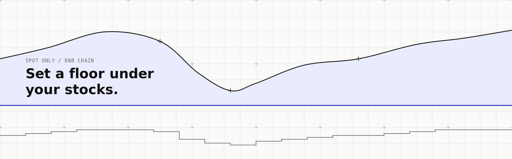
</picture>

</div>

---

## Live on mainnet

Floor runs on BNB Smart Chain mainnet (chain id 56), deployed at block 125815981. All three contracts are source-verified on BscScan. Addresses come from [`packages/contracts/deployments/56.json`](packages/contracts/deployments/56.json).

| Contract | Role | Address |
| --- | --- | --- |
| FloorFactory | Creates one vault per position. Holds roles, caps, defaults, asset and router lists. | [`0x1147d482fD08DDd7F377838efb610B606B3Ad765`](https://bscscan.com/address/0x1147d482fD08DDd7F377838efb610B606B3Ad765#code) |
| FloorLens | Read-only view helper for positions and keeper scans. | [`0x63Ae440B9D309959442eaD3E08cBC3A025C67780`](https://bscscan.com/address/0x63Ae440B9D309959442eaD3E08cBC3A025C67780#code) |
| FloorVault (implementation) | The code every position clone copies. | [`0xEA0603a83BCf28a1D57d8534971149eACD874055`](https://bscscan.com/address/0xEA0603a83BCf28a1D57d8534971149eACD874055#code) |

| Fact | Value |
| --- | --- |
| Owner and guardian | The same address, `0x762c9626711BCc882050cBf06Edd610fE8b91F1A`. Disclosed. |
| Keeper (also the deployer) | `0x46FD797AeBD0250A2E768022AD992DF21F12e58a` |
| Launch caps | 1,000 USDT per position, 5,000 USDT in total across all users. The owner can change both with `setLimits`. |
| Product minimum | 5 USDT per position (web and API guard; the factory's own hard floor is 1 USDT) |
| Router | Direct PancakeSwap v3 router only: `0x1b81D678ffb9C0263b24A97847620C99d213eB14` |
| Assets | NVDAB, SPCXB, QQQB (BSC bStocks). Deposits are USDT only. |

Check it yourself. These are free read calls:

```bash
export RPC=https://bsc-dataseed.bnbchain.org
export FACTORY=0x1147d482fD08DDd7F377838efb610B606B3Ad765
cast call $FACTORY "owner()(address)" --rpc-url $RPC
cast call $FACTORY "guardian()(address)" --rpc-url $RPC
cast call $FACTORY "maxDeposit()(uint256)" --rpc-url $RPC     # 1000000000000000000000 = 1,000 USDT
cast call $FACTORY "maxTotalTvl()(uint256)" --rpc-url $RPC    # 5000000000000000000000 = 5,000 USDT
```

## What is Floor

Floor is a protection vault for tokenized stocks on BNB Chain. You deposit USDT into your own vault, pick a floor (the lowest value you want to hold) and a term. The vault holds a mix of bStocks and USDT. It sells stock as prices fall and buys it back as they rise, using the CPPI rule (constant proportion portfolio insurance). Every trade is a plain spot swap on PancakeSwap v3. There is no leverage, no borrowing, no derivatives and no protocol fee in v1.

Floor reduces downside. It does not remove it. If a price gaps by more than about 24% before the vault can rebalance, the value can end below the floor. See [Status and known limitations](#status-and-known-limitations).

## Why

Tokenized stocks put US equities on a public chain. They also put their drawdowns on a public chain. Holders on BNB Chain have lending (Venus, Lista DAO), baskets and perps, but we found no downside-protection product for tokenized stocks there ([`CONTEXT.md`](CONTEXT.md), competitive landscape). In traditional finance this protection is sold as a principal-protected note: fees, minimums, bank counterparties.

Floor rebuilds the same rule as a public contract with spot swaps only. The price is not a fee. It is upside you give up, and the docs measure how much.

## How it works

The vault holds stock equal to four times your cushion, capped at your whole value. The rest stays in USDT.

```text
F  = deposit x floor%            the floor
C  = max(V - F, 0)               the cushion (V is current vault value)
E* = min(m x C, V)               target stock exposure, m = 4
```

When the cushion shrinks the vault sells stock. When it grows the vault buys stock back. A gap of 1/m = 25% in the stock leg uses the whole cushion, and costs plus the sell band take about a point of that, so the gap limit is about 24%.

### Worked example

Deposit 10,000 USDT, floor 90%. So F = 9,000, C = 1,000, E* = min(4 x 1,000, 10,000) = 4,000 in stock and 6,000 in USDT. Bands and trading costs are ignored here (the contract applies both).

| Step | Event | Stock | USDT | Value V | Cushion C | Target E* | Trade |
| --- | --- | ---: | ---: | ---: | ---: | ---: | --- |
| 0 | Deposit | 4,000 | 6,000 | 10,000 | 1,000 | 4,000 | none |
| 1 | Stock falls 10% | 3,600 | 6,000 | 9,600 | 600 | 2,400 | sell 1,200 |
| 2 | Falls another 10% | 2,160 | 7,200 | 9,360 | 360 | 1,440 | sell 720 |
| 3 | From step 0, stock rises 10% | 4,400 | 6,000 | 10,400 | 1,400 | 5,600 | buy 1,200 |
| 4 | From step 0, instant 25% gap | 3,000 | 6,000 | 9,000 | 0 | 0 | sell 3,000 (V = F exactly) |
| 5 | From step 0, instant 26% gap | 2,960 | 6,000 | 8,960 | 0 | 0 | below the floor by 40 |

Rows 1 and 2 are sequential. Rows 3 to 5 each start from step 0. Step 5 shows the limit: a gap bigger than 1/m falls through the floor. Once V reaches F the vault holds only USDT until the term ends (the "cash lock"). The same table is on [`/docs/how-it-works`](apps/web/app/docs/how-it-works/page.tsx).

### What it costs: the trade-off

Protection is paid for in upside. The share of a gain you keep is about 4 x (100 - floor)%. Measured at m = 4 on pooled equities, 6 bps one way, daily rebalance (source: [`apps/web/app/docs/evidence/page.tsx`](apps/web/app/docs/evidence/page.tsx), from `research/m_study/REPORT.md`):

| Floor | Share of gain kept in up years | Clear-breach rate |
| ---: | ---: | ---: |
| 95% | about 23% | about 0.3% |
| 90% | about 42% | about 0.4% |
| 85% | about 59% | about 0.5% |
| 80% | about 72% | about 0.5% |

The 42% figure is a pooled mean over up years at a 90% floor, not a typical year. Across 1,581 one-year windows the vault's median year was +1.6% against +13.7% for holding. In a normal year the vault gives most of the return away. That is the price of the floor.

<picture>
  <source media="(prefers-color-scheme: dark)" srcset="docs/assets/readme/tradeoff-chart-dark.png">
  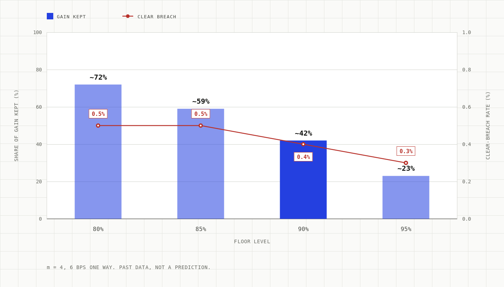
</picture>

<picture>
  <source media="(prefers-color-scheme: dark)" srcset="docs/assets/readme/cppi-mechanism-dark.png">
  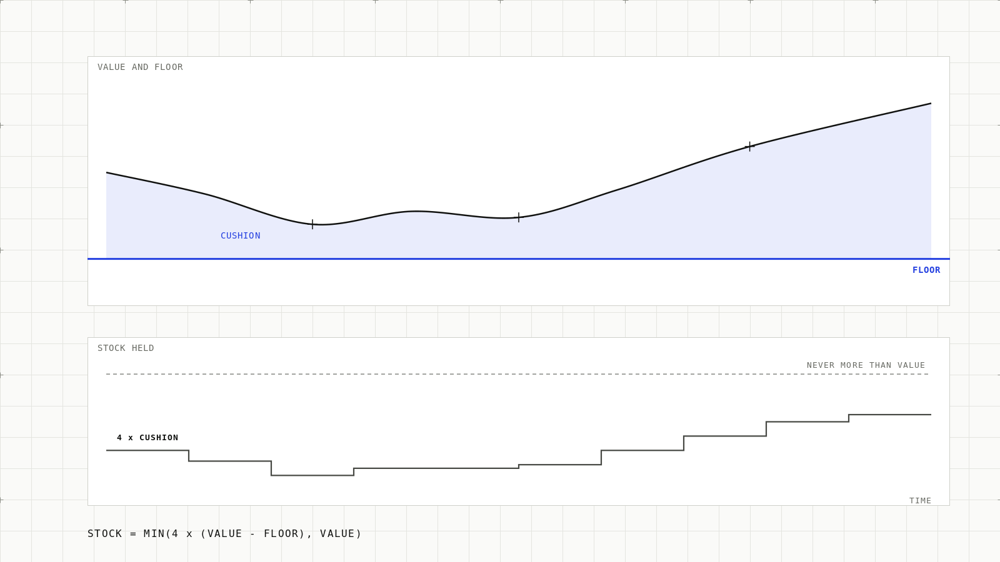
</picture>

## Architecture

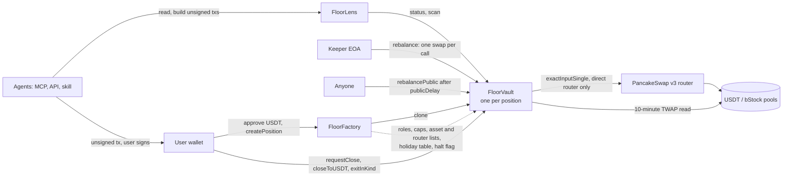

<picture>
  <source media="(prefers-color-scheme: dark)" srcset="docs/assets/readme/architecture-overview-dark.png">
  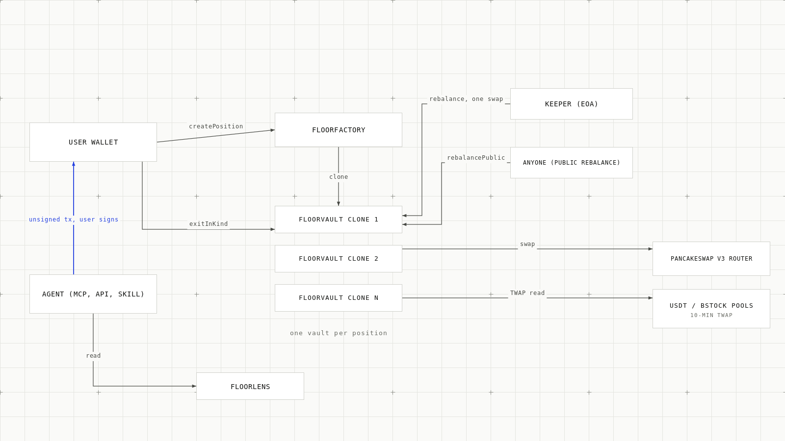
</picture>

Key design points (full design in [`docs/CONTRACTS.md`](docs/CONTRACTS.md), off-chain in [`docs/ARCHITECTURE.md`](docs/ARCHITECTURE.md), reconciliation in [`docs/DECISIONS.md`](docs/DECISIONS.md)):

- One vault clone per position. No shared balance, no shared price, no shared share supply. One user's gap loss cannot touch another's.
- The vault reads its own price from a 10-minute Pancake v3 TWAP. The keeper supplies no price.
- Economic parameters (floor, term, weights, multiplier, bands, tolerances) are copied into the position at creation and cannot be changed.

### User flow

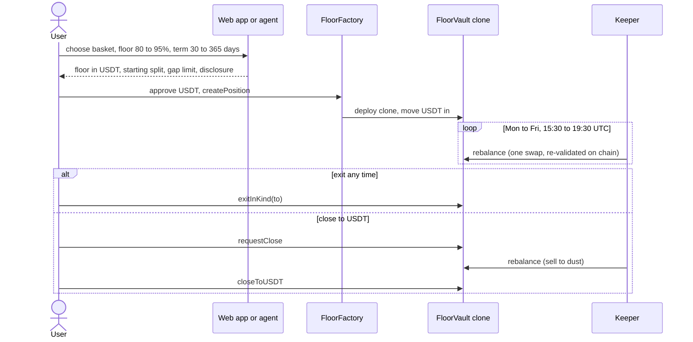

### Agent flow

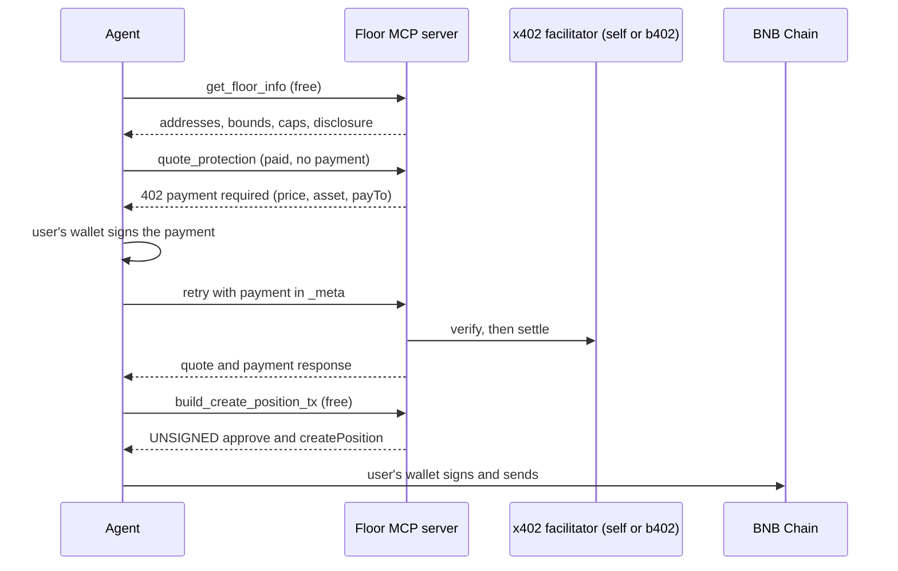

<picture>
  <source media="(prefers-color-scheme: dark)" srcset="docs/assets/readme/user-flow-dark.png">
  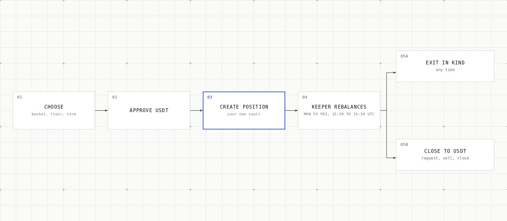
</picture>

## Smart contracts

Solidity 0.8.28, Foundry, EVM `cancun`, optimizer 200 runs ([`packages/contracts/foundry.toml`](packages/contracts/foundry.toml)). Sources in [`packages/contracts/src`](packages/contracts/src).

| Contract | What it does | Guards |
| --- | --- | --- |
| `FloorFactory` | `createPosition` clones a vault. Owns roles, asset and router lists, defaults, launch caps (`setLimits`), pause and halt flags, the NYSE holiday table. | Floor 50 to 98%, term 7 to 400 days (contract bounds). Caps per position and total. Routers added later wait 24 hours (`ROUTER_DELAY`). Two-step ownership transfer. |
| `FloorVault` (clone) | Holds USDT and bStocks for one position. `rebalance` (keeper), `rebalancePublic` (anyone), `requestClose`, `closeToUSDT`, `exitInKind`, `rescue` (owner of the position). | TWAP price, SwapGuard, trade window, per-asset trade cap, `minInterval`. `exitInKind` is always allowed. |
| `FloorLens` | `status(vault)` and `scan(from, to)` views. | Read-only. |
| `CPPIMath` | Floor, cushion, target exposure, sell and buy amounts, `minOut`. | Pure functions, fixed point (WAD). |
| `TwapOracle` | 10-minute Pancake v3 TWAP and spot checks. | Tick deviation bound (`maxTickDev` 300), history and liquidity checks. |
| `SwapGuard` | Runs the router call and checks balance deltas. | Vault is the only receiver. Spend and receive are checked, `minOut` is enforced. |
| `MarketHours` | Mon to Fri, 15:30 to 19:30 UTC window plus holiday table. | Guardian-set non-trading days. Holiday table runs through 2028-12-31. |
| `DefaultsCheck` | One set of bounds for the defaults struct. | Used by constructor, `setDefaults` and deploy preflight. |

Defaults at deploy ([`packages/contracts/script/params/56.json`](packages/contracts/script/params/56.json)): sell band 100 bps, buy band 200 bps, `minInterval` 900 s, `publicDelay` 3600 s, `twapWindow` 600 s, `maxTickDev` 300, tolerance 30 bps (aggregator) and 100 bps (direct), `minTrade` 20 USDT, dust 1 USDT. Per-asset trade caps: NVDAB 25,000, SPCXB 10,000, QQQB 5,000 USDT.

Exit paths:

- `exitInKind(to)`: owner only, any time, no keeper or market hours needed. Sends all USDT first, then each held bStock, skipping a token that fails (for example a paused token). It is never blocked by the guardian or a pause.
- `requestClose`, then `closeToUSDT`: sells to USDT through the normal path, then pays out.
- `rebalancePublic(assetIdx)`: anyone, no calldata, direct pool only, after `publicDelay` of open-market time, at 2x the normal band.

## Keeper

The keeper ([`apps/keeper`](apps/keeper)) scans positions through `FloorLens` and sends one-swap `rebalance` calls inside the trading window. The vault re-validates everything the keeper chooses: direction, size, router allowlist, `minOut`, window and `minInterval`. A keeper cannot withdraw, set prices or pick a recipient. An EOA keeper is primary. A Binance Agentic Wallet as an optional second keeper is not set up.

<picture>
  <source media="(prefers-color-scheme: dark)" srcset="docs/assets/readme/keeper-timeline-dark.png">
  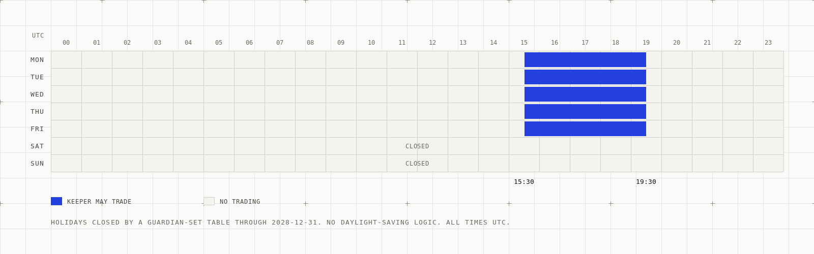
</picture>

```bash
pnpm --filter @floor/keeper start once --dry-run   # one scan, no transaction sent
```

## Agents: MCP, API, x402 and b402

Floor is built to be used by agents as well as people. State-changing tools only return **unsigned** transactions. Floor never signs and never holds keys.

| Surface | Where | Notes |
| --- | --- | --- |
| MCP server | [`apps/mcp`](apps/mcp), `POST /mcp` (Streamable HTTP, stateless), default port 8788. Hosted: `https://floor-server-wb4i.onrender.com/mcp` | 9 tools, below |
| REST API | [`apps/api`](apps/api), default port 8787 | Reads, unsigned tx builders, one paid route |
| Agent skill | [`skills/floor/SKILL.md`](skills/floor/SKILL.md) | Confirm-then-sign workflow and honest-claim rules |
| Payments | [`packages/x402`](packages/x402) | x402 v2 on `eip155:56`. Own facilitator is the demo path. |

MCP tools (source: [`apps/mcp/src/tools.ts`](apps/mcp/src/tools.ts)):

| Tool | Cost | Purpose |
| --- | --- | --- |
| `get_floor_info` | free | Factory, lens, USDT, enabled assets, bounds, caps, state, disclosure |
| `list_assets` | free | Enabled bStocks with pool, fee, price and market status when available |
| `get_status` | free | One position (`vault`) or all of an owner's (`owner`): value, floor, cushion, state |
| `get_rebalance_history` | free | Recent keeper runs, optional `vault`, `limit` 1 to 100 |
| `build_create_position_tx` | free | Unsigned USDT approve and `createPosition` |
| `build_exit_tx` | free | One unsigned exit: `requestClose`, `closeToUSDT` or `exitInKind` |
| `quote_protection` | paid | Starting split, floor value, gap tolerance |
| `backtest` | paid | Stored historical results for a basket and mode (no live computation) |
| `simulate_gap` | paid | What an instant fall of X bps does to a new position |

`quote_protection`, `backtest` and `simulate_gap` each cost 0.01 USD per call (default; `PRICE_QUOTE_PROTECTION_USD`, `PRICE_BACKTEST_USD`, `PRICE_SIMULATE_GAP_USD` override it), paid in USD1 or U on BSC. Read the live price from `get_floor_info` (`tools.paid[].priceUsd`).

API routes ([`apps/api/src/app.ts`](apps/api/src/app.ts)): `GET /healthz`, `/v1/floor`, `/v1/assets`, `/v1/market`, `/v1/positions`, `/v1/positions/:vault`, `/v1/keeper/runs`, `/v1/keeper/runs/:id`; `POST /v1/tx/create-position`, `/v1/tx/exit`, and the paid `POST /v1/paid/quote`.

Copy-paste example against a local MCP server (see [Quick start](#quick-start)):

```bash
curl -s http://127.0.0.1:8788/mcp \
  -H 'content-type: application/json' \
  -H 'accept: application/json, text/event-stream' \
  -d '{"jsonrpc":"2.0","id":1,"method":"tools/call","params":{"name":"get_floor_info","arguments":{}}}'

# Paid tool: the first call returns a payment-required result. Pay, then retry
# with params._meta["x402/payment"]. depositUsdt is a decimal string.
curl -s http://127.0.0.1:8788/mcp \
  -H 'content-type: application/json' \
  -H 'accept: application/json, text/event-stream' \
  -d '{"jsonrpc":"2.0","id":2,"method":"tools/call","params":{"name":"simulate_gap","arguments":{"depositUsdt":"1000","floorBps":9000,"termSeconds":31536000,"gapBps":2500}}}'
```

**x402 and b402 status, stated exactly.** The b402 client ([`packages/x402/src/b402.ts`](packages/x402/src/b402.ts)) calls Binance's `POST https://web3.binance.com/build/api/v2/b402/{supported,verify,settle}` with a Binance Web3 API key that has the B402 Payments permission. Verified live on 2026-10-05: `supported` and `verify`. `settle` has not been run live. Live paid calls therefore use our own facilitator ([`packages/x402/src/self.ts`](packages/x402/src/self.ts)), which is the default (`X402_FACILITATOR=self`). The payee for paid calls is `0xF5f349ABe9647278AC3450058bc054886DaF816B`.

<picture>
  <source media="(prefers-color-scheme: dark)" srcset="docs/assets/readme/agent-x402-flow-dark.png">
  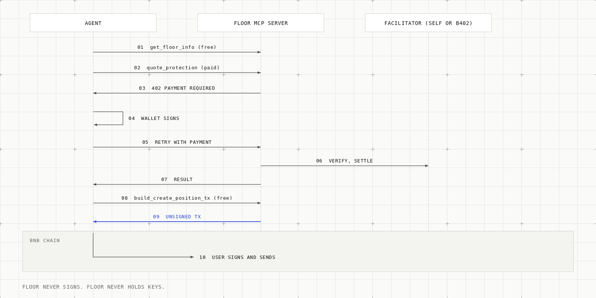
</picture>

## Trust model

Floor is non-custodial in the sense that no role can move a depositor's funds. It is not trustless. These roles exist, and at launch two of them are one address.

| Role | Address | Can | Cannot |
| --- | --- | --- | --- |
| Owner | `0x762c9626711BCc882050cBf06Edd610fE8b91F1A` | List assets, add routers (active after 24 hours), set keepers and the guardian, set defaults for new positions, set the launch caps with `setLimits` (no redeploy, existing positions unaffected), pause, transfer ownership (two-step). | Touch an existing position, move user funds, change a position's parameters. |
| Guardian | Same address as the owner | Pause and halt trading, set non-trading days, remove a router, disable an asset, approve a new bStock implementation. | Move funds. Add a router. |
| Keeper | `0x46FD797AeBD0250A2E768022AD992DF21F12e58a` | Trigger rule-valid rebalances, one swap per call. | Withdraw, set prices, choose recipients, use a non-allowlisted router, trade outside the window or faster than `minInterval`. |
| Position owner (you) | Your wallet | `requestClose`, `closeToUSDT`, `exitInKind`, `rescue`. | Change floor, term or weights after creation. |
| Anyone | n/a | `rebalancePublic`, `createPosition` for self. | n/a |

What this means in practice:

- Owner and guardian are the same address (disclosed), so the guardian adds no separation of duties. The owner is a single wallet. There is no multisig.
- A compromised keeper can only trigger rule-valid rebalances at bad timing. Per swap the loss is capped by the tolerance times the trade size, once per `minInterval` (design: [`docs/CONTRACTS.md`](docs/CONTRACTS.md) section 7).
- A halt or pause stops de-risking sells. It never stops `exitInKind`.
- The owner can raise the launch caps at any time. That is a trust point.
- bStocks have their own issuer pause, blocklist and sanctions list. A restricted token can block swaps of that token, and `exitInKind` skips a token that cannot be moved.

## Security model and reviews

Layers between a price move and a user's value:

1. On-chain price: 10-minute Pancake v3 TWAP, tick-deviation bound, minimum history and liquidity. No keeper-supplied price.
2. SwapGuard: balance-delta checks around every router call, `minOut` from the TWAP minus tolerance.
3. Rate and size limits: `minInterval`, `minTrade`, per-asset `maxTradeValue`.
4. Trading window: Mon to Fri 15:30 to 19:30 UTC, holiday table, guardian halt.
5. Router allowlist: direct PancakeSwap v3 router only; additions wait 24 hours.
6. Isolation: one clone per position, parameters fixed at creation.
7. Exit: `exitInKind` always callable by the position owner.
8. Launch caps: 1,000 USDT per position, 5,000 USDT total.

<picture>
  <source media="(prefers-color-scheme: dark)" srcset="docs/assets/readme/security-layers-dark.png">
  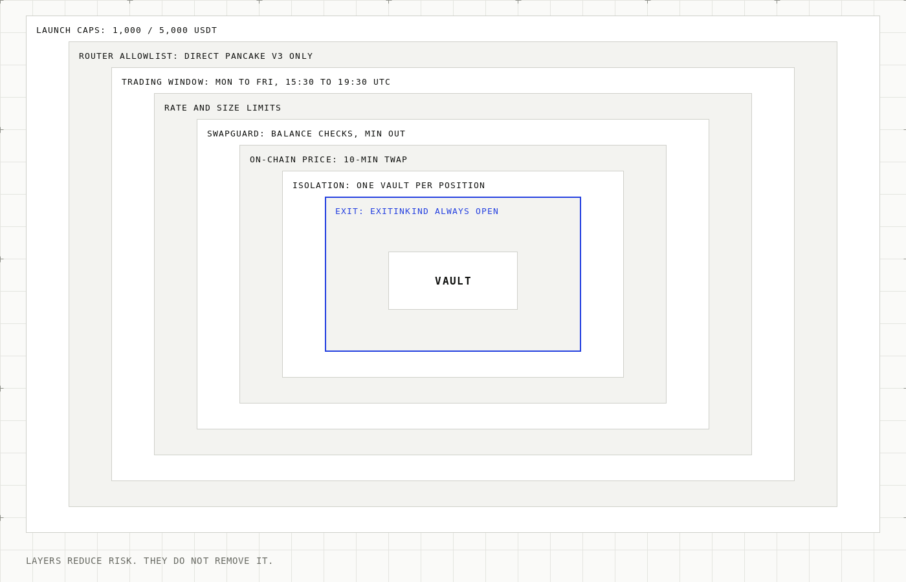
</picture>

**Reviews. There has been no formal human audit.** The contracts were checked with AI-assisted security reviews using the open-source Pashov Audit Group skills. Pashov Audit Group did not review Floor and this is not an endorsement. Process and claim wording: [`docs/AUDIT.md`](docs/AUDIT.md). Reports and triage: [`reviews/`](reviews/). Accepted findings and one proposed, unsigned acceptance: [`reviews/acceptances.md`](reviews/acceptances.md). Tests live in [`packages/contracts/test`](packages/contracts/test) (unit, fuzz, invariant, fork).

<picture>
  <source media="(prefers-color-scheme: dark)" srcset="docs/assets/readme/vault-state-machine-dark.png">
  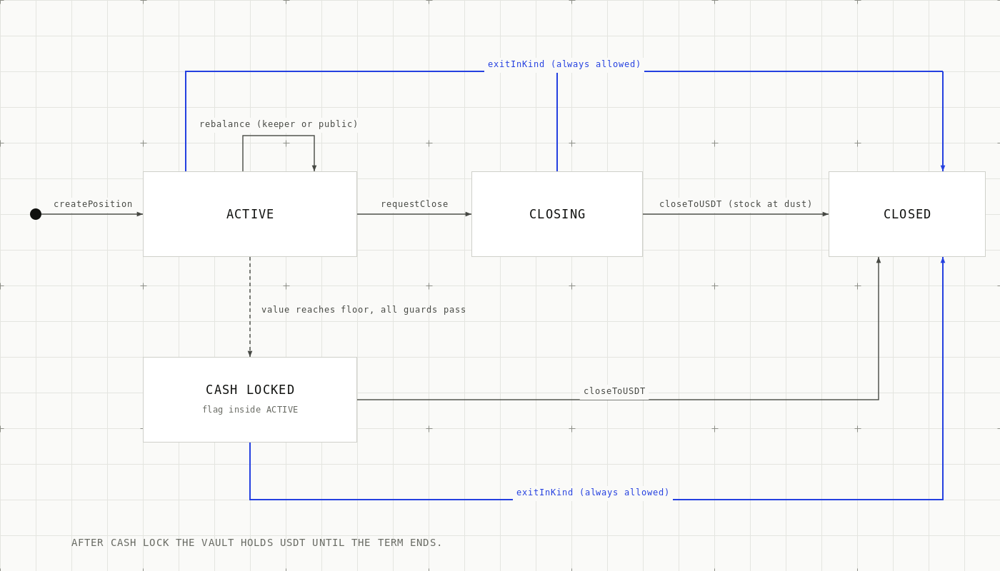
</picture>

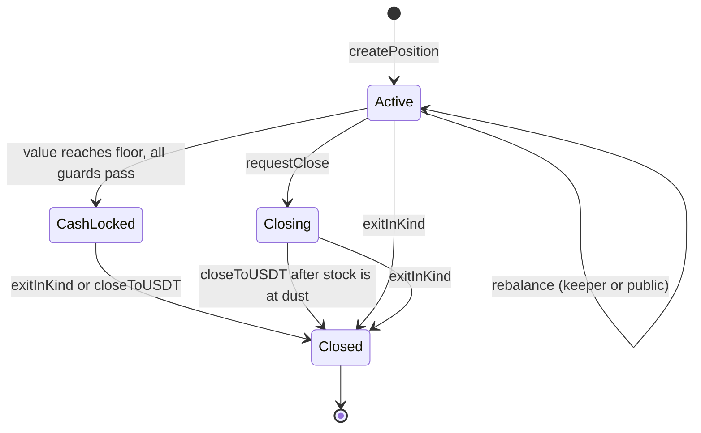

## Backtest evidence

All numbers below come from the repo. They are past data and do not predict the future. Daily closes only, survivorship bias, no intraday or halt gaps.

Long-history study: 1,581 non-overlapping one-year windows over 38 series, 1928 to 2026, 90% floor, m = 4, 6 bps one way, full overnight and weekend gaps, 0% on stablecoins ([`research/m_study/REPORT.md`](research/m_study/REPORT.md), [`research/m_study2/REPORT.md`](research/m_study2/REPORT.md), table T1).

"Clear breach" means the vault ended more than 1 point below the floor, at a 90% floor:

| Term | Clear-breach rate (95% CI) |
| --- | --- |
| 1 week | 0.02% (0.01 to 0.04) |
| 2 weeks | 0.04% (0.02 to 0.06) |
| 1 month | 0.09% (0.04 to 0.15) |
| 3 months | 0.20% (0.08 to 0.36) |
| 6 months | 0.25% (0.06 to 0.50) |
| 1 year | 0.44% (0.07 to 0.93) |

<picture>
  <source media="(prefers-color-scheme: dark)" srcset="docs/assets/readme/backtest-breach-chart-dark.png">
  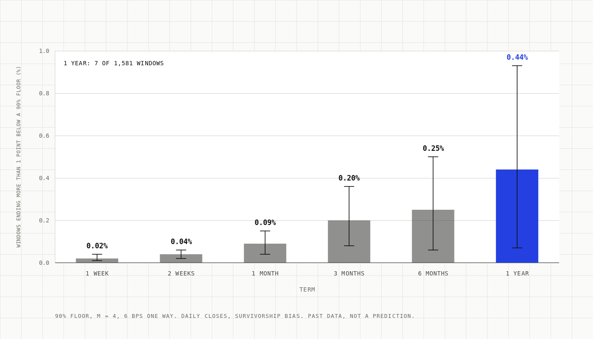
</picture>

Reading the numbers:

- 7 of 1,581 one-year windows breached clearly. All 7 came from the 29 windows that contained a one-day drop bigger than 25%. None of the 1,552 windows without such a drop breached ([`apps/web/app/docs/evidence/page.tsx`](apps/web/app/docs/evidence/page.tsx)).
- The worst simulated one-week window (AIG, 15 Sep 2008, 90% floor) lost 24% ([`CONTEXT.md`](CONTEXT.md)). Never read the floor as "max loss 10%".
- S&P 500 alone: 0 breaches in 98 years. Single stocks: 0.61% clear breach and 4.07% any shortfall at one year.
- Worst real NVDA one-year window (4 Jan 2022 to 4 Jan 2023): holding -51.0%, Floor -10.0% ([`docs/data/`](docs/data)).
- Ended below the floor by any amount (costs and the cash lock included): 2.85% of one-year windows at a 90% floor (T2).
- The short 2018 to 2026 sample (93 windows, no breach at m = 4) is one market regime. It is not a safety claim.
- Rebalance costs, live quotes on a $10k round trip (2026-10-02): QQQB 0.7 bps, NVDAB 5.9, SPCXB 6.0. Direct-route cost was about 49 bps for NVDAB at 100 USDT. Weekend cost is not measured ([`docs/RESEARCH_RESULTS.md`](docs/RESEARCH_RESULTS.md)).

## Repository layout

```text
floor/
├── apps/
│   ├── web/        Next.js site, docs pages, app (locked by default, see docs/BRANCHING.md)
│   ├── api/        Hono REST API: reads, unsigned tx builders, paid route
│   ├── mcp/        MCP server: 6 free and 3 paid tools, x402 gate
│   ├── keeper/     Rebalance keeper (CLI: once, run)
│   └── onebox/     API, MCP and an in-process keeper loop in one process
├── packages/
│   ├── contracts/  Foundry project: src, script, test, deployments, holidays
│   ├── sdk/        CPPI maths, constants, disclosure strings
│   ├── x402/       x402 gate, self facilitator, b402 client
│   ├── bw3/        Binance Web3 API client
│   └── db/         x402 payment receipt storage
├── local/          One-command local stack on an Anvil fork of BSC
├── skills/floor/   Agent skill
├── docs/           CONTRACTS, ARCHITECTURE, DECISIONS, AUDIT, BRANCHING, backtest data
├── reviews/        AI-assisted review reports, triage, acceptances
├── research/       Backtest studies (m_study, m_study2)
└── ops/            Deploy runbook, ERC-8004 prep, README image briefs
```

<picture>
  <source media="(prefers-color-scheme: dark)" srcset="docs/assets/readme/repo-map-dark.png">
  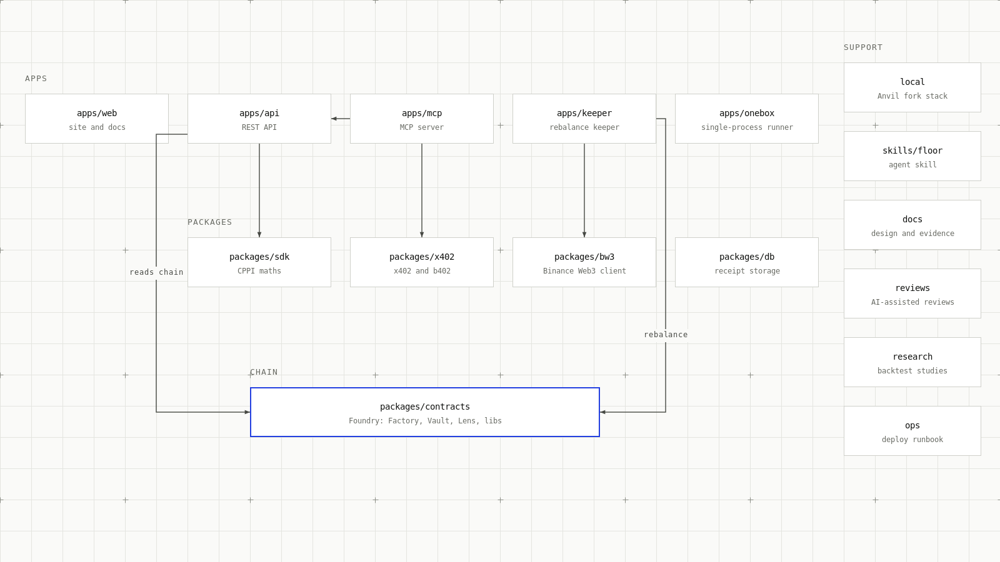
</picture>

## Quick start

Needs Node 20+, pnpm 10 (`packageManager` is `pnpm@10.34.5`), and Foundry for contracts and the local stack.

```bash
pnpm install
pnpm build          # pnpm -r build
pnpm typecheck
pnpm test           # pnpm -r test (vitest)
```

Test counts (run 2026-10-06 on `main`): contracts 270 Foundry tests (269 passed, 1 invariant replay failed: `invariant_keeperHandlerNoViolations`); TypeScript 622 vitest tests passed (web 155, sdk 310, x402 32, api 33, mcp 25, keeper 39 of 40, bw3 19, onebox 8, db 1) plus 4 skipped (fork or RPC needed) and 1 failed in `apps/keeper`. Fork tests need a BSC RPC.

Contracts:

```bash
cd packages/contracts
forge build
forge test          # fork tests need a BSC RPC; see docs/CONTRACTS.md section 12
```

Run everything locally on an Anvil fork of BSC mainnet (contracts, API, keeper, MCP, web). Nothing touches a real network. Details in [`local/README.md`](local/README.md):

```bash
pnpm local:up       # about 2 minutes; prints URLs, addresses and flows
pnpm local:status
pnpm local:down
```

Run single pieces:

```bash
NEXT_PUBLIC_APP_LOCKED=0 pnpm --filter web dev   # web app; locked without the flag
pnpm --filter @floor/api dev                      # API on :8787
pnpm --filter @floor/mcp dev                      # MCP on :8788
```

Dependencies are locked by `pnpm-lock.yaml`. Commit it with any dependency change.

Branching: `main` is what production serves and is locked by default. `dev` is the integration branch. The app routes are gated by `NEXT_PUBLIC_APP_LOCKED`; docs stay public. Details in [`docs/BRANCHING.md`](docs/BRANCHING.md).

## Deploy and verify

The mainnet deploy runbook is [`ops/deploy/runbook.md`](ops/deploy/runbook.md): pre-flight checklist, one-script deploy, owner post-deploy steps, BscScan verification (with a Sourcify fallback), keepers, rollback. Parameters are in [`packages/contracts/script/params/56.json`](packages/contracts/script/params/56.json). The runbook's `AUDITED_COMMIT` placeholder is still unfilled because no `reviews/audit-pashov-final.md` exists. Hosted-service notes: [`docs/DEPLOY_RENDER.md`](docs/DEPLOY_RENDER.md). ERC-8004 registration is prepared in [`ops/erc8004/`](ops/erc8004) and has not been broadcast.

## Configuration

Names only. Values are secrets or deployment-specific and never belong in git. The full list with defaults is in [`ops/deploy/render.env.template`](ops/deploy/render.env.template).

| Area | Variables |
| --- | --- |
| Chain | `FLOOR_CHAIN_ID`, `FLOOR_RPC_URL`, `BSC_RPC_URL`, `FLOOR_FACTORY`, `FLOOR_LENS`, `FLOOR_RUNS_FROM_BLOCK`, `FLOOR_ASSETS` |
| Keeper | `KEEPER_ADDRESS`, `KEEPER_PRIVATE_KEY`, `KEEPER_ROUTE`, `KEEPER_INTERVAL_SEC`, `KEEPER_HEARTBEAT_FILE`, `ALERT_WEBHOOK_URL` |
| x402 and b402 | `X402_FACILITATOR`, `X402_NETWORK`, `X402_PAYTO`, `X402_ASSET`, `X402_ASSET_SYMBOL`, `X402_ASSET_DECIMALS`, `SELF_FACILITATOR_KEY`, `BW3_API_KEY`, `BW3_API_SECRET` |
| Prices | `PRICE_QUOTE_PROTECTION_USD`, `PRICE_BACKTEST_USD`, `PRICE_SIMULATE_GAP_USD` |
| Servers | `MCP_PORT`, `MCP_PUBLIC_URL`, `MCP_ALLOWED_ORIGINS`, `API_BASE_URL`, `WEB_ORIGIN`, `TRUST_PROXY` |
| Web | `NEXT_PUBLIC_APP_LOCKED`, `APP_LOCKED`, `NEXT_PUBLIC_SITE_URL` |
| Local stack | `BSC_FORK_RPC_URL`, `LOCAL_PORT_OFFSET` |

## Status and known limitations

- **No formal human audit.** Reviews are AI-assisted only (Pashov Audit Group skills). See [`docs/AUDIT.md`](docs/AUDIT.md) and [`reviews/`](reviews/). That is why the launch caps are small.
- **The floor can be breached.** A gap bigger than about 24% before a rebalance can take value below the floor. Single stocks have had bigger one-day drops. A fraud or bankruptcy can take a stock down 80% to 100% in a day.
- **Acceptances are not all signed.** The batch acceptance of 2026-10-04 awaits the team lead's written confirmation. The 2026-10-05 run raised one finding (a caller with 5,000 USDT can fill the shared cap and block new deposits). Its acceptance is proposed and not signed. 19 unscored leads from that run are neither accepted nor rejected ([`reviews/acceptances.md`](reviews/acceptances.md)).
- **Owner and guardian are one address.** No multisig.
- **Cash lock.** Once value reaches the floor the vault stays in USDT until the term ends and cannot buy stocks again.
- **Delayed sells.** A sell reverts while spot and the 10-minute average disagree by more than the tolerance (finding F-04, accepted). In a fast crash this can let value fall below the floor.
- **Public rebalance can be sandwiched** within its 1% slippage bound. The keeper acts first.
- **No de-risking sell** when a held stock has no price history. Use `exitInKind`.
- **Shared launch cap.** One caller can fill it. The owner can raise it.
- **Weekends.** The vault does not trade on weekends. Weekend trading cost is not measured. The backtest rebalances once a day at the close, not in the contract's 4-hour window.
- **Holiday table** ends 2028-12-31. A 365-day term cannot be created after about 18 Dec 2027 unless the guardian extends it.
- **b402:** `supported` and `verify` run live, `settle` not run live. Paid calls settle through our own facilitator.
- **Not done:** Agent Studio listing, ERC-8004 registration (prepared, not broadcast), Agentic Wallet keeper (optional, not set up).
- **Site status.** The live URL is `https://floor.ayush.works` and the app is unlocked on production. The code still locks the app routes by default unless `NEXT_PUBLIC_APP_LOCKED=0` is set ([`docs/BRANCHING.md`](docs/BRANCHING.md)). The hosted API and MCP server run on a free Render instance at `https://floor-server-wb4i.onrender.com` (`/healthz`, `/mcp`); it can sleep if idle.

Full list: [`apps/web/app/docs/open-items/page.tsx`](apps/web/app/docs/open-items/page.tsx) and [`apps/web/app/docs/risks/page.tsx`](apps/web/app/docs/risks/page.tsx).

## Roadmap

Only items that appear in the docs:

- Written team-lead confirmation of the batch acceptance and the 2026-10-05 proposal.
- Formal human audit (not done).
- A multisig owner (not set up).
- Hourly backtest to match the contract's trading window (only about two years of hourly data exist).
- Measure weekend and crash-time rebalance cost.
- Extend the holiday table beyond 2028-12-31.
- Run b402 `settle` live.
- Optional: Agentic Wallet as a second keeper, ERC-8004 registration.
- Optional, not in v1: supply idle USDT to Venus for yield ([`CONTEXT.md`](CONTEXT.md)).

## Hackathon

Built for **BNB Hack: Tokenized Stocks Edition**. Tracks and fit, from [`CONTEXT.md`](CONTEXT.md): bStocks (NVDAB, SPCXB, QQQB) are central, spot only, BSC mainnet deployment, execution on PancakeSwap v3.

What we did not do:

- No Agent Studio listing and no Agentic Wallet side-prize entry.
- No ERC-8004 registration broadcast.
- No b402 `settle` run live.
- No formal audit, no multisig.
- No leverage, borrowing, derivatives, protocol fee or in-app AI model.
- No Ondo or xStocks assets. Ondo was excluded because its issuer RFQ never quoted through the aggregator.

## Contributing

Work on `dev`, promote to `main` by fast-forward after the gates in [`docs/BRANCHING.md`](docs/BRANCHING.md): `pnpm -r typecheck`, `pnpm -r lint`, `pnpm -r test`, `pnpm --filter web build`. Any change under `packages/contracts/src` or `packages/contracts/script` after an audit run voids that run ([`docs/AUDIT.md`](docs/AUDIT.md)). Never commit secrets or `.env` files.

## License

No `LICENSE` file exists in this repository, so no license is granted. Individual Solidity files carry `SPDX-License-Identifier: MIT` headers. The owner needs to decide and add a license file.

## Disclaimer

Floor is experimental software. It is not financial advice, not insurance and not a guarantee of any outcome. Backtests use past prices and do not predict the future. You can lose money, including below your chosen floor. Tokenized stocks carry issuer, regulatory, liquidity and smart-contract risk. Read [`apps/web/app/docs/risks/page.tsx`](apps/web/app/docs/risks/page.tsx) and the contracts before depositing, and only deposit what you can afford to lose.
