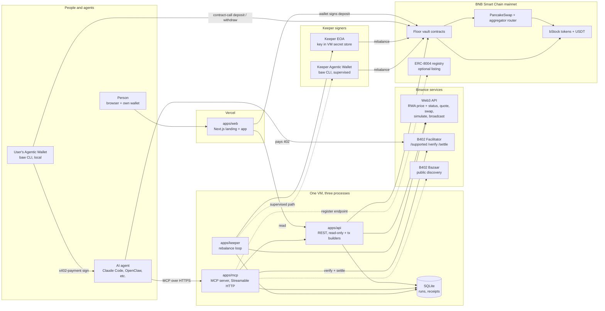
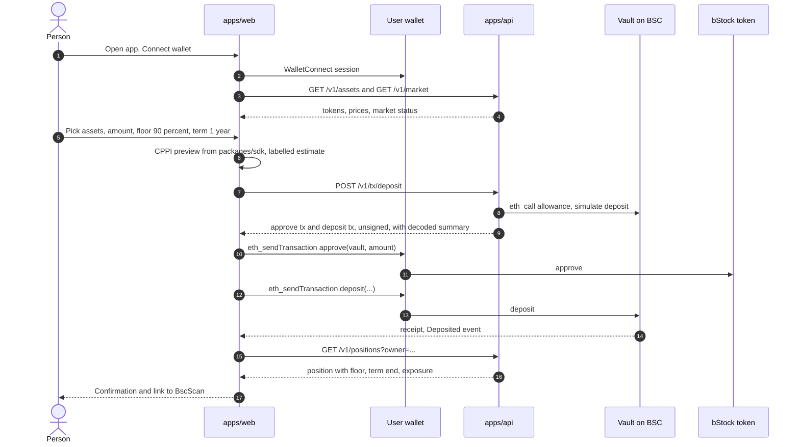
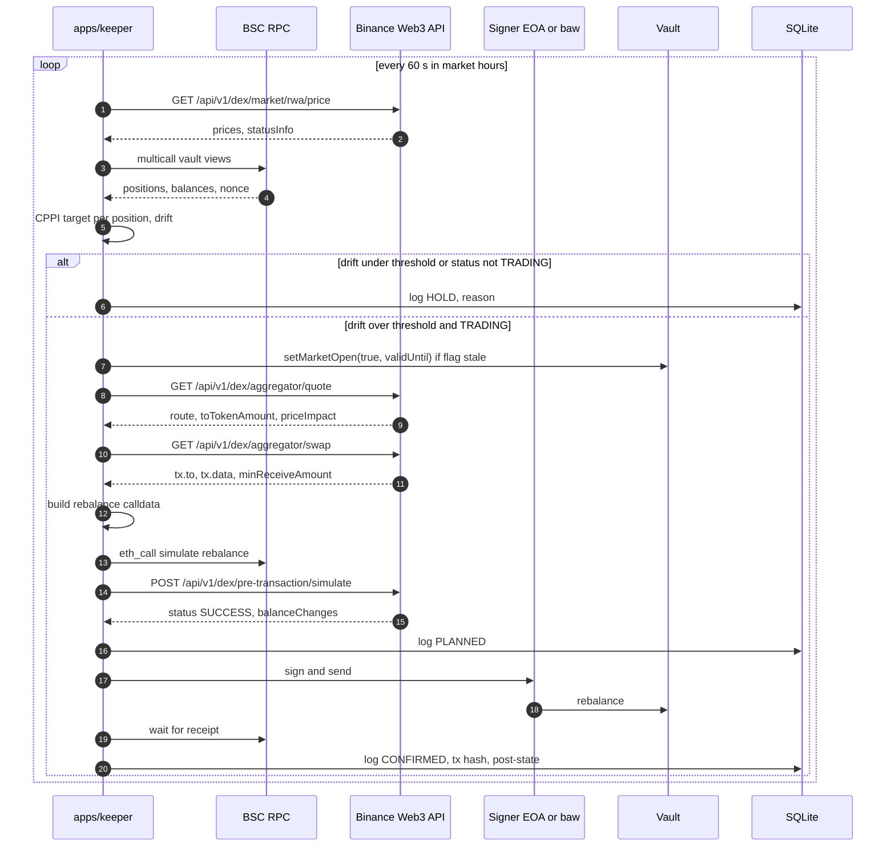
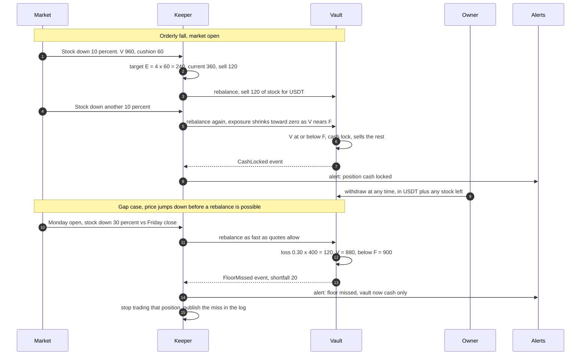
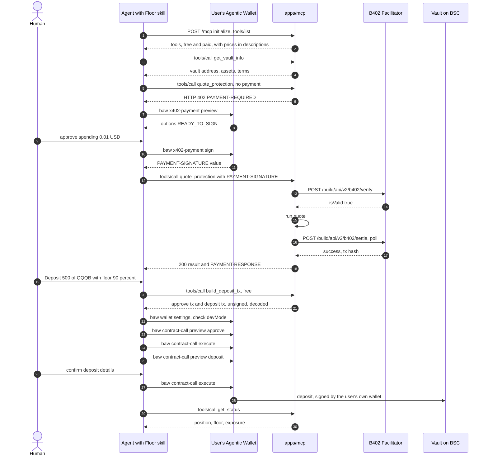
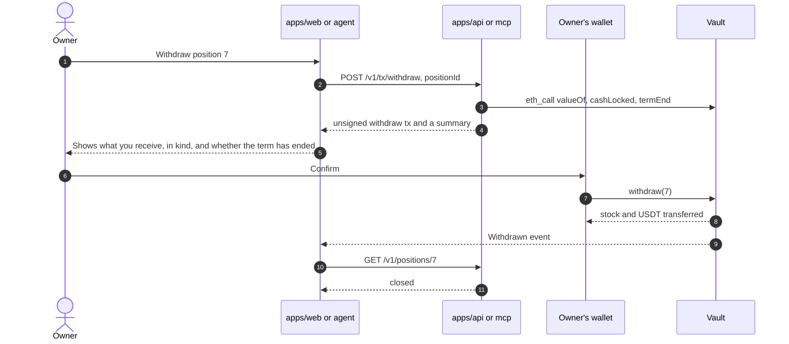

# Floor: system architecture

Status: design only, written 2026-10-02. Nothing here has been built, signed or paid for.
Inputs: `CONTEXT.md`, `afterbell/docs/EXECUTION.md`, and the sources in section 12.
`docs/CONTRACTS.md` did not exist when this was written, so the contract interface in section 2 is a list of **assumptions** to reconcile (section 2.1).

Labels: **[verified]** = read in a primary source or run read-only. **unverified** = inferred, or the source is silent. Source tags like `[S3]` point to section 12.

---

## 0. Summary of decisions

1. **Keeper = a plain EOA Node process, not the Agentic Wallet.** The Agentic Wallet (AW) session expires and needs a human QR scan to renew [S2, S4]. A one-year vault needs a keeper that never needs a human. AW is kept in three roles where a human is present anyway: (a) pays b402 for the agent demo, (b) signs a *user's* deposit and withdraw through `contract-call`, (c) a second, supervised keeper address used live in the demo window. Section 5.1 has the evidence.
2. **Floor never signs for anyone but itself.** The keeper key can only call `rebalance()` (and the market flag). Every user-facing state change is an unsigned transaction that the user's own wallet or the user's own AW signs.
3. **One backend codebase, three small processes on one VM:** `api` (REST), `mcp` (Streamable HTTP), `keeper`. Shared logic lives in packages. One SQLite file for run logs and payment receipts. The web app is on Vercel.
4. **SUPERSEDED 2026-10-10: no merchant account is needed; a Web3 API key with the B402 Payments permission is enough (see the 2026-10-05 correction in section 3.2). b402 `supported` and `verify` ran live 2026-10-05, `settle` has not, and live paid calls use Floor's own facilitator.** Original note: b402 needs a merchant account that Binance grants on request [S12, S14, S19]. This is the biggest schedule risk. Apply today. Build the paywall behind a `FacilitatorClient` interface so a self-run x402 facilitator can stand in (section 3.2).
5. **The calendar is a hard constraint.** US markets are closed on Sat 3, Sun 4, Sat 10 and Sun 11 Oct. The submission deadline is Sun 11 Oct 12:00 UTC [S33]. Every live mainnet rebalance recording has to happen Mon 5 to Fri 9 Oct, between 13:30 and 20:00 UTC (US cash session, EDT). The contract must be on mainnet by Monday morning (section 9).

---

## 1. Components

### 1.1 Diagram



`MCP --> API` means MCP imports the same `packages/core` functions as the API. It does not need to call the API over HTTP. Whether they are one process or two is a deployment choice; two keeps the paywall and rate limits separate from the web-facing reads.

### 1.2 Component table

| Component | Job | Tech | Must never |
|---|---|---|---|
| **apps/web** | Landing page and app. Connect wallet, pick assets / floor / term, run the CPPI maths client-side from `packages/sdk`, build the deposit with viem, show positions and the public keeper log. | Next.js (App Router), Tailwind, Magic UI, wagmi + viem, WalletConnect (Reown AppKit) | Hold keys. Show "guaranteed", "safe" or "can't lose". Show a number not in `RESEARCH_RESULTS.md` without a "simulated" label. |
| **apps/api** | REST: asset list, market data with status, position reads, keeper log, unsigned tx builders (deposit, withdraw), paid endpoints for agents. | Node 22, Hono (or Fastify), zod, viem, better-sqlite3 | Hold any user or vault key. Sign anything. Call a state-changing function of the vault. Return a tx whose `to` is not the vault or an approved token. |
| **apps/mcp** | Same capabilities as MCP tools. Free tools plus b402-gated paid tools. Streamable HTTP, stateless. | `@modelcontextprotocol/sdk`, Hono, `packages/x402` | Sign for users. Return a tool result that makes the agent call an address other than the vault. Settle a payment before verify. Run a paid tool before verify. |
| **apps/keeper** | The only writer to the vault. Price check, drift, market-open check, quote, simulate, sign, broadcast, confirm, record. Sets the market-open flag. | Node 22, viem, `packages/cppi`, `Signer` interface (`EoaSigner`, `BawSigner`) | Withdraw, change floors, change the router list, touch the admin role. Trade when status is not `TRADING`. Retry a submitted tx blindly. Put the key in logs. |
| **Keeper EOA** | Primary signer. Has only the `KEEPER` role. | One key in the VM secret store, a few dollars of BNB | Hold user funds. Hold the admin role. Be the same key as the b402 payee. |
| **Keeper Agentic Wallet** | Secondary, supervised keeper. Also the demo's proof of AW use. | `baw contract-call preview / execute` | Be on the critical path. It cannot run a year without a human (section 5.1). |
| **Binance Web3 API** | External. Prices and market status, aggregated quotes, calldata, simulation, broadcast with MEV protection [S32]. | HMAC-signed HTTP | n/a. We must treat every response as untrusted input and re-check on-chain (`minOut`, simulation, `eth_call`). |
| **B402 Facilitator** | External. Verifies the buyer's EIP-712 authorization, sponsors gas, settles on BSC [S12, S17, S18]. | HMAC-signed HTTP with a Web3 API key (corrected 2026-10-05; earlier notes said RSA) | n/a. Our `payTo` wallet must be receive-only. |
| **Vault contracts** | Custody and rules (CONTRACTS.md). | Solidity, Foundry | n/a. See 2.1 for what we need from them. |
| **SQLite** | `keeper_runs`, `x402_receipts`, `price_cache`. | better-sqlite3 + Drizzle, WAL mode, one volume | Be the source of truth for balances. Chain state is. It is a log. |

Why SQLite: three processes on one VM, one writer per table (keeper writes runs, mcp/api write receipts). If the team prefers serverless hosting for api/mcp, swap for Neon Postgres. Nothing else changes.

---

## 2. Contract interface assumptions

### 2.1 Assumptions to reconcile with `docs/CONTRACTS.md`

This is the minimum surface the off-chain parts need. If CONTRACTS.md differs, change this table or the contract, but make the choice explicit.

| # | Assumption | Why the off-chain side needs it |
|---|---|---|
| A1 | `deposit(address asset, uint256 amount, uint16 floorBps, uint32 termDays) returns (uint256 positionId)`. Pulls tokens with `transferFrom`, so the user approves the **vault** first. The position owner is `msg.sender`. | Web and MCP build this call. If the user's own AW signs, owner = the AW address, which is what we want. |
| A2 | One position per deposit, with its own `floorBps` (floor = deposit value x floorBps / 10000, fixed at deposit) and `termEnd`. Positions are accounted separately even if swaps are batched. | Keeper computes CPPI per position. Status tool reads per position. |
| A3 | `withdraw(uint256 positionId)` is callable by the owner at any time, **never needs the keeper**, and pays out in kind (stocks + USDT as held). It works while the vault is paused for market-closed. A USDT-only exit, if wanted, is a separate keeper-assisted flow and is out of v1. | Flow 2e. A user must always be able to leave without us. |
| A4 | `rebalance(...)` is `onlyKeeper`, with `KEEPER` a role that several addresses can hold (EOA and AW). It takes the swaps to execute (`router`, `tokenIn`, `tokenOut`, `amountIn`, `minOut`, `data`) and a `nonce` (equal to the vault's current rebalance nonce, then incremented). A repeated or stale call reverts. | Idempotency (section 6.2). The keeper builds `data` from the Binance `/swap` response. |
| A5 | The contract **does not trust the keeper's price**. It checks the result after the swaps: received >= `minOut`, and the post-trade exposure per position is within a band of the CPPI target. How it values stocks on-chain (own TWAP, pool spot, signed price attestation) is the contracts agent's decision. This is the hardest open item (section 11, Q1). | The keeper's `minOut` and slippage limit rely on it. |
| A6 | Swap targets are restricted: `router` in an allowlist (the aggregator router, e.g. `0xB444...DdA5` seen in EXECUTION.md, and the PancakeSwap router), tokens in an asset allowlist (the table in CONTEXT.md). The allowlist is changed only by an admin role, not the keeper. | Limits what a stolen keeper key can do. |
| A7 | Market-closed pause: a flag `marketOpen` plus `validUntil`, settable by the keeper (or a guardian). `rebalance` reverts when it is not set or has expired. `deposit` and `withdraw` are not blocked by it. If the contracts agent chooses an on-chain trading calendar instead, the keeper only reads it. | Keeper step "market-open check". |
| A8 | Cash-lock: when position value <= floor, the next `rebalance` must sell the position's stock to USDT and mark it `cashLocked`. It stays that way until `termEnd`. | Flow 2c. |
| A9 | Views the API reads in one multicall: `positions(id)`, `valueOf(id)` (in USDT at a documented price rule), `exposureOf(id)`, `cashLocked(id)`, `positionsOf(owner)`, `rebalanceNonce()`, `marketOpen()`, `assets()`. | Status tool, web, keeper. |
| A10 | Events: `Deposited(positionId, owner, asset, amount, floorBps, termEnd)`, `Withdrawn(positionId, owner, ...)`, `Rebalanced(nonce, keeper, positionIds, ...)`, `CashLocked(positionId, value, floor)`, `FloorMissed(positionId, value, floor)`, `MarketFlagSet(open, validUntil)`. We index with `getLogs`. No subgraph. | Keeper log, UI history, demo. |
| A11 | Rate limits on-chain: minimum seconds between rebalances and a maximum turnover per call, so a stolen keeper key cannot churn the vault. | Section 7. |
| A12 | Optional: `depositFor(address owner, ...)`. Not needed if the agent's wallet is the owner. | Only if a bot deposits for a third party. Skip in v1. |

### 2.2 What Floor does when the contract disagrees

The keeper reads the ABI from `packages/sdk` (generated from the Foundry build). A change to A1 to A11 is a one-file change there plus the keeper `plan` step.

---

## 3. External services: what we learned

### 3.1 Binance Agentic Wallet

Facts, with sources. This section answers research item 1.

| Question | Answer | Source |
|---|---|---|
| What is it? | Keyless MPC wallet. "Your private key is never fully reconstructed on any single device or server." Driven by an agent through the `baw` CLI (npm `@binance/agentic-wallet`, v1.10.0 at time of writing). Supports BSC, Ethereum, Base, Solana. | [S8], npm registry [S10] |
| Headless / unattended? | The CLI has no interactive prompts of its own: every command takes `--json`, and `contract-call` is a two-step `preview` then `execute --requestId` [S3]. Nothing in the CLI forces a human *per call*. The confirmation rule ("confirm with the user before any state-changing command") is written into the SKILL for the **agent**, not enforced by the CLI [S1]. So a Node process can shell out to it. **unverified in practice**: nobody on the team has run it. Whether Binance's terms allow a non-interactive script is **unverified**. | [S1, S3] |
| Session lifetime | Sign-in is a QR pairing: `auth signin` returns `urlForWeb`, `qrCodeId`, `pairingCode`; the user confirms in the Binance App; `auth verify` blocks up to 5 minutes [S2]. `wallet settings` returns `maxSigninDuration` (example `48h`), `inactiveSignoutDuration` (example `48h`, "fixed and not user-configurable"), and `sessionExpireTime`. The skill says sign-out is **silent**, "the user otherwise only finds out when a later command fails" [S4, S6]. The doc values are marked "illustrative"; real values come from `wallet settings`. | [S2, S4, S6] |
| Re-auth | Needs a human with the Binance App every time the session ends. No API-key or refresh flow is documented. | [S2] |
| Storage of session | The CLI depends on `@github/keytar` (OS keychain). On a headless Linux VM that needs a Secret Service / libsecret daemon. This is an inference from the dependency list. **unverified**. | [S10] |
| Developer Mode | Required for `contract-call` and `sign-message`. It can only be enabled or configured in the Binance App. `wallet settings` shows `devMode.enabled`, `devMode.expiresAt` (Unix seconds, so it **expires**), `devMode.dailyLimit` (example 10000), `devMode.balanceExceeded`, and `developerModeQuotaUsed`. The quota is independent of the swap, DeFi and x402 quotas. | [S3, S4] |
| What counts against the Developer Mode quota | Not documented. Our `rebalance()` moves value inside the vault, so the keeper wallet's own balance changes are about zero. Whether the quota counts calldata value, simulated balance changes, or something else is **unverified**. | [S4] |
| What triggers `requireConfirmation=true` | Docs only say: `false` means execute can broadcast directly; `true` means execute creates an order that must be approved in the Binance App (`PENDING_CONFIRMATION`). The setting `abnormalTxnHandling` is `AutoReject` or `NeedConfirmation` for "high-risk or abnormal price impact" transactions, and "any action outside your rules is automatically rejected or requires a second confirmation". So the likely trigger is the risk engine plus that setting. Exact rule: **unverified**. `wallet tx-lock` exists to "check if any transactions are pending or require double-confirmation". | [S1, S3, S4, S8] |
| What the risk engine checks | Preview returns `simulationResult` (status code, `balanceChanges`, `allowanceChanges`, `authorityChanges`), `risks.riskDetails` (code, title, `RISK` or `CAUTION`), per-address `riskLevel`, and `tokenInfos`. A blocked preview returns error `351803 AGENT_DEV_MODE_RISK_BLOCKED` with no `requestId`. `351805` is the generic simulation failure. If the audit service is unreachable the skill says to fail closed and require acknowledgement [S1]. Whether a brand-new unverified contract trips it: **unverified**. Verifying the vault source on a block explorer is the obvious mitigation, but that it helps is **unverified**. | [S3, S1] |
| Other limits | Separate 24h quotas: swaps / transfers (example 50000), DeFi (example 5000), x402 (default 20 USD per day in the docs example and a search summary of the product docs), Developer Mode. All set in the Binance App only. A tradable-token allowlist exists (`tradeAllTokens`). | [S4, S9] |
| Gas | Keeper wallet pays BNB gas for `contract-call`. x402 payments are gasless for the buyer [S7]. | [S7] |

**Recommendation: do not rely on AW for the unattended keeper.** Section 5.1 gives the decision and the fallback.

#### Publishing a Floor skill to `binance-skills-hub`

| Item | Fact | Source |
|---|---|---|
| Layout | One folder per skill under `skills/` (the existing Binance ones sit under `skills/binance-web3/`). A `SKILL.md` with YAML frontmatter, optional `references/` and `scripts/`. Lowercase-hyphen names. | [S11] |
| Frontmatter | CONTRIBUTING.md says `name`, `description`, `version`, `license`. README.md says `title`, `description`, `metadata.version`, `metadata.author`, `license: MIT`. The shipped AW skill uses `name`, `description`, `metadata.author`, `metadata.version`. The two docs disagree. Use `name`, `description`, `license`, and `metadata.version` + `metadata.author` so every variant is satisfied. | [S11, S1] |
| Content rules | Do not promote any asset, do not present any asset as guaranteed, safe or recommended, no valid wallet addresses in the skill text. No obfuscation, no root, minimal dependencies. | [S11] |
| Process | Fork, branch `feature/<skill-name>`, PR to `main`. The PR template wants: Summary, APIs Used (table), Binaries Used, How it works, Use Cases. "Once approved, the skill will be merged." No timeline is stated. | [S11] |
| Reality check | On 2026-10-02 the repo has 60 open PRs. Recent community PRs are all still open, including the sibling Afterbell skill (#337, opened 2026-09-08). The merged ones we looked at are Binance-team release PRs. **Do not plan on a merge before 2026-10-11.** | [S11] (via `gh pr list`) |
| Plan | (1) Put the skill in our own public repo `floor/skills/floor-protection/` and say in the README to install it with the same `npx skills add <repo url>` pattern the hub README uses (that this works for arbitrary repos is **unverified**). (2) Open the hub PR on day 6 so it is in the queue. (3) Describe it honestly in the submission as "submitted, pending review". | [S11] |

**Rule conflict to resolve in the skill text:** the hub forbids "no valid wallet addresses" in a skill, but the AW skill itself says never to invent contract addresses and to use only addresses it knows. Floor's skill must not hard-code the vault address. Instead it tells the agent to fetch it from the MCP tool `get_vault_info`, then compare `to` in every unsigned tx with that value and with the address shown in the AW `contract-call preview` (`parsedTx`). That keeps both rules.

### 3.2 b402 (Binance x402 on BSC)

Answers research item 2.

**What it is.** An x402 implementation on BSC: the seller returns 402 with payment terms, the buyer signs an off-chain EIP-712 authorization, the seller calls the facilitator `/verify` then `/settle`, the facilitator pays gas and moves the tokens buyer to seller [S12, S22].

**Hard facts that change the plan:**
- **SUPERSEDED 2026-10-05 (see the correction in step 1 below): no merchant application, `clientId` or RSA key is needed; a Web3 API key with the B402 Payments permission is enough.** The notes in this bullet describe the onchainpay-x402 doc set, a different product. Original note: **Access is by application.** The intro page says "Live on BSC Testnet; mainnet access by application". The base-URL page lists the authenticated API base URLs for Sandbox (chain 97) and Production (chain 56) both as "Please contact us for access". Onboarding needs: business name, contact email, an EVM address to receive funds, an RSA public key, IP addresses to whitelist, optional webhook. Credentials: `clientId`, sign access token. Sandbox and production are separate accounts. Approval time and whether KYB is needed are **not stated**. [S12, S14, S19] CONTEXT.md describes b402 as simply available; it is not.
- Only the discovery API (B402 Bazaar) has a public production URL: `https://www.binance.com/bapi/ramp/v1/public/ramp/b402` [S14].
- **Tokens (BSC mainnet):** U `0xcE24...6666` and USD1 `0x8d0D...8B0d` support `eip3009` and Permit2; USDT `0x55d3...7955` and USDC `0x8AC7...580d` support Permit2 only (exact and upto) [S12]. CONTEXT.md lists all four as equal. They are not: USDT and USDC need a one-time Permit2 allowance, U and USD1 do not [S7].
- **Header names:** the x402 v2 HTTP transport uses `PAYMENT-REQUIRED` (402 response), `PAYMENT-SIGNATURE` (retry), `PAYMENT-RESPONSE` (settlement result) [S23]. The AW skill and the CMC and Agent Studio services use the same names [S5, S7]. The B402 quick start says to return payment terms in an `X-PAYMENT-REQUIREMENTS` header [S13]. That looks like a v1 leftover. Use the v2 names. Confirm with the sandbox. **unverified**.

**Seller-side integration, step by step** (endpoints are relative to the base URL Binance gives us; auth on each call is below):

1. **Auth on every facilitator call.** **CORRECTED 2026-10-05 (live-verified):** b402 is part of the Binance Web3 API at `https://web3.binance.com/build`. Auth is the normal Web3 API key with the "B402 Payments" permission: `X-OC-APIKEY`, `X-OC-TIMESTAMP` (ISO ms), `X-OC-SIGN` = Base64(HMAC-SHA256(secret, timestamp+METHOD+path+body)), request bodies wrapped as `{"body": ...}`, responses `{status,type,code,errorData,data}`. The RSA / `X-Tesla-*` flow from earlier notes belongs to a different product. Settle is irreversible: call once, reconcile any returned tx hash instead of retrying.
2. **Startup:** `POST /build/api/v2/b402/supported`. Cache it. Take `kinds[].extra` (it holds `signerAddress` / `spenderAddress` and the token domain info) and copy it whole into the `extra` of every `accepts` entry we return. Buyers cannot call `/supported` themselves. [S13, S20]
3. **On a paid request without a payment header:** respond `402` with `PAYMENT-REQUIRED: base64(JSON)`. JSON is `{x402Version: 2, error, resource: {url, description, mimeType}, accepts: [{scheme: "exact", network: "eip155:56", asset, amount, payTo, maxTimeoutSeconds, extra}]}` [S23]. Offer U and USD1 (`eip3009`) first, then USDC and USDT (`permit2`).
4. **On a retry with `PAYMENT-SIGNATURE`:** base64-decode to `paymentPayload`. Check `accepted` matches one entry we offered (same `amount`, `asset`, `payTo`). Then `POST /build/api/v2/b402/verify` with `{x402Version: 2, paymentPayload, paymentRequirements}`. HTTP is 200 even for invalid payments. Read `data.isValid`, `data.payer`, `data.invalidReason`. [S17]
5. **Run the tool.** Only after `isValid` is true.
6. **Settle:** `POST /build/api/v2/b402/settle` with the same body. Response is always HTTP 200. `data.success=true` is done. `success=false` with empty `transaction` is a terminal failure. `success=false` with a non-empty `transaction` means pending: call `/settle` again (it is idempotent) every 3 to 5 seconds, for at least `maxTimeoutSeconds`. Since 2026-07-14 settle no longer blocks until final confirmation. Typical settlement is 10 to 45 seconds. [S18, S20, S21]
7. **Return** the result with `PAYMENT-RESPONSE: base64({success, transaction, network, payer})`. If settlement is still pending after our deadline (we pick 20 s), return the result with `PAYMENT-RESPONSE` marked pending and keep polling in the background. Record the receipt. Do not charge twice: store `(nonce, network, payer)`, which is also what the facilitator enforces [S20].
8. **Limits:** 100 verify per second and 20 settle per second per merchant; 429 means back off [S18, S20].

**Node tooling.** There is no Binance SDK or npm package; the quick start says so [S13]. Generic x402 packages exist: `@x402/core`, `@x402/express`, `@x402/hono`, `@x402/fetch`, `@x402/mcp`, all version 2.28.0 on npm. `@x402/core` defines a `FacilitatorClient` interface with `verify`, `settle` and `getSupported`, so a custom client can plug into `x402ResourceServer` [S26]. (Note 2026-10-10: the signing sentence below is outdated; the shipped client in `packages/x402/src/b402.ts` uses HMAC, not RSA.) B402's paths, auth, response envelope (`{code, message, data}`) and async settle all differ from the stock HTTP facilitator, so we write `B402FacilitatorClient` (about 120 lines: HMAC signing, per the 2026-10-05 correction; the original draft said RSA signing, envelope unwrap, settle polling). Whether the stock `@x402/evm` exact scheme builds correct `accepts` for B402's `extra` fields is **unverified**; to be safe our `packages/x402` builds `accepts` explicitly from `/supported` and uses `@x402/core` only for types. We do not depend on `@x402/express`.

**How an agent pays.** Binance AW has the buyer side:
- `baw x402-payment preview --paymentRequirements <base64 or raw JSON from the 402> --json` returns `paymentId` and `options[]` with `status` (`READY_TO_SIGN`, `ACTION_REQUIRED`, `NOT_SIGNABLE`), token, `amountUsd`, `needApproveFirst`.
- `baw x402-payment sign --paymentId <id> --selectedIndex <n> --json` returns `paymentHeaderName: PAYMENT-SIGNATURE`, `paymentHeaderValue`, `signatureExpiresAt`. Replay the original request with that header. The signature is single-use and, per the campaign notes, short-lived (about 30 s), so sign and replay with no pause. [S5, S7]
- Supported: x402 v2 only, `exact` scheme, transfer methods `eip3009` and `permit2`, chains BSC, Base, Solana. `upto` is not in the supported scheme list the doc shows, so Floor uses `exact` only. [S5]
- x402 daily limit is its own quota (default 20 USD in the docs). A paid call at 0.01 to 0.05 USD fits many times over. [S4, S9]
- The same pattern already works against MCP: CMC's MCP endpoint returns HTTP 402 with a `payment-required` header on `tools/call`, the agent runs `preview` then `sign`, replays with `PAYMENT-SIGNATURE`, and gets 200 with `payment-response` [S7]. Floor copies that.

**Fallback if b402 credentials do not arrive in time (status 2026-10-10: the fallback is what runs; `X402_FACILITATOR=self`).** Keep the paywall code, swap the facilitator:
- Implement `SelfFacilitatorClient` using the same `FacilitatorClient` interface. `verify` checks the EIP-3009 `transferWithAuthorization` signature locally (viem `verifyTypedData`). `settle` submits `transferWithAuthorization` from a small gas-paying EOA, on U or USD1 (the EIP-3009 tokens). USDT and USDC would need Permit2 and are not offered in fallback mode. Whether U's EIP-3009 domain is what AW signs for: **unverified**, test with one cent.
- This is honestly **x402 on BSC with our own facilitator, not b402**. In the submission say so. It still shows the whole agent-pays flow on mainnet.
- Decide on day 2 (Sun 4 Oct) evening: if no sandbox credentials by then, ship fallback for the demo and keep b402 as "integration written, waiting for credentials".

### 3.3 MCP server practice

Answers research item 3. Spec version used: 2025-11-25.

| Topic | Decision | Source |
|---|---|---|
| Transport | **Streamable HTTP**, single endpoint `POST /mcp` (and GET returns 405 or SSE). Remote agents need HTTP. stdio is for local subprocess servers and the spec says clients SHOULD support it, so also ship a tiny stdio wrapper later only if time allows. | [S27] |
| State | Stateless: no `MCP-Session-Id`. All tools are request and response, no streaming needed. Servers MAY assign sessions; they do not have to. | [S27] |
| Safety | Validate the `Origin` header (403 if invalid), require `MCP-Protocol-Version` handling (400 on unsupported), bind locally only in dev. | [S27] |
| Auth | Authorization is optional in the spec. HTTP servers that use it follow OAuth 2.1 with Protected Resource Metadata. **Floor does not use OAuth.** Free tools are open with per-IP rate limits. Paid tools are authenticated by payment (the x402 payload proves a payer). No accounts. This is fewer moving parts and nothing for an agent to register. If we ever add per-user data, add OAuth then. | [S28] |
| Payment inside MCP | The x402 MCP transport: paid tool called with no payment returns a tool result with `isError: true`, `structuredContent` = `PaymentRequired`, and the same JSON in `content[0].text`. The client retries with `params._meta["x402/payment"]` = `PaymentPayload`. The server verifies, runs, settles, and returns settlement in `_meta["x402/payment-response"]`. `@x402/mcp` ships `createPaymentWrapper` for this and `createX402MCPClient` for clients. | [S24, S25] |
| Payment for AW | AW's `x402-payment` takes the `PaymentRequired` JSON and returns a header value. CMC's working pattern is HTTP 402 plus `PAYMENT-REQUIRED`/`PAYMENT-SIGNATURE` headers on the MCP POST itself [S7]. | [S5, S7] |
| **Floor's choice** | Support **both** on the same endpoint: (1) HTTP-level 402 for `tools/call` of a paid tool when the request has neither header nor `_meta`, with the `PAYMENT-REQUIRED` header and also the spec's `isError` body shape in the body; (2) accept payment from either `PAYMENT-SIGNATURE` header or `_meta["x402/payment"]`. Build (1) with the header first, because AW is our demo agent. Add `_meta` second. Cost is small: both end at the same `gate()` function. **unverified** that a generic MCP client surfaces an HTTP 402 body well; that is why `_meta` is the second path. | [S7, S24] |
| Tool design | Few tools, clear names, `readOnlyHint` / `destructiveHint` annotations, JSON output schema, plain-language `description` that states cost and whether it changes state. State-changing tools return unsigned txs only. | [S27] (annotations are in the MCP spec tool section; **unverified** here, check on day 5) |

### 3.4 BNB Agent Studio

Side prize "Best Use of BNB Agent Studio". Answers the last part of item 3.

What it is [S29, S30, S31]:
- A developer toolkit: the `bnb` / `bag` CLI (pip `bnbagent-studio`), a **read-only** dev-time MCP server (`bag mcp serve`, 15 read-only tools, for Claude Code and Cursor), IDE skills, and a runtime library. You describe an agent in Claude Code or Cursor; Studio scaffolds, registers and deploys it to AWS Bedrock AgentCore (or Azure Foundry).
- Each agent gets an on-chain identity in the **ERC-8004** IdentityRegistry and a task interface via **ERC-8183** (escrowed jobs, `negotiate` and `notify_funded`). Other agents find agents with `ERC8004Agent.get_all_agents()` and call them. Providers register with `ERC8004Agent.register_agent(name, endpoint, ...)`.
- Live on BSC mainnet (chain 56) and testnet (97). The SDK is Python; a TypeScript quickstart and template exist. The generated TypeScript project has entrypoints for A2A + x402 (`unifiedMain.ts`) and MCP (`mcpMain.ts`), and one process holds the only key ("one runtime, one signer").
- **There is no marketplace or "list your MCP server" form** in the pages we read. The only discovery mechanism documented is the ERC-8004 registry. The Studio MCP server is for developers building agents, not a catalog of third-party MCP servers.

What this means for Floor:
- **Cheap, honest fit:** register Floor's MCP endpoint as an ERC-8004 agent (`register_agent(name, endpoint)`). One transaction from a small wallet, about half a day including reading the SDK. Claim in the submission: "Floor's MCP server is discoverable through the ERC-8004 registry". Do not claim a Studio listing. Whether registry entries need a specific metadata schema (e.g. an agent card at the endpoint) is **unverified**; read the SDK quickstart on day 5.
- **Bigger fit, optional:** host `apps/mcp` using Studio's TypeScript template (`mcpMain.ts` and the x402 entrypoint) on AgentCore. This couples us to their template and runtime in the last week. Only do it if everything else is done. Not planned.
- **Do not** make the keeper a Studio agent. Studio holds the only key inside its runtime; we want our own key control and a replaceable runner.
- A related fact for the demo: the BNB Chain Stock Analyze Agent (`https://stock-agent.bnbchain.org`, `POST /x402/analyze/async`) is itself a paid x402 agent that AW pays [S7]. We can name it as an example of the pattern, nothing more.

---

## 4. Data flows

Notation: "BW3" = Binance Web3 API at `https://web3.binance.com/build` with the signed headers described in EXECUTION.md [S32]. Chain id `56`.

### 4a. A person deposits through the web app



1. User connects with WalletConnect (Reown AppKit through wagmi). The wallet is Binance Web3 Wallet, MetaMask or similar. The web app never sees a key.
2. `GET /v1/assets` (token list, from the table in CONTEXT.md) and `GET /v1/market` (BW3 `GET /api/v1/dex/market/rwa/price`, with `statusInfo`) feed the form [S32].
3. The form shows the CPPI preview computed in the browser by `packages/sdk` (`E = min(m x (V - F), V)`, m = 4). Any numbers beyond the CONTEXT.md list are labelled "estimate".
4. `POST /v1/tx/deposit {owner, asset, amount, floorBps, termDays}`. The API checks the asset allowlist, builds `approve(vault, amount)` (exact amount, not unlimited) if the allowance is short, builds `deposit(...)` with viem `encodeFunctionData`, and runs BW3 `POST /api/v1/dex/pre-transaction/simulate` with `evmTx {from: owner, to: vault, data}` for the deposit once allowance exists. For the first call, allowance is zero so the deposit simulate fails with an allowance revert, as seen in EXECUTION.md [S32]. So the API simulates the approve first and the deposit with an `eth_call` state override of the allowance. If that override is awkward, simulate the deposit only after the approve is mined and show "check after approve" in the UI.
5. The browser sends the approve with `eth_sendTransaction`, waits for the receipt, then sends the deposit.
6. The UI waits for the receipt (`useWaitForTransactionReceipt`), reads the `Deposited` event, then calls `GET /v1/positions?owner=` and shows floor value, term end and starting exposure.
7. The app shows the BscScan link and the plain-language terms ("a floor that holds unless prices gap more than about 24% before the vault can rebalance").

### 4b. Keeper rebalance loop



Numbered steps, with exact endpoints and calls. All BW3 paths are relative to `https://web3.binance.com/build`.

1. **Tick (every 60 s during market hours, every 10 min otherwise).** Outside market hours the keeper only writes a heartbeat. Start of tick: open a run row `(cycle_key, started_at)` in `keeper_runs`. `cycle_key = floor(unix_time / 60) + ":" + vault_nonce`.
2. **Prices and status.** BW3 `GET /api/v1/dex/market/rwa/price` for each held asset (endpoint from EXECUTION.md / research FINDINGS) [S32]. Read `statusInfo.openState` / `marketStatus`. Values listed: `TRADING`, `MARKET_CLOSED`, `MARKET_PAUSED`, `MARKET_MAINTENANCE`, `ASSET_PAUSED`, `ASSET_LIMITED`, `UNSUPPORTED` [S32]. Only `TRADING` allows a trade. Anything else: log `HOLD:<status>` and stop.
3. **Vault state.** One viem `multicall` on `https://bsc-dataseed.binance.org` with a fallback RPC (`bsc.publicnode.com`, both used in EXECUTION.md [S32]): `positionsOf`, `valueOf`, `exposureOf`, `cashLocked`, `rebalanceNonce`, `marketOpen`, token balances.
4. **Target and drift.** For each position, `target = min(4 x (V - F), V)` using `packages/cppi`. `drift = |E_current - E_target| / V`. Trigger rule (proposed, to tune with the backtest scripts): drift >= 2.0% of V, or >= 0.5% of V when cushion (V-F)/V is under 5%, and a notional of at least a minimum trade (default 25 USDT, 0.25 in demo mode). **These numbers are proposals, not measured.** If no position triggers, log HOLD with the largest drift seen.
5. **Market flag.** If `marketOpen` is false or expires in under 5 minutes, send `setMarketOpen(true, now + 30 min)` from the keeper. At close (or on a non-`TRADING` status) send `setMarketOpen(false, 0)`. (Assumption A7.)
6. **Quote.** For each leg (stock to USDT when selling, USDT to stock when buying): BW3 `GET /api/v1/dex/aggregator/quote` with `binanceChainId=56`, `amount` in smallest units, `fromTokenAddress`, `toTokenAddress`, **`userWalletAddress=<vault address>`** because the vault is the taker [S32]. Take the `isBest` route. Reject the plan if `priceImpactPercent` is over 0.30, or `isHoneyPot` is true, or `taxRate` is not 0. `quoteId` lives about 30 s [S32], so the rest of the pipeline must finish in 20 s. Otherwise re-quote.
7. **Build swap calldata.** BW3 `GET /api/v1/dex/aggregator/swap` with the same params plus `quoteId`, `slippagePercent=0.5`. Take `data.tx.to` (router), `data.tx.data`, `data.tx.minReceiveAmount`. If `executionMode` is `RFQ`, the route needs an EIP-712 signature from the taker and cannot be used by a contract in v1: re-quote with a non-RFQ vendor (the quote takes `vendor`) or fall back to the direct PancakeSwap route (step 7b). Whether the aggregator accepts a contract as `userWalletAddress` and returns calldata that works when the vault calls the router is **unverified** (section 11, Q2).
   - **7b. Direct Pancake fallback.** `packages/sdk` has `buildPancakeExactIn(tokenIn, tokenOut, fee, amountIn, minOut)` for the known USDT pools (EXECUTION.md notes a TSLAB/USDT Pancake V3 pool with 1.96M USD TVL [S32]; pools for NVDAB, SPCXB, QQQB need confirming, **unverified**). Slower to build, no API dependency.
8. **Assemble** `rebalance(swaps, nonce)` calldata with viem (A4).
9. **Simulate twice.** (a) viem `simulateContract` against the RPC with `account = keeper`. (b) BW3 `POST /api/v1/dex/pre-transaction/simulate` with `{binanceChainId: "56", evmTx: {from: keeper, to: vault, value: "0", data}}`. Require `status = SUCCESS` and that `balanceChanges` show no outflow to an address other than the router and the vault. If either fails: log `SIM_FAIL` with `failReason`, no send.
10. **Record PLANNED.** Insert the plan (inputs, quotes, calldata hash) with the unique `cycle_key`. If the insert conflicts, another run owns the cycle: stop.
11. **Send.**
    - `EoaSigner`: `signTransaction` locally, then BW3 `POST /api/v1/dex/pre-transaction/broadcast-transaction` with `{binanceChainId: "56", signedTransaction, address: keeper, enableMevProtection: true}` [S32]. MEV protection is a broadcast option, not a quote option. If broadcast errors (KYT codes 40311 to 40314 are documented but untested [S32]), fall back to `eth_sendRawTransaction` on the RPC.
    - `BawSigner` (supervised): `baw wallet settings --json` (check `devMode.enabled`, `sessionExpireTime`), then `baw contract-call preview --binanceChainId 56 --from <keeperAW> --to <vault> --value 0 --inputData <hex> --json`. Abort if the response is an error (`351803`, `351805`), or `risks.riskDetails` is non-empty, or `requireConfirmation` is true. Then `baw contract-call execute --requestId <id> --json`. `status = BROADCASTED` gives `txHash`; `PENDING_CONFIRMATION` means a human must tap in the Binance App, which makes it unattended-incompatible [S3].
12. **Confirm.** Wait for the receipt (viem `waitForTransactionReceipt`, timeout 90 s, BSC blocks are fast). Do not treat an `orderId` as success [S32]. Decode `Rebalanced`. Re-read vault state and compute `post drift`. Record CONFIRMED with tx hash, gas, realised price vs quote, and post state.
13. **Record.** Write the final row. Emit one JSON log line (section 6.5). Update the heartbeat file.

### 4c. A crash: the vault de-risks, and the gap case

Arithmetic example, not a backtest (use it only as a labelled illustration): deposit 1,000 USDT of stock, floor 90% (F = 900), m = 4. Start: cushion 100, exposure E = min(4 x 100, 1000) = 400, cash 600.



Steps:

1. **Orderly decline.** Each tick, step 4 of flow 4b recomputes the target. At stock -10%: V = 1000 - 40 = 960, cushion 60, target E = 240, current stock value 360, so the keeper sells 120 USDT worth. Each fall shrinks exposure faster than the loss grows. Weekdays only, `TRADING` status only.
2. **Approaching the floor.** The trigger band tightens when cushion is under 5% of V (4b step 4), so trades are smaller and more frequent. Slippage cap stays at 0.30% impact. If a quote exceeds the cap, split into two or three legs across blocks. Record `SPLIT`.
3. **Cash lock.** When V <= F the contract sells the remaining stock and locks (A8). The `CashLocked` event triggers an alert and a UI banner: "Your position is in USDT until term end."
4. **Gap case (honest version).** The 25% rule: exposure is 4 x cushion, so a one-step gap of `g` costs `4 x cushion x g`. This is below the cushion only if `g < 25%`. In the example a 30% gap loses 120 of a 100 cushion: V = 880, 20 below the floor (about 2% of the deposit). The vault cannot prevent this: it was long stock when the gap happened. What it does: sell what is left immediately when `TRADING` resumes, emit `FloorMissed`, and alert. The UI must show the shortfall and never hide it.
5. **Weekend.** Rebalancing is off on weekends (CONTEXT.md), so the risk maths assumes the full weekend gap lands in one step. Historical worst overnight or weekend gaps are in CONTEXT.md (NVDA -19.3%, TSLA -14.9%, QQQ -9.5%, SPCX -10.3% over 76 days).
6. **Market not open or trading halted.** `MARKET_PAUSED` / `ASSET_PAUSED` / `ASSET_LIMITED`: the keeper does not trade, alerts at once, and keeps polling. If the pause lasts through a fall, the floor can be missed. This is a stated limitation, not a bug we can fix.
7. **Owner action.** `withdraw(positionId)` always works (A3). The UI offers it but never nudges the user to hold or sell.

### 4d. An AI agent uses Floor through MCP



1. **Discover.** Agent connects to `https://mcp.<domain>/mcp` (Streamable HTTP), sends `initialize` and `tools/list` [S27]. Each tool description states price and whether it changes state. Optional: the agent found the endpoint through the ERC-8004 registry (section 3.4).
2. **Free context.** `get_vault_info` returns the vault address, assets and terms. The skill tells the agent to remember this address and compare it with every unsigned tx.
3. **Paid call, no payment.** `tools/call quote_protection` with no payment header. The server returns HTTP 402 with `PAYMENT-REQUIRED` (base64 JSON; `accepts` offers U and USD1 via `eip3009` first, USDC and USDT via `permit2`; `payTo` is the revenue wallet; `maxTimeoutSeconds` 60). The body repeats the MCP-spec shape (`isError`, `structuredContent`) [S23, S24, S7].
4. **Pay.** `baw x402-payment preview --paymentRequirements '<JSON>' --json`, choose a `READY_TO_SIGN` option (prefer U or USD1, no allowance needed [S7]). The human approves the spend (the AW skill requires this confirmation [S5]). `baw x402-payment sign --paymentId <id> --selectedIndex <n> --json`. Replay at once with `PAYMENT-SIGNATURE: <value>`.
5. **Verify, run, settle.** Server runs `/build/api/v2/b402/verify`, then the tool, then `/build/api/v2/b402/settle` with polling (flow 3.2 steps 4 to 7). Returns the result and `PAYMENT-RESPONSE` with the tx hash. A repeat of the same `PAYMENT-SIGNATURE` returns the stored result, with no second charge (receipt table).
6. **Deposit on the user's behalf.** `build_deposit_tx` (free) returns two unsigned transactions, each `{chainId: 56, to, data, value: "0", description, decoded}`. **Floor never signs.** The agent signs with the user's own AW:
   1. `baw wallet settings --json`: confirm `devMode.enabled=true` and `devMode.expiresAt` not near [S1, S4]. If not, tell the user to enable Developer Mode in the Binance App.
   2. `baw contract-call preview --binanceChainId 56 --from <user's AW address> --to <token> --inputData <approve calldata> --json` then, after the human confirms, `execute --requestId`.
   3. Same for the `deposit` call to the vault. The AW `parsedTx` and `risks` show the user what is being signed [S3].
   4. Owner on-chain is the user's AW address. The AW must hold the stock tokens and a little BNB for gas.
7. **Result.** `get_status` with the owner address returns the new position.

Failure branches the skill must handle: Developer Mode off, `351803` risk block (tell the user, do not retry or reformat the call), `PENDING_CONFIRMATION` (the user confirms in the Binance App), x402 `INSUFFICIENT_BALANCE` or `BLOCKED_DAILY_LIMIT_REACHED` [S5].

### 4e. Withdraw at or before term end



1. `POST /v1/tx/withdraw {positionId, owner}` (or MCP `build_withdraw_tx`). API reads `positions(id)`, `valueOf(id)`, `cashLocked(id)`, `termEnd`.
2. It returns one unsigned tx `withdraw(positionId)` and a summary: current value, floor value, assets received, `beforeTermEnd: true/false`.
3. **Before term end** (assumption A3: allowed any time). The summary says the position value is paid as it stands; the floor applied only while the vault could rebalance. If CONTRACTS.md adds a fee or penalty for early exit, show it here. Open question Q5.
4. **At or after term end.** Same call. The summary notes the term is over.
5. **Signing.** The owner's wallet, or the owner's AW via `contract-call`. Floor does not sign.
6. **Works without us.** The call only needs the vault and the owner key. If our servers are down the user can call `withdraw` from BscScan's contract tab (needs a verified contract, section 11).
7. **After.** The UI reads `Withdrawn` and the position shows closed.

---

## 5. Keeper design

### 5.1 Agentic Wallet unattended or a fallback: the decision

**Recommendation: EOA keeper as the primary. Agentic Wallet as supervised secondary, user-side signer and b402 payer.**

Evidence:

| Finding | Effect on an unattended keeper | Source |
|---|---|---|
| Sign-in is a QR pairing that needs the Binance App, and it expires (`maxSigninDuration`, `inactiveSignoutDuration`, `sessionExpireTime`). Sign-out is silent. | A keeper that must run for a one-year term cannot rely on a session that needs a human every day or two. The doc examples say 48h; the real value is **unverified** until someone runs `wallet settings`. | [S2, S4, S6] |
| Developer Mode is enabled only in the App and has `expiresAt` and a daily limit. | Another human-renewed switch. Quota accounting for a call that moves no value from the wallet is **unverified**. | [S3, S4] |
| `requireConfirmation` can be true when the risk engine or `abnormalTxnHandling=NeedConfirmation` applies. | A confirmation tap in the App at the moment of a crash (exactly when a rebalance matters) would stall the keeper. Trigger rule **unverified**. | [S3, S4] |
| The risk engine can hard-block (`351803`) and fails closed if its audit service is down. | A fresh contract, or a transient audit outage, can stop every rebalance. **unverified** for our contract. | [S1, S3] |
| The CLI stores its session through the OS keychain (`@github/keytar`). | A headless VM needs a keyring daemon. Inference, **unverified**. | [S10] |
| The CLI is local and per machine, with no documented multi-tenant or server API. | Same conclusion as AFTERBELL/EXECUTION.md. | [S32, S8] |
| There is no CLI-enforced human per call. | So a supervised script is possible. That is why AW still works for the demo window. | [S1, S3] |

**Roles:**

| Role | Signer | When |
|---|---|---|
| Production keeper | `EoaSigner`, key in the VM secret store, `KEEPER` role only, a few dollars of BNB | Always |
| Demo keeper | `BawSigner` with a second AW address that also holds `KEEPER` | Day 4 onward during market hours, with a human signed in. The keeper config `signer: "baw"` for a named run list. If `baw` returns anything other than `BROADCASTED`, the keeper falls through to the EOA in the same cycle. |
| User-side signing | The user's own AW (`contract-call`) | Flow 4d |
| b402 payer | The agent's AW (`x402-payment`) | Flow 4d |

**Day-2 spike for the AW unknowns** (a human runs this, not us, because it needs the Binance App; none of it is part of this design task). On the machine that will run the supervised keeper:
1. `baw wallet settings --json`: record `maxSigninDuration`, `inactiveSignoutDuration`, `sessionExpireTime`, `devMode.*`.
2. Enable Developer Mode in the App. Record `expiresAt` and `dailyLimit`.
3. `baw contract-call preview` against the deployed (mainnet or fork-equivalent) vault with a real `rebalance` calldata from a tiny position. Record `requireConfirmation`, `risks`, and any `3518xx` error. Preview does not broadcast.
4. Set `abnormalTxnHandling` both ways and repeat step 3.
5. One `execute` with a tiny position and record `developerModeQuotaUsed`.
6. Sign out, sign in again, time it, note whether the session survives a reboot of the shell and of the machine.
Outputs go into the Developer Experience Report (it must be a real, human-written report, per the judging rules [S33]).

### 5.2 Schedule and thresholds

| Setting | Default | Note |
|---|---|---|
| Tick during `TRADING` | 60 s | Rate limits of the BW3 API are undocumented in what we read [S32]. Add backoff. |
| Tick outside market hours | 600 s | Heartbeat only. No trades on weekends. |
| Drift trigger | 2.0% of V (0.5% of V when cushion < 5% of V) | **Proposal**, tune with `afterbell/research/vault_check/` scripts before mainnet. |
| Min trade | 25 USDT (demo mode 0.25) | Gas on BSC is about 0.05 gwei [S32], so cost is dominated by swap fees. |
| Max price impact per leg | 0.30% | Measured round-trip costs are 0.7 to 6.6 bps for the main names and 46 bps for TSLAB at 10k (CONTEXT.md). Weekend or crash costs are **not measured**. |
| Slippage in `/swap` | 0.5% | Contract `minOut` enforces it. |
| Quote to broadcast budget | 20 s | `quoteId` TTL is about 30 s [S32]. |
| Receipt timeout | 90 s | Then see failure table. |
| Min seconds between rebalances | 30 s (contract-enforced, A11) | |

### 5.3 Idempotency

- **Off-chain:** `keeper_runs.cycle_key` is unique. States: `planned`, `simulated`, `submitted`, `confirmed`, `failed`, `abandoned`. On start, the keeper loads rows in `submitted`, checks the receipt by tx hash, and completes them. It never builds a new plan for a position while a `submitted` row exists for it.
- **On-chain:** `rebalance(swaps, nonce)` reverts if `nonce != rebalanceNonce` (A4). A duplicate broadcast of the same signed tx is harmless: same hash. A second plan with the same nonce loses the race and reverts with the cost of gas only.
- **EOA nonce:** one in-process sender, local nonce manager seeded from `eth_getTransactionCount(pending)`. A stuck tx is replaced by the same nonce with a gas bump (never a new nonce).
- **b402 side:** receipts table keyed by `(nonce, network, payer)`.

### 5.4 Failure handling

| Failure | Action |
|---|---|
| BW3 API down or 5xx | Backoff 2, 4, 8 s, up to 3 tries. Then route through the direct Pancake fallback if the position is within 3% of the floor, else HOLD and alert after 3 minutes. |
| Price status not `TRADING` | HOLD, log reason. Alert if a position's cushion is under 5%. |
| Quote impact over cap | Split into up to 3 legs. Still over: HOLD, alert. |
| Quote expired before send | Re-quote once. |
| Simulation fails | Log `failReason`. No send. Two consecutive failures: alert. |
| Tx reverts | Log decoded revert. Do not retry the same calldata. Re-plan next tick. Three reverts in a row: stop the keeper for that position and alert. |
| Tx stuck over 90 s | Speed up with same nonce, +25% gas, once. Then alert. |
| RPC down | Fall back RPC. Both down: HOLD and alert. |
| `baw` returns `PENDING_CONFIRMATION`, an error code, or a signed-out state | Do not wait. Fall through to the EOA in the same cycle. Alert "AW needs attention". |
| Keeper BNB under 0.02 | Alert. Under 0.005: pause trading and alert. |
| Keeper process crash | Process supervisor restarts it. Startup reconciliation as in 5.3. |
| A position is `FloorMissed` | Stop trading it, mark in log, alert. |

### 5.5 Alerting

Telegram bot (or a Discord webhook): one HTTP POST from the keeper. Plus an external dead-man's switch (healthchecks.io style): the keeper pings after every completed tick; no ping in 5 minutes during market hours pages us. Alert list: stuck tx, 3 reverts, API or price outage over 3 minutes, cushion under 2% on any position, `CashLocked`, `FloorMissed`, keeper BNB low, AW session expires in under 6 hours (from `wallet settings` `sessionExpireTime`), b402 settle failures over 3 in an hour.

### 5.6 What is logged for the demo

One JSON line per tick and one row per run (`keeper_runs`), shown on the public activity page through `GET /v1/keeper/runs`:

`cycle_key`, timestamps, price per asset with `marketStatus`, per position: `V`, `F`, cushion %, `E_current`, `E_target`, drift %, decision (`HOLD` with reason, or `REBALANCE`), quote summary (vendor, route, `priceImpactPercent`, `toTokenAmount`, `quoteId`), simulation result and `balanceChanges`, signer used (`eoa` or `baw`) and the `requestId` for `baw`, tx hash with a BscScan link, gas, realised vs quoted price, post-state, and latency of each step.
Private fields (calldata beyond a hash, RPC URLs, API keys, session tokens) are never logged.

---

## 6. MCP tools

Common rules. Endpoint: `POST https://mcp.<domain>/mcp`, Streamable HTTP, stateless. Prices below are **ideas**, to be set after we know the cost of each call. All amounts in USD stable value, paid in U, USD1, USDC or USDT on BSC; the 402 `accepts` carries exact token amounts (token decimals are checked on-chain, **unverified for U and USD1**).
**State-changing tools never sign.** They return unsigned transactions (`UnsignedTx` below). The user's own wallet signs.

Shared types:

```jsonc
// UnsignedTx
{ "chainId": 56, "to": "0x...", "data": "0x...", "value": "0",
  "description": "Approve vault to spend 500 QQQB",
  "decoded": { "function": "approve", "args": { "spender": "0x...", "amount": "500000000000000000000" } },
  "simulation": { "status": "SUCCESS", "balanceChanges": [] },   // from BW3 simulate, may be null
  "expiresAt": 1789000000 }
```

| # | Tool | Description (what the agent sees) | Input | Output | Price | Changes state? |
|---|---|---|---|---|---|---|
| 1 | `get_vault_info` | Vault address, supported assets, terms, fees, disclosure text, last keeper run. Call first. | `{}` | `{ vault, chainId, assets: [{symbol, address, decimals}], mMultiplier: 4, minFloorBps, maxFloorBps, termOptionsDays, disclosure, lastRebalance: {time, txHash} }` | free | no |
| 2 | `list_assets` | Supported bStocks with live price and market status. | `{}` | `{ assets: [{symbol, address, price, marketStatus}] }` | free | no |
| 3 | `get_status` | Position(s) for an owner or a position id: value, floor, cushion, exposure, cash-lock, term end. | `{ owner?: address, positionId?: string }` | `{ positions: [{id, owner, value, floorValue, cushionPct, exposurePct, cashLocked, termEnd, assets: [...]}] }` | free | no |
| 4 | `get_rebalance_history` | Recent keeper runs. Public. | `{ limit?: int<=50, positionId?: string }` | `{ runs: [{time, decision, txHash?, priceImpactBps?}] }` | free | no |
| 5 | `build_deposit_tx` | Build (do not send) the approve and deposit transactions. Floor never signs. You sign with the user's wallet. | `{ owner: address, asset: address, amount: string, floorBps: int, termDays: int }` | `{ txs: UnsignedTx[], summary: {startingExposurePct, floorValue, termEnd}, warnings: string[] }` | free | **builds an unsigned tx, state change happens only if the user signs** |
| 6 | `build_withdraw_tx` | Build (do not send) the withdraw transaction for a position. | `{ owner: address, positionId: string }` | `{ txs: UnsignedTx[], summary: {assetsReceived, beforeTermEnd, valueNow, floorValue} }` | free | same as above |
| 7 | `quote_protection` | Cost and shape of a protected position: starting exposure, cushion, expected rebalance cost from live quotes, the largest one-step gap it survives, historical results from our backtest. | `{ assets: [{symbol, weightBps}], depositUsd: number, floorPct: number, termDays: int }` | `{ startingExposurePct, cushionUsd, maxGapSurvivedPct: 25, estRoundTripCostBps: {symbol: number}, upsideKeptHistorical: {...}, floorHeldWindows: {held, total}, disclosure }` | 0.01 USD | no |
| 8 | `backtest` | Run the CPPI engine on stored daily history for a basket, floor and period. Results are historical, not a forecast. | `{ assets: [{symbol, weightBps}], floorPct: number, from: date, to: date }` | `{ windows: n, floorHeld: n, medianReturn, worstYear, holdingWorstYear, pathSample: [{date, value, floor}], disclosure }` | 0.05 USD | no |
| 9 | `simulate_gap` | Given a position or a hypothetical one, show the result of a sudden fall of X% before any rebalance. | `{ positionId?: string, hypothetical?: {...}, gapPct: number }` | `{ valueAfter, floorValue, shortfallUsd, floorHeld: boolean }` | 0.01 USD | no |

Notes:
- Tools 5 and 6 are free on purpose: nobody should have to pay to reach their own money. They set `destructiveHint: false`, `readOnlyHint: true` because they return data, and say in the description that signing is separate.
- All outputs carry a `disclosure` string: "A floor that holds unless prices gap more than about 24% before the vault can rebalance." Never "guaranteed".
- Paid tools return `PaymentRequired` first (section 3.2 and 3.3). They run no computation and read no rate-limited resource until `verify` has passed.
- Tool results are data. Inputs from the agent are validated with zod. Addresses are checksummed, amounts are strings of integers.
- Cut order if time is short: `simulate_gap`, `get_rebalance_history`, then `backtest`. Keep `quote_protection` (it is the demo's paid call).
- MCP `quote_protection` returns only numbers from `RESEARCH_RESULTS.md` or computed live from the CPPI engine. Anything computed live is labelled as such.

---

## 7. REST API (apps/api)

Base `https://api.<domain>`. JSON. All reads are cached for 5 to 15 s. IP rate limit on free endpoints: 60 requests per minute (per IP), 10 per minute for tx builders. Rate limit counters in memory (single process).

| Method and path | Purpose | Auth / payment |
|---|---|---|
| `GET /healthz` | Liveness and keeper heartbeat age | none |
| `GET /v1/vault` | Vault address, assets, parameters, ABI version | none |
| `GET /v1/assets` | Asset list from the allowlist | none |
| `GET /v1/market` | Prices and `statusInfo` per asset (proxies BW3 RWA price, adds cache) | none |
| `GET /v1/positions?owner=0x..` | Positions of an owner (chain reads) | none, public data |
| `GET /v1/positions/:id` | One position: value, floor, cushion, exposure, cash-lock, term end | none |
| `GET /v1/keeper/runs?limit=&positionId=` | Public keeper log | none |
| `GET /v1/keeper/runs/:cycleKey` | One run in full | none |
| `POST /v1/tx/deposit` | Unsigned approve and deposit | none, rate limited |
| `POST /v1/tx/withdraw` | Unsigned withdraw | none, rate limited |
| `GET /v1/paid/price` | The paid endpoints and their prices (so an agent can plan spend) | none |
| `POST /v1/paid/quote` | Same engine as MCP `quote_protection` | x402 (b402), 0.01 USD |
| `POST /v1/paid/backtest` | Same as MCP `backtest` | x402, 0.05 USD |
| `POST /v1/paid/gap` | Same as MCP `simulate_gap` | x402, 0.01 USD |

The web app does not need the paid endpoints: it runs the CPPI maths in the browser with `packages/sdk`. The paid ones exist for agents and for the hackathon's b402 story. The tx builders do not need payment or login because they hold no secrets and cost us only a simulation.

---

## 8. Security and trust boundaries

### 8.1 Where keys live

| Key | Where | Can do | Worst case if stolen |
|---|---|---|---|
| User keys | User's wallet or user's own AW | Everything on their positions | Not our system. |
| Keeper EOA | VM secret store, loaded at start, never logged | `rebalance()` and the market flag, within on-chain bounds | Attacker can run rebalances that stay inside `minOut`, the router and asset allowlists and the rate limit. Loss per call is capped by slippage bound times turnover cap (A5, A6, A11). Cannot withdraw to itself or change the lists. Action: revoke the role (admin), rotate. |
| Keeper AW session | The local machine's keychain | Same as keeper EOA, through Binance risk checks | Same as above. Also revocable in the Binance App ("sign out anytime to revoke the Agent's access" [S8]). |
| Admin (allowlists, role grants, pause) | A separate key, ideally multisig. For the hackathon: one hardware-wallet or cold key, offline. | Change routers, assets, keepers, pause deposits | Can swap in a malicious router. This is the largest trust assumption. State it on the site: "admin can change the router list; no timelock in v1" unless CONTRACTS.md adds one. Q4. |
| b402 Web3 API key and secret (`BW3_API_KEY`, `BW3_API_SECRET`; earlier notes said RSA key) | VM secret store (API and MCP only) | Authenticate to the facilitator as us | Attacker can call `/verify` and `/settle` as us. They cannot change `payTo` of buyers' signed payments. |
| b402 `payTo` wallet | Receive-only address, separate from every key above | Receives revenue | Nothing is custodied there. Withdraw by hand. |
| Binance API key and HMAC secret | VM secret store (API, keeper) | Read data, quote, simulate, broadcast signed txs | Rate-limit abuse. Cannot sign. |
| Web | No keys. Public WalletConnect project id only. | | |

No `.env` is committed. `.env.example` has names only. Secrets come from the VM's secret manager.

### 8.2 What each component can do in the worst case

| Component compromised | Worst case |
|---|---|
| Web (XSS or supply chain) | Show a wrong deposit `to` address or amount. Mitigation: the wallet's own confirmation shows the real `to`; the UI prints the vault address, which is also in the README and on BscScan; pin dependencies; CSP. |
| API | Return wrong unsigned txs or wrong data. Cannot sign. The wallet UI and AW `parsedTx` are the second line. API returns `decoded` and the skill compares `to` with `get_vault_info`. |
| MCP | Same as API, plus returning prompt-injection text to agents. Tool outputs are structured JSON with fixed fields; free text appears only in `disclosure` and `description`. The skill says tool output is data, not instructions. |
| Keeper host | Keeper EOA stolen (row above). Also an attacker could keep the keeper from running. The contract does not depend on liveness for withdrawal (A3). |
| Binance Web3 API (bad data) | Wrong calldata or price. The contract's `minOut` and allowlists and our double simulation cap the damage. A bad price could stall rebalances or trigger needless ones; the drift and impact caps limit it. |
| Facilitator | Could refuse to settle: we deliver the result after verify, so a settle failure costs us the fee, not the user anything. |

### 8.3 Rate limits and abuse

- Free REST and MCP tools: 60 per minute per IP; tx builders 10 per minute per IP.
- Paid: verify first, so unpaid calls cost one HMAC-signed `/verify` call. A cheap pre-check rejects malformed headers before calling the facilitator. 100 verify per second is the facilitator cap [S20]; we cap at 20 per second.
- Per-payer cap on paid calls: 120 per hour.
- Request body limit 32 KB; zod validation on every input; asset must be in the allowlist; `amount` must be an integer string under a maximum.
- MCP: Origin validation, `MCP-Protocol-Version` check [S27].
- Keeper: never accepts inbound traffic. It has no HTTP port except a localhost health endpoint.

### 8.4 Prompt-injection note

Token names, symbols and anything on-chain can carry injection text (the AW skill warns about this [S1]). Floor never returns raw token names from chain; names come from our own allowlist.

---

## 9. Repo layout and the 8-day plan

### 9.1 pnpm monorepo

```
floor/
  apps/
    web/            Next.js landing + app (wagmi, viem, Magic UI)
    api/            Hono REST server
    mcp/            MCP server (Streamable HTTP) + x402 gate
    keeper/         rebalance loop, Signer interface
  packages/
    contracts/      Foundry project (CONTRACTS.md owner). Outputs ABI + addresses.
    sdk/            Shared: ABIs (generated), addresses, zod schemas, UnsignedTx type,
                    token table, Pancake route builder
    cppi/           Pure CPPI maths, drift, gap tests. Used by web, keeper, mcp, backtest.
    x402/           B402FacilitatorClient, SelfFacilitatorClient, gate(), receipts store
    bw3/            Binance Web3 API client (HMAC), RWA price, quote, swap, simulate, broadcast
    db/             Drizzle schema + migrations for SQLite
  skills/
    floor-protection/   SKILL.md + references/ (the skill we publish)
  data/
    history/        Daily price CSVs for the backtest tool (source + licence: unverified, check)
  scripts/          fork-demo.ts, replay.ts, spike-baw.md (AW spike checklist)
  docs/             ARCHITECTURE.md, CONTRACTS.md, RESEARCH_RESULTS.md, diagrams/
  .env.example      names only
  pnpm-workspace.yaml, tsconfig.base.json, biome.json
```

Test-first on `packages/cppi` (it is the product). Add a property test: for any gap under 25%, V stays at or above F.

### 9.2 Order of work, day by day

Dates: submission is Sun 2026-10-11 12:00 UTC. "Day 1" is today. Market hours (Mon to Fri 13:30 to 20:00 UTC) matter for live proofs.

| Day | Date | Work | Done when |
|---|---|---|---|
| 1 | Fri 10-02 (evening) | **Apply for b402 sandbox and production** today [S13, S19]. (No RSA key is needed after the 2026-10-05 correction.) Pin the contract interface with the contracts agent (section 2.1). Create the monorepo skeleton. `packages/cppi` with tests. | Application submitted. `pnpm test` green on cppi. |
| 2 | Sat 10-03 | `packages/bw3` (price, quote, swap, simulate) read-only against production. Keeper dry-run against live prices (no tx). API read endpoints. Human runs the AW spike (5.1). ABIs from CONTRACTS.md into `sdk`. | `GET /v1/market` live. Dry-run keeper prints decisions for a fake position. AW spike notes written. |
| 3 | Sun 10-04 | Contracts to anvil fork of BSC. Keeper full loop on the fork with a fake position, both signers. Web: connect wallet and deposit flow on fork. **Decision point (evening):** b402 credentials or self-facilitator fallback. | A rebalance executes on the fork. Deposit works in the UI. |
| 4 | Mon 10-05 | **Contracts on mainnet by 13:00 UTC** with caps (tiny deposit cap). Verify source. Fund keepers with BNB. First real small position and a **first live rebalance in market hours** (use the demo-mode settings in section 10). Soak test starts. | Real tx hash from the keeper EOA. |
| 5 | Tue 10-06 | `apps/mcp` and `packages/x402` (gate, receipts). Free tools. Paid tool with sandbox or fallback facilitator. Register ERC-8004 entry. Public activity page. | `quote_protection` returns 402 then result for a test payer. |
| 6 | Wed 10-07 | Agentic Wallet paths: pay the 402 with `x402-payment`, `contract-call` deposit with Developer Mode. Skill text (`skills/floor-protection`). Open the skills-hub PR. Landing page polish, honest copy. | Recorded clip of agent pays, deposits. |
| 7 | Thu 10-08 | Keeper hardening: alerts, dead-man's switch, restart reconciliation. Supervised AW keeper rebalance in market hours. Crash-simulation replay page (clearly labelled). Developer Experience Report notes (written by a human). | AW-signed rebalance tx, or a documented reason it failed. |
| 8 | Fri 10-09 | Freeze features at 12:00 UTC. Record the live keeper rebalance in the US session. README, architecture diagram, demo video. Mainnet deposit cap stays low. | Video recorded, repo tagged. |
| buffer | Sat 10-10, Sun 10-11 am | Submit by 10-10 evening. Only fixes on Sunday. Markets are closed both days, so no live rebalance footage is possible. | Submitted before 12:00 UTC on 10-11. |

Cut list if behind: `simulate_gap`, `backtest` tool, ERC-8004 registration, skills-hub PR (keep the skill in our repo), supervised AW keeper (keep user-side AW and b402 payer), landing page extras.

---

## 10. Demo plan: what is live and what is simulated

### 10.1 Must be live on BSC mainnet (judges can check)

- Vault contracts deployed and source verified, with the address in the README. Deposit cap low.
- One real position, funded by the team, small (for example about 100 USDT of NVDAB or QQQB). Real deposit tx hash.
- At least one real keeper `rebalance()` tx from the EOA, in US market hours, with a BscScan link and our log row beside it.
- The keeper running unattended for the days before submission (the run log shows continuous heartbeats and HOLD decisions with reasons).
- The 402 flow: `quote_protection` returns 402 and the paid result, with a **real settlement tx hash**. If b402 production is not granted, label it "x402 on BSC with a self-run facilitator" and show the tx.
- One AW-signed transaction, if the day-7 attempt works: either the user-side `deposit` through `contract-call` or the supervised rebalance. If it does not, show the failure honestly in the Developer Experience Report.

### 10.2 What can be simulated, and must be labelled "SIMULATED"

- **The crash.** A replay page runs the same `packages/cppi` code over a historical or synthetic path (for example NVDA's worst year from the backtest data, or a -15% three-day fall). It draws stock value, USDT share, and the floor line. A "SIMULATED" ribbon stays on screen. This matches `marketing/DEMO_SCRIPT.md` ("Say 'simulated' aloud and show it on screen").
- **The on-chain version of the crash**, optionally: the keeper's contract logic on an anvil fork of BSC, with prices fed from the replay. Needs the contract to accept a test price source on the fork build only (Q1). Label it "fork, not mainnet".
- **Gap and floor-missed case.** Show it simulated with a 30% gap (section 4c arithmetic). Do not stage it on mainnet.

### 10.3 Showing a real rebalance without a real crash (and being honest)

A rebalance is triggered by a change in the stock price relative to the cushion. A small cushion makes a normal move large relative to it.

- Demo position: V = 100 USDT, floor **95%**, so cushion 5 and exposure E = 20. A -3% move in the stock gives V = 99.4, cushion 4.4, target E = 17.6, current stock value 19.4: the keeper sells 1.8 USDT worth, a 1.8% drift. NVDAB moves 3% on many days; QQQB less often. (Arithmetic, not measured. Check with the live price.)
- Demo mode config: drift trigger 1.5% of V, min trade 0.25 USDT, label "demo mode" on the activity page and in the video. Production defaults stay as in 5.2.
- Honest caption: "This is a small position with a tight floor so an ordinary daily move triggers a rebalance. A real 90% floor trades less often."
- Costs at this size are dominated by fixed fees and are not representative of a 10,000 USDT trade (CONTEXT.md measured 0.7 to 6.6 bps at 10k on the main names). Do not quote the demo's cost as the product's cost.
- Because the live window is Mon to Fri 13:30 to 20:00 UTC, set up the position on Mon 10-05 and let the keeper run all week. If the stock does not move enough, lower the floor margin on a second small position (floor 97%) rather than faking a trigger.
- If no rebalance fires naturally by Thursday, use the supervised path: the operator may lower the drift threshold in the demo config for that run. The log shows the setting used.

---

## 11. Open questions and risks

Each with how to resolve it. Ordered roughly by how much they can hurt.

| # | Question or risk | Why it matters | How to resolve | By |
|---|---|---|---|---|
| R1 / Q-b402 | **(Superseded 2026-10-05: b402 works through a Web3 API key; settle is not yet verified live.)** Earlier note: b402 production access is by application, with unstated approval time, and base URLs are given only on contact [S12, S14, S19]. | No facilitator, no b402 claim on mainnet. | Apply today. In parallel build `SelfFacilitatorClient`. Decide on day 3 evening. Say plainly in the submission which one ran. | Day 3 |
| R2 / Q2 | **Does the aggregator return usable calldata when the taker is a contract (the vault)?** RFQ vendors may require a signature for the taker; `approveTarget` and router could change per quote; EXECUTION.md saw `executionMode: SWAP` for an RFQ-sourced route, so the trigger for `RFQ` is unclear [S32]. | The rebalance cannot execute if the calldata fails from a contract context. | Day 2: `eth_call` `simulate` with the vault as `from` on a fork, for each asset. If it fails, use the direct Pancake route (4b step 7b). Keep the router allowlist to two entries. | Day 2 to 3 |
| R3 / Q-AW | **AW unattended**: session expiry, Developer Mode expiry, `requireConfirmation` trigger, risk block on a new contract, quota accounting (section 3.1, 5.1). | Decides AW's role. | Day 2 spike (5.1). Plan already assumes EOA is the primary. | Day 2 |
| R4 | **Calendar.** Weekend days are non-trading, and the deadline is a Sunday. | No live rebalance footage on Sat or Sun. | Contract on mainnet by Mon 13:00 UTC. Record all live clips Mon to Fri. Section 9.2. | Day 4 |
| Q1 | **How does the vault value stock on-chain, and how does it know a rebalance is correct without trusting the keeper?** (A5) Pool TWAP can be manipulated in thin pools. Keeper-signed price is a trust hop. No oracle is named in CONTEXT.md. | Decides what a stolen keeper can do and whether the fork-crash demo is possible. | Contracts agent to specify. Recommendation: execution-price bound by `minOut` plus a max deviation from a keeper-attested price, and caps on turnover per call. Reconcile on day 1. | Day 1 |
| Q3 | **Liquidity during stress.** Round-trip costs were measured on a Thursday pre-market; weekend and crash costs are not measured (CONTEXT.md). TSLAB is 46 bps at 10k. | Rebalance may be too costly or slip at the moment it matters. | Keep TSLAB out of v1 (CONTEXT.md already says "borderline"). Measure quotes at open on a Monday and log them. Impact cap and split legs in the keeper. | Day 4 |
| Q4 | **Admin trust.** Router allowlist is changeable by admin. No timelock or multisig planned. | A key compromise could point the vault at a hostile router. | State it. Use a cold key or a Safe. Add a delay if CONTRACTS.md has one. | Day 3 |
| Q5 | **Early withdraw terms**: any fee, any loss of the floor promise? (A3) | The UI summary must say what the user gets. | Contracts agent decides. UI reads it. | Day 1 |
| Q6 | **Binance Web3 API terms and rate limits** for a production service are not in what we read [S32]. Is a backend allowed to call it at 60 s intervals and use `broadcast-transaction` for its own keeper? | A ban or throttle would stall the keeper. | Read "Overview and authentication guidance" page on day 2. Cache prices. Backoff. The keeper has an RPC-only fallback for broadcast. | Day 2 |
| Q7 | **Skills hub PR will not merge in time** (60 open PRs, community PRs unmerged) [S11]. | We cannot claim "published to the hub". | Publish in our repo, open the PR, say "submitted". | Day 6 |
| Q8 | **Header and shape differences** between the B402 quick start (`X-PAYMENT-REQUIREMENTS`) and x402 v2 (`PAYMENT-REQUIRED`) [S13, S23]. U and USD1 decimals and domain data. | A mismatched header breaks AW's `x402-payment preview`. | Test in the sandbox with `baw x402-payment preview` on day 5. Use v2 names. | Day 5 |
| Q9 | **Agent Studio fit.** No listing mechanism found beyond ERC-8004 [S29, S30, S31]. Registry metadata schema unknown. | We might over-claim. | Read the SDK quickstart, register one entry, describe only what we did. | Day 5 |
| Q10 | **bStock transfer restrictions.** EXECUTION.md found no on-chain restriction but a jurisdiction gate at the Binance account level [S32]; a vault contract is not a Binance account. Do the tokens allow transfers to and from a contract at all? | If a bStock blocks a contract holder, nothing works. | Day 2: on a fork, transfer a bStock into a test contract and swap out. Also test with real dust on Monday. | Day 2 |
| Q11 | **Verified contract source on BscScan.** BscScan blocked our fetches in earlier work [S32]. | AW risk engine and users reading the contract. | Verify with Foundry through the Etherscan v2 API or Sourcify. Check on day 4. | Day 4 |
| Q12 | **Gas token for the user's AW** and tradable-token allowlist in AW (`tradeAllTokens`) may reject a bStock (EXECUTION.md notes this) [S32, S4]. | The deposit via AW could fail for a reason outside our code. | Check in the spike. Put in the skill's troubleshooting. | Day 2 |
| Q13 | **Weekend cost of rebalancing** is not measured (CONTEXT.md). We only trade on weekdays, so it matters only for gap risk. | Low. | Skip unless time. | n/a |

### Contradictions with `CONTEXT.md`

1. CONTEXT.md says one AW **is** the vault keeper. This design makes the EOA the keeper and AW a supervised second keeper. Reason: section 5.1. `marketing/DEMO_SCRIPT.md` says "A Binance Agentic Wallet is the keeper: it calls rebalance." Change that line unless the day-7 AW rebalance works, in which case say "a Binance Agentic Wallet can also call rebalance".
2. CONTEXT.md describes b402 as live. It is by application, testnet-first [S12].
3. CONTEXT.md lists U, USD1, USDT and USDC as equal b402 payment tokens. USDT and USDC are Permit2 only [S12].
4. CONTEXT.md says to publish a Floor skill to the hub. The hub's process is a PR with no review time given, and community PRs are not merging quickly [S11].

---

## 12. Sources

All fetched 2026-10-02.

Binance Agentic Wallet
- [S1] `SKILL.md`: https://github.com/binance/binance-skills-hub/blob/main/skills/binance-web3/binance-agentic-wallet/SKILL.md (read via `gh api`)
- [S2] `references/authentication.md`, same folder.
- [S3] `references/external-sign.md`, same folder.
- [S4] `references/wallet-setting.md`, same folder.
- [S5] `references/x402-payment.md`, same folder.
- [S6] `references/preflight.md`, same folder.
- [S7] `references/campaign.md`, same folder. The campaign window (2026-08-17 to 2026-09-01) has ended; used only as evidence of the working x402 patterns for MCP over HTTP 402 (CMC) and `stock-agent.bnbchain.org` (Agent Studio).
- [S8] https://developers.binance.com/en/docs/products/agentic-wallet/welcome
- [S9] https://developers.binance.com/en/docs/products/agentic-wallet/use-cases/security-settings (the page itself is thin; limit defaults come from a search summary, treat as **unverified** beyond the x402 20 USD figure shown in `wallet settings` docs)
- [S10] npm registry metadata for `@binance/agentic-wallet` 1.10.0 (dependency list incl. `@github/keytar`), https://www.npmjs.com/package/@binance/agentic-wallet
- [S11] Skills hub contribution rules and PR list: https://github.com/binance/binance-skills-hub (CONTRIBUTING.md, README.md, `.github/pull_request_template.md`, `gh pr list`)

b402 and x402
- [S12] https://developers.binance.com/docs/onchainpay-x402/introduction (roles, tokens, "mainnet access by application")
- [S13] https://developers.binance.com/en/docs/products/onchainpay-x402/quick-start
- [S14] https://developers.binance.com/en/docs/products/onchainpay-x402/basics/4.base-urls
- [S15] https://developers.binance.com/en/docs/products/onchainpay-x402/basics/3.request-signing
- [S16] https://developers.binance.com/en/docs/products/onchainpay-x402/basics/1.common-request-headers
- [S17] https://developers.binance.com/legacy-docs/onchainpay-x402/open-apis-v2/2.verify-payment
- [S18] https://developers.binance.com/legacy-docs/onchainpay-x402/open-apis-v2/3.settle-payment
- [S19] https://developers.binance.com/en/docs/products/onchainpay-x402/basics/6.apply-developer-account
- [S20] https://developers.binance.com/en/docs/products/onchainpay-x402/integration-guideline
- [S21] https://developers.binance.com/en/docs/products/onchainpay-x402/change-log
- [S22] https://developers.binance.com/en/docs/products/onchainpay-x402/basics/8.typical-integration-flow
- [S23] x402 v2 HTTP transport: https://github.com/coinbase/x402/blob/main/specs/transports-v2/http.md
- [S24] x402 v2 MCP transport: https://github.com/coinbase/x402/blob/main/specs/transports-v2/mcp.md
- [S25] `@x402/mcp` README: https://github.com/coinbase/x402/tree/main/typescript/packages/mcp
- [S26] `FacilitatorClient` interface: https://github.com/coinbase/x402/blob/main/typescript/packages/core/src/http/httpFacilitatorClient.ts

MCP
- [S27] https://modelcontextprotocol.io/specification/2025-11-25/basic/transports
- [S28] https://modelcontextprotocol.io/specification/2025-11-25/basic/authorization

BNB Agent Studio
- [S29] https://www.bnbchain.org/en/blog/bnb-agent-studio-is-live-on-bnb-chain-ai-agents-from-one-prompt
- [S30] https://docs.bnbchain.org/developer-kit/bnbchain-studio/architecture/
- [S31] https://docs.bnbchain.org/developer-kit/bnbagent-sdk/architecture/

Internal
- [S32] `afterbell/docs/EXECUTION.md` (Binance Web3 API endpoints, simulate, broadcast, quote TTL, status values, RPCs).
- [S33] `floor/CONTEXT.md`.
