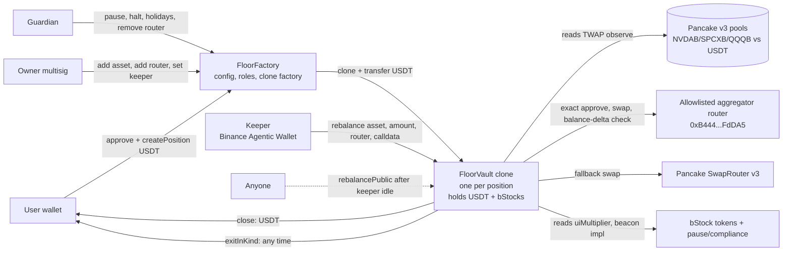

# Floor: smart-contract design (BSC mainnet)

Status: design only. Nothing here is deployed. Written 2026-10-02 (Fri). Build window ~8 days.
Every external fact has a source URL or a reproducible RPC call. Anything not checked is marked **unverified**.

RPC used for all read-only checks: `https://bsc-dataseed.bnbchain.org` (call it `$R`). Block at time of checks: 125,295,731.
Examples use Foundry `cast` (installed on this machine, forge 1.5.1).

---

## 0. Findings that change the plan (read first)

1. **EXECUTION.md section 4 is wrong about pause and blacklist.** The bStocks have an issuer-controlled
   **per-token pause**, an **address blocklist per token** and a **sanctions list**. They sit in two
   helper contracts the token calls. Details in section 4. The emergency path (section 9) is built around this.
2. **bStocks follow ERC-8056 ("Scaled UI Amount").** `balanceOf` and `totalSupply` are raw and never
   change when the multiplier changes. Only the UI view changes. The vault can hold raw balances and
   value them with the pool price per raw token. It does not need to multiply by the multiplier.
3. **Trading directly on the Pancake v3 pool costs 10 to 50 times more than the aggregator route** that
   CONTEXT.md quotes (5.9 bps round trip for NVDAB). Reason: the direct 0.25% pools charge 25 bps each way.
   The 0.05% and 0.01% pools are nearly empty for NVDAB/SPCXB. So the cheap fills come from other venues
   that only the aggregator reaches. Recommendation: **Option B (aggregator calldata, guarded by on-chain
   min-out vs a TWAP)** as the main path, **Option A (direct Pancake v3)** only as the permissionless
   fallback.
4. **A Pancake v3 TWAP is a usable on-chain price** for NVDAB, SPCXB and QQQB, if we cap trade sizes
   and TVL. No Chainlink or Binance Oracle feed for these tokens was found for BSC. Pyth has equity feeds
   but its public endpoint needed a key today. Details in section 3.
5. **Per-position isolated vaults** (one clone per deposit) is the only structure where a floor is simple
   and one user's loss cannot touch another's.

---

## 1. Summary of the recommended design

**Floor Factory** creates **one small vault contract per position** (EIP-1167 clone). The user's USDT goes
into that vault and nowhere else. A keeper (the Binance Agentic Wallet, or any allowlisted address) calls
`rebalance` on positions. The vault recomputes everything itself from an on-chain Pancake v3 TWAP, so the
keeper only chooses timing and the swap route. Every swap is checked by balance deltas inside the vault.
The user can always leave: `exitInKind` needs no keeper, no factory and no market hours.



Contracts (3 deployables, small):

| Contract | Purpose | Approx size |
|---|---|---|
| `FloorFactory` | Config, roles, allowlists (assets, pools, routers, holidays), creates clones. Holds no user funds. | ~250 lines |
| `FloorVault` (implementation, cloned) | One position: custody, CPPI maths, guarded swaps, exit. | ~450 lines |
| `FloorLens` (view only) | `previewRebalance` and `scan` for the keeper and the web app. | ~120 lines |

Libraries: `CPPIMath`, `TwapOracle`, `MarketHours`, `SwapGuard`.

### Why this structure (Question 1)

| Option | Verdict | Why |
|---|---|---|
| **One vault per position (clone)** | **Chosen** | Floor F and path (when you deposited, at what price) are per user. A clone stores one F, one maturity, one set of balances. No share price, no accounting between users, no way for user A's loss to reach user B. Invariants are local and easy to fuzz. Clone cost on BSC is tiny (about 45k gas for the clone plus init, cents). |
| Pooled ERC-4626 per (basket, floor, term) series | Rejected for v1 | A pooled share price only works if everyone starts at the same time and price. Late depositors would need a new floor relative to a moved NAV, so you need epochs (deposit window, then closed). That adds epoch logic, share maths, rounding and donation attacks. It also socialises gap losses inside the series. Cheaper keeper work (one rebalance per series), but not worth the complexity in 8 days. |
| Per-user sub-accounts inside one contract | Rejected | Same maths as clones, but one bug or one stuck token affects everyone, and a shared contract holds all funds (bigger blast radius). Clones give the same logic with isolation for free. |

Costs of the chosen design, stated plainly:
- The keeper must visit N positions. Fine for hackathon scale (tens of positions). A batcher is a stretch item (section 7).
- No pooling means each position pays its own swap costs. With the aggregator that is a few bps at $10k.
- No ERC-4626 interface. Not needed. A position is not a fungible share.

Deposit rules (keeps the maths simple):
- v1 accepts **USDT only**. The floor is a USDT amount, so no price is needed at deposit. (Accepting bStocks
  would need a TWAP valuation at deposit and a pause/blocklist pre-check. Deferred.)
- **One deposit per position.** No top-ups, no partial withdrawals before maturity. Want more? Open another
  position. This keeps F fixed and removes a class of bugs.
- Positions hold a basket of 1 to 3 assets with fixed weights in bps (sum 10,000), from the factory allowlist.
  One cushion for the whole position. This matches the basket backtest in RESEARCH_RESULTS.md.
- m = 4 is a **constant** in v1 (one knob fewer). Stored per position at creation so a later factory can change it.

---

## 2. Verified on-chain facts (all reproducible)

| Fact | Value | How to reproduce |
|---|---|---|
| bStock tokens share one custom beacon proxy | Beacon `0x156d6dce9a4f6139a3406f1f021f1a4880de93a3`, hardcoded in proxy bytecode | `cast code <token> --rpc-url $R` for NVDAB, SPCXB, QQQB: identical, beacon at bytes 7..27 |
| Beacon implementation | `0xCFEd6c4679297ea4889F8183bC057B4A86C64e46` (10,836 bytes) | `cast call 0x156d...93a3 "implementation()(address)"` |
| Beacon owner | `0x4333DAf4481F281F3D3d2B8735cE80bc00028d0C`. **Has no code: an EOA (or MPC key), not a contract multisig.** One key can upgrade every bStock. | `cast call <beacon> "owner()(address)"`, then `cast code <owner>` returns `0x` |
| Token decimals | 18 for NVDAB, SPCXB, QQQB | `cast call <token> "decimals()(uint8)"` |
| USDT (BSC-USD) | `0x55d398326f99059fF775485246999027B3197955`, name "Tether USD", 18 decimals. No blacklist or pause selectors in bytecode. `mint(uint256)` and `getOwner()` exist (peg token). | `cast call ... "name()(string)"`; selector scan of `cast code` |
| PancakeSwap v3 Factory | `0x0BFbCF9fa4f9C56B0F40a671Ad40E0805A091865`; pool deployer `0x41ff9AA7e16B8B1a8a8dc4f0eFacd93D02d071c9` | `cast call <factory> "poolDeployer()(address)"` |
| Pancake v3 SwapRouter | `0x1b81D678ffb9C0263b24A97847620C99d213eB14` (`factory()` returns the factory above, `WETH9()` = WBNB `0xbb4C...095c`) | `cast call <router> "factory()(address)"` |
| Pancake v3 QuoterV2 | `0xB048Bbc1Ee6b733FFfCFb9e9CeF7375518e25997` (`factory()` returns the factory above) | `cast call <quoter> "factory()(address)"` |
| Pancake SmartRouter | `0x13f4EA83D0bd40E75C8222255bc855a974568Dd4` (`factoryV3()` matches). Not used in the design. | `cast call ... "factoryV3()(address)"` |
| Binance aggregator router (from EXECUTION.md) | `0xB44446b0c8E56988c34f7Ff73Ae904982b5FdDA5`. 180-byte selector-forwarding proxy (looks like a diamond-style dispatcher). Its `owner()` is `0x1c6F8a6D1011Ca0334F6f8F5E2f9222eF1b68Fa9`, **also code-less (EOA)**. So its logic can change at any time. | `cast code`, `cast call <router> "owner()(address)"`, `cast code <owner>` |
| Tooling for fork tests | BSC supports PUSH0, TSTORE (EIP-1153) and MCOPY. | `eth_call` with creation code `0x600160005d60006000f3` returns `0x` (no invalid opcode) |

### Pools (USDT vs bStock), measured 2026-10-02 12:50 UTC

Pool address from `getPool(token, USDT, fee)`. `liquidity()` is active in-range liquidity. Cardinality is
`slot0.observationCardinality`. "Approx TVL" = USDT balance + token balance at the current tick price. It
includes uncollected fees, so treat it as +/- 10%. (EXECUTION.md quotes NVDAB/USDT ~$3.35M; I measure ~$4.8M
now. The pool moves. Use a live number at deploy.)

| Token | Fee | Pool | Active liq. | Cardinality | Approx TVL |
|---|---|---|---|---|---|
| **NVDAB** | 0.25% | `0x8FB4243b553aC29BA088aCf00B9B7dA24bD6690C` | 4.65e24 | 3000 | ~$4.8M |
| NVDAB | 1% | `0x18d52270d09AB842c87acd45977dCF64a82FA4ad` | 5.9e23 | 64 | ~$0.35M |
| NVDAB | 0.05% | `0xCC2bFfaeC373a6004bb6cCc8a62Cdd66061f7C6a` | 1.9e22 | 1 | thin (unusable: price impact >80% on $10k buy) |
| **SPCXB** | 0.25% | `0x977DaFFC095b33872E2741c19568925015C35b4d` | 2.29e24 | 4000 | ~$2.2M |
| SPCXB | 0.05% | `0x626301d37c135a6f368aDC6a12FE1462B14ef03a` | 4.8e21 | 4000 | ~$30k |
| **QQQB** | 0.01% | `0xe531fcb1F5a195de7608B9F4f9518544C2cdB693` | 6.0e23 | 5000 | ~$1.1M |
| QQQB | 0.05% | `0x7C84F9943Ec82cf2233c97A7Ee417f18bD2eC295` | 8.4e21 | 150 | ~$20k |
| SPYB (optional) | 0.01% | `0x7aA6d92Fc369A8C1EDc631A3aAc44eFB0808ddbF` | 6.1e23 | 500 | ~$0.25M |

Reproduce: `cast call 0x0BFb...1865 "getPool(address,address,uint24)(address)" <token> <USDT> <fee>`, then
`cast call <pool> "liquidity()(uint128)"` and `"slot0()(uint160,int24,uint16,uint16,uint16,uint32,bool)"`.

**TWAP pools to use (deepest, with large oracle history): NVDAB 0.25%, SPCXB 0.25%, QQQB 0.01%.**
Token order: NVDAB < USDT (token0 = NVDAB). SPCXB > USDT (token0 = USDT). QQQB is token0 on its pool (QQQB < USDT by address; correcting the earlier note). The code must read `token0()` from the pool instead of assuming.

Price sanity: NVDAB pool tick 54,624 gives 235.6 USDT. Venus ResilientOracle gives 234.98 (section 3).
SPCXB pool 149.4; Venus 149.6. TWAP check: `observe([1800,0])` on the NVDAB pool gave an average tick 54,613
(235.3) against spot 235.6.

---

## 3. Price source (Question 2)

### What exists

| Source | On BSC for NVDAB/SPCXB/QQQB? | Evidence |
|---|---|---|
| **Chainlink Data Streams** (US equities incl. SPY, QQQ, NVDA, AAPL, MSFT; 37 chains; supports market-closed suspension) | **Unverified for these bStocks.** BNB Chain is "early access" for Data Streams, which is pull-based and needs access and fees. Not a drop-in push feed. | https://cryptoslate.com/chainlink-launches-real-time-us-equities-data-stream-on-37-blockchains/ ; search result summary of https://docs.chain.link/data-streams/supported-networks |
| **Chainlink push feeds (AggregatorV3)** for NVDA/QQQ/SPCX on BSC | **Not found.** Not verified either way. | Searches returned only Data Streams and the Ondo/Chainlink custom feed deal (https://finance.yahoo.com/news/ondo-taps-chainlink-power-data-142836219.html). |
| **Pyth** | The equity feeds exist: NVDA `b1073854...a593`, QQQ `9695e2b9...452d`, SPCX `8a593d6e...bb94` (with market schedule and holidays). Pyth contract on BSC `0x4D7E825f80bDf85e913E0DD2A2D54927e9dE1594` has code (address is from memory, only the code check is verified). **Pull-based**: someone must submit signed update data. The public Hermes `updates/price/latest` call returned `unauthorized` today, so it needs a key. That is a live dependency risk for 8 days. Pyth quotes the share price, not the bStock raw token (needs `uiMultiplier`). | `curl "https://hermes.pyth.network/v2/price_feeds?query=NVDA&asset_type=equity"` (works); `curl -g ".../v2/updates/price/latest?ids[]=<id>"` returned `unauthorized`. `cast code 0x4D7E...1594` |
| **Venus ResilientOracle** | `0x6592b5DE802159F3E74B2486b091D11a8256ab8A` returns prices for NVDAB (234.98), SPCXB (149.62), TSLAB (356.64). **QQQB reverts** ("invalid resilient oracle price", no config). Main and pivot oracle contracts are owned by `0x939bD8d64c0A9583A7Dcea9933f7b21697ab6396` (likely Venus governance timelock, **unverified**). Governance-controlled, not ours to depend on. Useful as a **fork-test cross-check**, not as a dependency. | `cast call <RO> "getPrice(address)(uint256)" <token>`; `getTokenConfig` |
| Binance Oracle | No bStock feed found. Venus has had a Binance Oracle outage that caused losses (https://forklog.com/en/news/venus-suffers-274000-loss-from-binance-oracle-outage). | search |
| Venus/Lista bStock oracle provider (Atlas) | Atlas says it supplies first-party feeds to Venus and Lista (https://coinmarketcap.com/academy/pt/article/atlas-goes-live-venus-protocol-lista-dao). No public contract for a Floor-usable feed found. | search |

### Pancake v3 TWAP: how manipulable?

Measured with QuoterV2 (`quoteExactInputSingle`, read-only) on the chosen pools. Impact is vs a 1-USDT
quote, so it includes the pool fee. Round numbers:

| Pool | Buy $10k | Buy $100k | Buy $500k | Sell $10k | Sell $100k |
|---|---|---|---|---|---|
| NVDAB 0.25% | 1.4 bps | 14 bps | 146 bps | 51 bps | 64 bps |
| SPCXB 0.25% | 3.6 | 43 | 479 | 54 | 85 |
| QQQB 0.01% | 19 | 238 | (empty beyond range) | 12 | 51 |

(Sell numbers include the fee on both sides because the baseline quote already paid it once. Read them as
"sell side costs about 25 bps more than buy side on 0.25% pools".)

Reading this:
- To move NVDAB by ~1% you must buy about $400k. To move SPCXB by 1%, about $120k. To move QQQB by 1%,
  about $40k.
- A TWAP needs that displacement held for the whole window while arbitrageurs trade against it. A same-block
  flash move does not enter the average (Uniswap v3 `observe` uses the tick from before the current block).
- So manipulating a 10-minute TWAP by 1% costs the attacker roughly the displaced notional times the
  displacement, repeatedly, plus fees. For vault trades of $10k to $50k the profit is far below the cost
  on NVDAB and SPCXB. **QQQB is the weakest pool**: cheap to move, so QQQB needs a lower per-trade cap.
- The pools are 24/7. On weekends they trade without a reference price. That is why we do not trade then.

### Recommendation: on-chain TWAP as the only price, keeper supplies no price

| Choice | Decision | Reason |
|---|---|---|
| Keeper submits the price | **No** | A keeper-set price needs trust. Even bounded, the keeper decides the price within the band. The Agentic Wallet key is a hot key. |
| On-chain Pancake v3 TWAP, 10-minute window | **Yes** | No new trust, no extra dependency, works for all 3 tokens, fully testable on a fork. |
| Pyth / Chainlink Data Streams | **Not in v1** | Pull model, access or keys uncertain, QQQB-bStock multiplier mapping to add. Possible v1.1 second guard (`IPriceGuard`). |
| Venus oracle | Fork-test cross-check only | Governance-owned, no QQQB. |

The TWAP is used for two things:
1. **Valuation** `V` (all holdings priced at TWAP).
2. **Execution bound**: `minOut` for a swap is computed in the vault from the TWAP price and a tolerance.

Guards (all fail closed: revert and do nothing):
- Window `twapWindow = 600 s` (10 min). Why: short enough to follow a real move within a rebalance
  cycle, long enough that moving it costs real capital. Tradeoff: after a fast crash the TWAP lags and sells
  are delayed up to ~10 minutes. The m=4 sizing does not cover intraday lag below the 25% gap tolerance in
  any case, see section 5.
- `|spotTick - twapTick| <= maxTickDev` (default 300 ticks ~3%). Spot from `slot0`. Reverts `PriceDeviation`.
- Oracle history: `observationCardinality >= 200` and `observe` must not revert (`OLD` means history is
  too short; revert `OracleHistoryTooShort`).
- Pool `liquidity()` >= `minLiquidity[asset]` (guards a drained pool).
- Per-trade value cap `maxTradeValue[asset]` (launch: NVDAB 25k, SPCXB 10k, QQQB 5k USDT; **proposed**, tune
  from quotes at deploy).
- Global launch cap on TVL per position (`maxDeposit`, launch: 1,000 USDT) and total (`maxTotalTvl`, launch: 5,000 USDT, shared by all users). The OWNER can change both at any time with `setLimits(maxDeposit, maxTotalTvl)`, with no redeploy; existing positions are unaffected. A caller with `maxTotalTvl` of USDT can fill the shared cap and block new deposits (Pashov run 06, 2026-10-05: proposed acceptance, see `reviews/acceptances.md`). `totalTvl` counts deposits of OPEN positions: a vault reports its close once to `factory.onPositionClosed()` (from `closeToUSDT` / `exitInKind`, best effort, gas capped, result ignored) and the deposit is released. Minimum deposit is 1 USDT (A12 F-07 / F-01).
- Pricing when a pool guard fails (A12 F-03, A12r M-01): the asset cannot be traded and buys are suppressed, but it is still VALUED at its 10-minute TWAP (history is required, the spot-deviation and liquidity guards are not), so pushing one pool's spot for a block cannot understate V and force a sale of another asset. Only an asset with no TWAP at all (history too short) counts as 0, which can only make the vault sell more, never buy more. Preview (`previewRebalance`) skips an asset that cannot be traded (failed price, or a multiplier in its transition window; Pashov 02 #10) and treats a reverting token beacon as "buys blocked" (A12r L-02).
- Multiplier guard (section 4).

Failure modes of the TWAP design and what happens:

| Failure | Effect | Handling |
|---|---|---|
| Pool drained, or manipulated beyond `maxTickDev` | Rebalance reverts | Position idles. Exposure may be wrong. Owner can exit in kind. |
| Long manipulation within the 3% band | Mispriced sizing or a worse fill, loss bounded by tolerance (30 bps) times trade size, and capped by `maxTradeValue` | Accepted, small. |
| Pool price per raw token differs from the stock price (premium or discount) | The vault values at DEX price, the user's floor is on DEX value. Honest and consistent. | Document: floor is in on-chain USDT value, not in NYSE price. |
| Cardinality too low after a pool config change | `OracleHistoryTooShort` | Guardian disables the asset or picks another pool. |

---

## 4. bStock token behaviour (Question 4)

### Method

1. Selector scan of the implementation bytecode (`cast code 0xCFEd...4e46`) against the OpenChain
   signature database (`https://api.openchain.xyz/signature-database/v1/lookup?function=<selectors>`).
2. `eth_call` on the live tokens and helper contracts.
3. Public standard: ERC-8056 https://eips.ethereum.org/EIPS/eip-8056 and BNB Chain docs
   https://docs.bnbchain.org/developer-kit/scaled-ui-amount/ .

### Multiplier (rebasing or not?)

- **Not rebasing.** ERC-8056 states `balanceOf()` and `totalSupply()` stay fixed. The multiplier only scales
  the "UI amount" (what the user sees as shares). Source: the EIP and https://sqd.dev/learn/erc-8056-tokenized-stock-splits/ .
- On the live tokens: `uiMultiplier()` NVDAB = 1.000778223752807865, QQQB = 1.000724838657573033,
  SPCXB = 1.0. `balanceOf(pool)` is the raw number and `balanceOfUI` multiplies it. `toUIAmount(1e18)` =
  1.000778e18. `pendingMultiplier()` = 0, `hasPendingMultiplier()` = false, `effectiveAt()` = 0 for all three.
  (`cast call <token> "uiMultiplier()(uint256)"`, `"balanceOfUI(address)(uint256)"`, `"pendingMultiplier()(uint256)"`.)
  A multiplier above 1 on NVDAB/QQQB looks like dividends already applied (**unverified reading**).
- Multiplier changes are scheduled: `setUIMultiplier(uint256,uint256)` (selector `0x93d32890`, probably
  value and effective time; **unverified**), with `pendingMultiplier`, `newUIMultiplier`, `effectiveAt`
  views. The implementation also contains the strings "SecuritiesToken: multiplier below minimum (1e-9x)",
  "...above maximum (1e9x)", "ERC8056: effective time must be in future".
- Archive state is not available on public BSC RPC (`missing trie node`), so I could not read past
  multiplier values or events. **Unverified:** how often it changes and whether the Pancake pool price per
  raw token steps when it does.

### How the vault accounts for it

- The vault stores and moves **raw balances**. `V = usdt + sum(rawBalance_i * pricePerRawToken_i)`.
- The Pancake pool trades raw tokens, so its TWAP is already a price per raw token. No multiplier maths
  anywhere in CPPI. (If we ever used an external stock price, we would need price_per_raw = stock_price *
  uiMultiplier. Not needed in v1.)
- **Risk** is timing, not accounting: if the market price per raw token steps around a multiplier change,
  a 10-minute TWAP is stale for up to 10 minutes. Guard: `MultiplierWatch` in the factory.
  - `pokeMultiplier(token)` (permissionless) stores `lastMultiplier[token]` and `lastChange[token]` when
    `uiMultiplier()` differs.
  - If `uiMultiplier() != lastMultiplier[token]` the vault itself calls `pokeMultiplier(token)` and the `rebalance` /
    `rebalancePublic` call ends as a no-op that does NOT revert (so the update persists; A12 F-05). No keeper poke is
    needed, though a keeper poking every cycle starts the settle window earlier. Then `rebalance` reverts
    `MultiplierTransition` if
    `block.timestamp < lastChange[token] + twapWindow`, or `hasPendingMultiplier()` with
    `effectiveAt() - 1 hour <= block.timestamp`.
  - Sells in a transition are blocked too (conservative; transitions are rare and short). Open question:
    allow sells after the poke.

### Transfer restrictions that could trap funds (contradicts EXECUTION.md section 4)

Facts from selectors and live reads:

| Mechanism | Evidence | Who controls it |
|---|---|---|
| **Per-token pause and global pause** | The token implementation has selector `0x890d4112 setPauseManager(address)`, `0xabd13afe pauseManager()`, `0x5e76ad54 isTokenPaused(address)` and error `0xe7792495 TokenPaused()`. `pauseManager()` = `0x9fc74Be63f3589485B2423984a7a0557e0CF700a` for all three. That contract has `pauseToken(address)`, `unpauseToken`, `pauseAllTokens()`, `unpauseAllTokens()`, `pausedTokens(address)`, `allTokensPaused()`. Today: all false. | Admin `0xF3eFf082d1b859C75cdE44871E96968E543EA491` and an ops role `0x6A8ba4A89E6877Be3170a559C4Cec29A4cF77F46`, **both EOAs** (no code). Also `pauseManager` itself is settable by the token admin. |
| **Compliance contract** with **per-token address blocklist** and **sanctions list** | Token has `0x6290865d compliance()` = `0x53dBa7AaBDe774787A1F57236B235567dA8e14F4`, `0x34dae8d5 checkIsCompliant(address,address)`, `0xf8981789 setCompliance(address)`. That contract has `addToBlocklist(address token, address[])`, `removeFromBlocklist`, `addToSanctionsList(address[])`, `sanctionedAddresses(address)`, and error `UserSanctioned()`. | Role admin `0x6f64F80B50efbf0f5f13D72d16eC17a59abBe5C6`, ops `0xA4E4975433038361eDc07D726022cb29A6aABC3e` (both EOAs). Compliance role has no members today. |
| Mint and burn switches | `mintEnabled()`, `burnEnabled()` both true. | Issuer. |
| Token admin / issuers | Default admin `0x45e35Fe982F3869221b222Abea372fA97AA7679d` (EOA). Three issuer addresses. | Issuer. |
| Upgrade | Beacon owner `0x4333...8d0C` (EOA) can swap implementation for all bStocks at once. | Issuer. |
| Allowlist (only approved holders) | **Not found.** A `simulate` of `transfer(contract, 1e18)` from the NVDAB pool to the QuoterV2 contract and to a random address both succeeded (`cast call <token> "transfer(address,uint256)(bool)" <to> 1e18 --from <pool>`). So a contract can hold and move bStocks today. | n/a |

What I did **not** confirm: that `transfer` actually calls `checkIsCompliant` (the implementation has the
selector and the `ComplianceZeroAddress` error, which strongly suggests it does). **Unverified: whether
blocklisting applies to sender, receiver or both.** I could not call `checkIsCompliant` directly
(reverts for non-token callers).

Consequences for Floor:
- Issuer can **freeze all swaps** (pause), **freeze a single vault address** (blocklist) or **change token
  logic** (beacon). The vault cannot prevent any of these. It can only fail safe and let the owner recover
  whatever remains movable.
- A user who is sanctioned could be unable to receive bStocks. The `exitInKind` function therefore takes a
  `to` address (default: owner).

### Emergency path

See section 9. Short form: all failures **revert the swap**, never "half do" it. USDT is never subject to
bStock restrictions. The owner can withdraw USDT and any movable bStock at any time with no one else's help.

---

## 5. CPPI maths in fixed-point (WAD = 1e18)

Constants: `WAD = 1e18`, `BPS = 10_000`, `M = 4e18`.
All token amounts have 18 decimals (USDT on BSC is 18, bStocks are 18), so no decimal scaling is needed.
The code asserts `decimals() == 18` for every asset at registration.

Definitions (per position):
- `D` = deposited USDT.
- `F = ceilDiv(D * floorBps, BPS)`. Rounds **up**: the user's floor is never understated by rounding.
  `floorBps` allowed range [5000, 9800].
- `p_i` = TWAP price, USDT per 1e18 raw units of asset i, from the tick (WAD). `FullMath.mulDiv`.
- `V = usdtBal + sum_i floor(bal_i * p_i / WAD)`. Rounds **down**: value never overstated.
- `C = V > F ? V - F : 0` (cushion).
- `E* = min(floor(C * M / WAD), V)`. Rounds **down**: exposure target never overstated.
- Per-asset target `T_i = floor(E* * w_i / BPS)`, `w_i` in bps summing to 10,000.
- Current `E_i = floor(bal_i * p_i / WAD)`. `E = sum E_i`.
- After maturity or when `closing`: `E* = 0`.

Trade rule for asset i (one swap per call):
- **Sell** if `E_i > T_i` and `(E_i - T_i) * BPS >= band_i * V`, or if `E* == 0` and `E_i > dust` (the final unwind may be smaller than `minTrade`, so `closeToUSDT` can always finish; Pashov F-01).
  `amountValue = E_i - T_i` (all of E_i when `E* == 0`). Bands default: `sellBandBps = 100` (1% of V).
  `sellband_i = max(1, sellBandBps * bandMul * w_i / BPS)` (Pashov 02 #9, FIX3): the sell band is scaled by the asset's weight, so the
  sum of the per-asset drifts of a basket stays inside ONE band instead of one band per asset. A single asset (w = 100%) is unchanged.
- **Buy** if `T_i > E_i` and `(T_i - E_i) * BPS >= buyband_i * V`, with `buyband_i = max(1, buyBandBps * bandMul * w_i / BPS)`
  (Pashov 03 #3, FIX4: the buy band is scaled by the weight EXACTLY like the sell band, so the two sides are consistent).
  `amountValue = min(T_i - E_i, usdtBal)`.
  **The band rule, in one place:** bands are a share of V, split across the basket by weight. Sell an asset when it is over its
  target by at least `sellBandBps * w_i` of V, buy it when it is under by at least `buyBandBps * w_i` of V (defaults 1% and 2%
  of V for the whole basket, so 0.2% and 0.4% of V for a 20% token). A small overshoot of a low-weight token is not sold, and
  a large shortfall of a low-weight token is not left unbought. The sell band stays below the buy band for every weight
  (hysteresis). `minTrade` still limits buys (and a sell above `dust`, see below). Tests: `PashovFix4.t.sol` `test_F3_*`.
  Default `buyBandBps = 200` (2% of V). Buying is the lazier side: it only adds risk, so we wait for a bigger gap
  and save trading cost. Selling protects the floor, so it triggers sooner.
- Buys ignore `amountValue < minTrade` (default 20 USDT). SELLS ignore `minTrade` and only need `amountValue > dust` (Pashov 02 #4,
  FIX3): a small position (the demo positions are tiny) must be able to de-risk and finish its unwind; the band already keeps
  sells from being noise.
- A HELD asset with no TWAP at all (`observe` reverts) counts as 0, so V is understated and E* may even be 0. Since FIX3 (Pashov 02 #8)
  CPPI sells of OTHER assets are suspended while that is the case (`State.noPrice`), instead of selling them against a wrong V. Not
  suspended: a disabled asset, and the lifecycle unwind (Closing or matured), which do not depend on V. Exits are never affected.
- A failed price of a DISABLED asset (target 0): it is valued at its last good TWAP like an active token (FIX5, Pashov 04 #2), so
  pushing its spot cannot understate V and make the vault sell the ACTIVE tokens. The TWAP only sizes sells: if it is worth more than
  `dust` buys of every token are suppressed (`anyFailed`) and the cash lock is never set. With no TWAP at all it is unpriced (V
  understated, CPPI sells of the others suspended, `noPrice`). A dust amount (1 wei) with a failed price changes nothing (Pashov 02 #7).
  Trade-off: a TWAP raised in a thin disabled pool can inflate V and make the vault sell less, never buy.
- A HELD bStock that the issuer has paused or blocklisted (`pauseManager().isTokenPaused(token)`) keeps its last pool price in V, which
  may be wrong when it reopens: buys of the others are suppressed while it is held (Pashov 03 lead). `previewRebalance` skips a
  paused token and shows the next one (Pashov 03 #4). Sells of the others and all exits go on.
- Fail-soft pricing (A12 F-03, Pashov F-02): an asset whose price fails a guard (history, deviation, liquidity) is valued
  at 0 instead of reverting the whole call. V is then understated, so the vault only sells more; BUYS are suppressed
  while any asset is unpriceable. The asset being traded must itself pass every guard (no price, no trade).
  `valuation()` / `claimValue()` return the understated V in that state. Residual: an attacker who pushes one pool
  off its TWAP can force the vault to de-risk (sell) other holdings; bounded by `maxTradeValue` and `tol`.
- Cap `amountValue <= maxTradeValue[asset]`.
- Sell input `amountIn = floor(amountValue * WAD / p_i)`, capped at `bal_i`. Rounds down.
- Buy input `amountIn = amountValue` (USDT).
- `minOut`: sell `floor(amountIn * p_i / WAD * (BPS - tolBps) / BPS)`; buy `floor(amountIn * WAD / p_i * (BPS - tolBps) / BPS)`.
  Round **down** (a lower minimum would favour the swapper; rounding down is the tolerant direction, so the tolerance
  bound is the real protection). `tolBps` default 30 for the aggregator path, 100 for the direct Pancake path
  (must cover the 25 bps pool fee).
- The vault enforces that the keeper's `amountIn` is `<= computed amountIn` and `>= ceil(computed / 2)` and non-zero (so a keeper
  cannot nibble pennies to burn the rate limit, nor overshoot, nor send a zero-size trade that only resets `lastRebalance`).

Invariant by construction: `E* <= V` and `E* <= M * C`. `sum T_i <= E*` (flooring). USDT never goes
negative because buys are capped by `usdtBal`.

### Worked example (matches CONTEXT.md): $10,000 deposit, F = $9,000, m = 4, one asset at 100% weight

Numbers in USDT. Rebalance at each step, bands ignored for clarity, no trading cost.

| Step | Event | Stock | USDT | V | C = V - F | E* = min(4C, V) | Trade |
|---|---|---|---|---|---|---|---|
| 0 | Deposit, first rebalance | 4,000 | 6,000 | 10,000 | 1,000 | 4,000 | buy 4,000 |
| 1 | Stock -10% | 3,600 | 6,000 | 9,600 | 600 | 2,400 | sell 1,200 |
| 2 | Stock -10% again | 2,160 | 7,200 | 9,360 | 360 | 1,440 | sell 720 |
| 3 | Gap -25% before any trade | 1,080 | 7,920 | 9,000 | 0 | 0 | sell 1,080, cash lock |
| 0' | From step 0, stock +10% | 4,400 | 6,000 | 10,400 | 1,400 | 5,600 | buy 1,200 |

(In step 3, start from step 2 after its trade: stock 1,440, USDT 7,920. A 25% gap takes stock to 1,080, so V = 9,000 = F exactly.)

In WAD (step 0): `D = 10_000e18`, `F = 9_000e18`, `C = 1_000e18`, `E* = mulDiv(1_000e18, 4e18, 1e18) = 4_000e18`.

Why 25%: the loss on a gap g is `E * g`. With `E = m * C`, that equals `C` when `g = 1/m = 25%`.
**Honest caveats the docs and UI must carry:**
- Bands let E sit above target by up to `sellBand * V`. Worst case with a 1% band at V = 10,000: E up to 4,100,
  so tolerance drops to `1000 / 4100 = 24.4%`.
- Every trade costs a few bps and the vault buys and sells repeatedly. Costs eat the cushion. The backtest in
  RESEARCH_RESULTS.md used calm-market costs.
- The floor is in on-chain USDT value (TWAP-priced), not in NYSE price.
- The cash lock: once `C = 0` then `E* = 0`. The position stays in USDT to maturity. It cannot re-risk. Since FIX4 (Pashov 03
  lead) this is PERSISTENT: the vault stores `cashLocked = true`. From then on `E* = 0` for the rest of the term: a price recovery
  or a USDT donation never makes the vault buy stock again (the lock only costs upside; the floor is never at stake). Because it is
  permanent, FIX5 (Pashov 04 #3, #4) sets it ONLY from a price that passed every guard (`_lockCheck`):
  - Active, before maturity, market open and not halted or paused (`rebalance`, `rebalancePublic` already require it;
    `lockIfBelowFloor()` reverts `TradingClosed` otherwise);
  - no asset failed its TWAP, spot-deviation or liquidity guard, no held asset is paused or unpriced, and no disabled token with
    a failed price is worth more than `dust`;
  - every listed token's multiplier is settled (not stale, not changed within `twapWindow`, no change due within an hour);
  - confirmation margin: `V * (BPS + tolDirectBps) <= F * BPS`, i.e. V below the floor by `tolDirectBps` (1% by default).
    One swap loses at most `tolDirectBps` of its value (at most V), so a sandwich fill loss near the floor cannot trip the lock.
    Between `F - margin` and `F` the target is already `E* = 0` (no buys); the lock simply is not set yet.
  A lock set inside `rebalance` or `rebalancePublic` survives: if the call then cannot trade (wrong direction, nothing to do,
  failed price for the traded token) it returns instead of reverting. A keeper should call `lockIfBelowFloor()` when it sees
  `V <= F` with nothing to sell. After the lock a held token with no TWAP no longer blocks the sale of the others (the unwind
  does not depend on V). Consequence the product copy must keep: after the floor was hit the position stays in cash and earns no
  upside, and a weight that was disabled stays in USDT.
- Weekend gaps are fully exposed (no trades on weekends, section 6).

---

## 6. Market-closed pause (Question 5)

**Decision: a time rule on-chain plus a guardian-maintained holiday table plus a guardian halt flag. No keeper flag.**
Why: a keeper-asserted "market open" is exactly the unbounded power we want to avoid; a time rule is
deterministic and testable; a holiday table is cheap data that a human can review.

Rule (`MarketHours.isOpen(ts)`), all UTC:
1. `day = ts / 86400`, `weekday = (day + 3) % 7` (0 = Monday; check: day 20000 is Friday, `(20000+3)%7 = 4`).
   Closed if `weekday >= 5`.
2. Closed if `nonTradingDay[day]` is set (factory storage, set by guardian, bitmap by day).
3. Closed unless `secondsOfDay` is in **[15:30, 19:30)**.
4. Closed if `halted` (guardian flag).

Why 15:30 to 19:30 UTC: US regular session is 13:30 to 20:00 UTC in daylight time (until 2026-11-01) and 14:30
to 21:00 UTC in standard time. The intersection is 14:30 to 20:00. I shrink it by an hour on the open side so
the 10-minute TWAP window never covers the opening auction, and by 30 min on the close side. This **avoids
any daylight-saving logic in the contract**. Cost: only 4 hours per weekday to trade. The backtest in
RESEARCH_RESULTS.md rebalanced at open and close, so this is within its assumptions. Pyth confirms the
schedule format `America/New_York;0930-1600` and holidays
(`curl "https://hermes.pyth.network/v2/price_feeds?query=NVDA&asset_type=equity"`).

Holidays and half-days:
- Guardian sets `nonTradingDay` for every NYSE full holiday and every early-close day (treat early close as
  closed: simplest and conservative). From the Pyth schedule string for 2026: 0907 (Labor Day), 1126
  (Thanksgiving), 1127 (half day), 1224 (half day), 1225, then 2027 dates 0101, 0118, 0215, 0326, 0531, 0618,
  0705. Cross-check against the NYSE calendar before launch. **Unverified: NYSE official list; take it from
  nyse.com at deploy.**
- Generate the table with a script at deploy and pre-load the whole term year. A missed holiday means the
  vault trades on a day the market is shut. Impact: the pool price is noise but still passes TWAP and tolerance
  bounds, so impact is bounded by the same tolerance. Accepted risk.
- Ad-hoc halts (trading halt, circuit breaker, issuer notice): guardian calls `setHalted(true)`. Binance's RWA
  Data API `statusInfo.marketStatus` (from EXECUTION.md) can drive an off-chain alert to the guardian. It is not
  trusted on-chain.

What the market flag blocks: `rebalance`, `rebalancePublic`. It does not block `exitInKind`, nor
`withdrawUSDT` after the position is unwound.

---

## 7. Roles, keeper and rate limits (Question 6)

### Roles

| Role | Who | Can | Cannot |
|---|---|---|---|
| **Owner** | Multisig (Safe) if the team can set one up in time; otherwise the team lead's hardware-wallet EOA. **Decision for team lead.** | Add or retire asset (pool, weights cap, trade cap), add router to the allowlist (activation delayed 24 h), add or remove keepers, set defaults for **new** positions, change launch caps, transfer ownership (2-step). | Touch any position. Move any user funds. Change params of existing positions. |
| **Guardian** | Separate EOA (hot, fast) | `pause()` and `unpause()` (blocks new positions and all rebalances), `setHalted`, `setNonTradingDay`, **remove** a router or asset immediately, approve a new beacon implementation. | Add a router. Move funds. Unpause is allowed for guardian but owner can also pause. |
| **Keeper** | EOA (primary). A Binance Agentic Wallet address is a supervised second keeper (DECISIONS P3) | Call `rebalance(...)` on any position, `pokeMultiplier`. | Withdraw, set prices, choose recipients, choose a non-allowlisted router, trade the wrong direction or size, trade outside market hours, trade faster than `minInterval`. |
| **Position owner** (user) | Depositor | `requestClose`, `closeToUSDT`, `exitInKind`, `rescue`. | Change floor, term or weights after creation. |
| **Anyone** | n/a | `rebalancePublic`, `pokeMultiplier`, `createPosition` for self. | n/a |

### What the keeper cannot do (and why it holds)

- Funds only move to: (a) a router and back inside one call, with the **vault** as receiver (balance-delta
  checks), or (b) the position owner. There is no `transfer(to)` for the keeper.
- Price comes from the vault, not from the keeper. The keeper passes only `assetIdx`, `amountIn`, `router`,
  `swapData`.
- Everything the keeper chooses is re-validated (direction, size window, router allowlist, `minOut`).
- Worst case from a compromised keeper: it can trigger **rule-valid** rebalances at bad timing, and for each
  one the loss is capped by `tolBps` (30 bps) times trade size (`maxTradeValue`), once per `minInterval`.
  It could also stop calling (floor then depends on the permissionless fallback).

### Rate limits and thresholds

| Parameter | Default | Why |
|---|---|---|
| `minInterval` (per position, per asset) | 15 min | Prevents ping-pong inside the TWAP window. |
| `sellBandBps` | 100 | Protect floor early. |
| `buyBandBps` | 200 | Save cost; buying only adds risk. |
| `minTrade` | 20 USDT | Avoid dust swaps (gas is cheap, but quotes are noisy). |
| `maxTradeValue[asset]` | 25k / 10k / 5k (NVDAB / SPCXB / QQQB) | Bound manipulation payoffs, see section 3. |
| `tolBps` | 30 (aggregator), 100 (direct) | Aggregator quotes were 6 bps round trip at $10k (CONTEXT.md). Leaves headroom. |
| `twapWindow` | 600 s | Section 3. |
| `maxTickDev` | 300 | ~3%. |

Gas on BSC is about 0.05 to 0.08 gwei (EXECUTION.md section 6). A 450k-gas swap is about $0.015 in BNB at current
prices (**estimate**). Keeper gas is paid by the keeper wallet. No gas refund from user funds in v1.

### Permissionless fallback

`rebalancePublic(assetIdx)`: anyone, no calldata. The vault itself computes the trade and swaps through the
**direct Pancake v3 pool** (`exactInputSingle` on the registered pool and fee). Allowed only when:
- market open, not paused, same checks as keeper path;
- `publicDelay` seconds of REAL OPEN-MARKET time have passed since THIS ASSET'S last trade, or the position start (design default 4 h; the mainnet value in `script/params/56.json` is 3600 s, decided 2026-10-04;
  Pashov 02 #11, Pashov 03 #5). Closed hours, weekends, guardian-listed holidays (`nonTradingDay`) and everything before the last
  unpause or un-halt (`factory.tradingResumedAt`) do not count (`factory.hasOpenSeconds`, a backward walk that stops as soon as the
  delay is reached). A trade of another asset does not reset it. `publicDelay` is bounded to 1 h .. 24 h of open time. NOTE: with the 4 h window and a 4 h delay the public path opens from
  the second trading day after the last rebalance; a position created at 08:00 cannot use it the same day. Use a lower
  `publicDelay` (minimum 1 h) if a same-day public trade is needed (the fork tests use 3600), and
- drift >= **2x** the normal band (so it only fires when something is clearly wrong), and
- `tolBps` = 100 (pool fee 25 bps one way plus impact).

Why this is safe: the caller has no discretion over amount, direction or recipient. Their only power is
timing. Cost: the direct path is much more expensive (25 bps fee on NVDAB/SPCXB), so it is a fallback, not a plan.

### Baw (Agentic Wallet) unknowns and the design response

CONTEXT.md lists unknowns: manual confirmation on `contract-call`, the risk engine
(`351803 AGENT_DEV_MODE_RISK_BLOCKED`), Developer Mode quota. Responses:
1. The keeper role is a **set** of addresses, not one. A spare EOA with `cast send` can take over in a minute.
2. The vault accepts the keeper's call or nothing, so no migration needed.
3. `rebalancePublic` exists for the case where no keeper works.
4. Stretch: `FloorBatcher.rebalanceMany(Call[])` (itself a registered keeper, callable only by keeper EOAs, uses
   try/catch per call) to cut `baw contract-call` count to one per tick. Build only if the quota turns out to
   be a problem.
5. **Verify early (day 2):** one `baw contract-call preview` and `execute` of a harmless view-like call on a
   test contract, to learn the confirmation and risk-engine behaviour.

The keeper loop (off-chain, outside this doc's scope) is: for each position, `FloorLens.previewRebalance` to
get `(assetIdx, tokenIn, tokenOut, amountIn, minOut)`, then `/aggregator/quote` and `/swap` with
`userWalletAddress = <vault>` and `slippagePercent` consistent with `minOut`, then `rebalance(...)`.

---

## 8. Swap execution (Question 3)

### Option A: direct Pancake v3 from the vault

Addresses are in section 2. Pro: no external calldata, deterministic, fully on-chain, easy to fork-test.
Con (measured): the usable pools charge **25 bps** (NVDAB, SPCXB) each way, so a round trip is 50 bps plus
impact (NVDAB buy $10k 1.4 bps, sell about 51 bps including fee). The aggregator quote in CONTEXT.md was 5.9 bps
round trip for NVDAB. QQQB 0.01% costs 1 bp fee but impact of 19 bps at $10k buy. Over a year with many
rebalances this decides whether the product keeps its upside.

### Option B: Binance Web3 aggregator calldata, guarded by the vault

EXECUTION.md section 2: `GET /api/v1/dex/aggregator/swap` returns `tx.to` (router), `tx.data`,
`minReceiveAmount`. The router in the example is `0xB44446b0c8E56988c34f7Ff73Ae904982b5FdDA5`. One route in
EXECUTION.md went USDT to QQQB via "Tessera V" then QQQB to TSLAB via Pancake V3, so the cheap venues are not all Pancake.

**Vault execution procedure (`SwapGuard.exec`):**
1. Check `router` is in the factory allowlist (activation delayed 24 h; guardian can remove instantly).
2. Snapshot balances of `tokenIn`, `tokenOut` and every other tracked asset and USDT.
3. `tokenIn.forceApprove(router, amountIn)`. Exact amount, never unlimited.
4. `(ok,) = router.call(swapData)` with `value = 0`. Revert on failure.
5. `tokenIn.forceApprove(router, 0)`.
6. Require: `balanceBefore(tokenIn) - balanceAfter(tokenIn) <= amountIn`; `balanceAfter(tokenOut) - balanceBefore(tokenOut) >= minOut`;
   every other tracked token balance `>=` its snapshot.
7. Emit `Rebalanced`.

This neutralises a malicious or upgraded router: it can take at most `amountIn`, and must give back at least
`minOut` computed from the TWAP, in the vault's own balance. The router owner is an EOA (section 2), so a router logic change is a
real possibility; the checks make it bounded rather than catastrophic.

Things we cannot check on-chain and must test:
- **Does the aggregator return working calldata when `userWalletAddress` is a contract?** Quote docs say
  `userWalletAddress` is required for RFQ routes. RFQ routes may need an EOA signature or `tx.origin`. **Unverified.**
  Smoke test (section 12) must cover this. If RFQ legs fail for contracts, ask the API for `vendor` filters
  (the quote has a `vendor` param) that return pure AMM routes.
- Quote TTL is ~30 s (EXECUTION.md); the keeper must build and send within that time. The vault does not
  need the `quoteId`.
- `/swap` needs an `approve` to the router's `approveTarget`. Same address as router in the examples, but
  **check `approveTarget` each time** and approve that, not `tx.to`, if they differ. Allowlist stores
  `(router, approveTarget)` pair. (**Design detail to keep: vault approves `approveTarget` and calls `router`.**)

### Recommendation

**Primary: Option B. Fallback: Option A (`rebalancePublic`).** One-line reason: the aggregator is 10 to 50x cheaper
in measured fees and the on-chain min-out check removes the need to trust it; Option A keeps the product alive
if the keeper or the API is down.

### Slippage and MEV protection

- On-chain: `minOut` from the 10-minute TWAP minus `tolBps`. This is the hard bound whatever the router does.
- Sandwich risk: a searcher can push the price inside the tolerance before our swap. Their gain is bounded by
  `tolBps * tradeValue` (30 bps of at most 25k = $75). Pool depth makes the push costly (section 3).
- Submission: the keeper's `baw contract-call` route to the chain is not documented to offer a private
  mempool (**unverified**). The Binance Transaction API has `enableMevProtection` on `broadcast-transaction`
  (EXECUTION.md section 2, step 7), but `baw` is separate. If we sign ourselves with a spare keeper, use that.
- Keep trades small (caps in section 7) and spread over several calls rather than one big swap.

---

## 9. Emergency design and isolation (Questions 4 and 8)

### Principles
1. **Fail closed on trading, fail open on exit.** Anything odd stops swaps. Nothing stops the owner leaving.
2. **No privileged party can move user funds.** Not the owner, guardian or keeper.
3. Sells are the safe direction. Where we can allow sells and still be safe, we do.

### State and what is allowed

| Condition | Rebalance (keeper/public) | Owner exit |
|---|---|---|
| Normal, market open | yes | yes |
| Market closed or halted | no | `exitInKind`, `closeToUSDT` if already unwound |
| Factory `paused` | no | yes |
| bStock token paused (`isTokenPaused`) | swaps revert (token) | `exitInKind`: USDT leaves, paused token is skipped, kept in vault, `rescue(token)` later |
| Vault address blocklisted or owner sanctioned | swaps/transfers of that token revert | `exitInKind(to)` lets the owner choose a clean address. A blocklisted vault cannot move that token until unblocked. USDT is unaffected. |
| Token beacon implementation changed from approved | **sells only** (reduce exposure to a changed token), buys blocked | yes |
| Price checks fail (TWAP, deviation, cardinality) | no | yes |
| Matured | target exposure 0: sells only, anyone may call | `closeToUSDT` once stock <= dust |

Beacon check: the factory stores `approvedTokenImpl` (initially `0xCFEd...4e46`) and `tokenBeacon`
(`0x156d...93a3`). Vault reads `IBeacon(tokenBeacon).implementation()` per rebalance (cheap `STATICCALL`). On
mismatch, buys revert `TokenImplChanged`. Guardian re-approves after a manual review. Honest limit: this only
detects an upgrade; it cannot detect a malicious token that was upgraded and reports the same address.

### Owner functions (user funds)

- `requestClose()`: sets `closing = true`. Target exposure becomes 0. Keeper or public path sells everything.
  Why not sell inside this call: swaps need a route; keep owner calls simple and non-failing.
- `closeToUSDT()`: requires each asset's stock value <= dust at the plain 10-minute TWAP, no spot or liquidity guard (so 1 wei of stock plus a pushed pool cannot block closing, Pashov 02 #6; no TWAP at all fails closed, use `exitInKind`) (`dustValue` default 1 USDT; per asset, not the sum, so it matches the unwind rule `E_i > dust`; A12r L-01) and transfers all USDT to
  the owner. Marks the position `Closed`. After this, if dust bStocks remain, `rescue(token)` moves them.
- `exitInKind(address to)`: **always callable by owner**. Marks `Closed`, sends ALL USDT to `to` FIRST, then for each
  asset reads `balanceOf` (staticcall, 100k gas, exactly 32 bytes of return data or the token is skipped) and calls
  `transfer` (500k gas, 32-byte return limit); any failure (revert, gas burn, empty or oversized data) skips that
  token, never reverts the exit. A caller supplying too little gas reverts the whole call (nothing is skipped
  silently). Why: one paused or malicious token (all bStocks share one beacon) must not trap the USDT (A12 F-00).
  `closeToUSDT` treats a failing `balanceOf` as an empty balance.
- `rescue(address token, address to)`: owner only, only when `Closed`, any token. Recovers a paused or blocklisted bStock
  after the issuer lifts the restriction, and any airdropped token.

Matured positions: floor is "locked in" as USDT only if the position was unwound. The vault auto-targets 0
after maturity, and the user is not forced to wait for the keeper to exit (`exitInKind`).

### Gap risk and isolation (Question 8)

- A gap that pushes `V < F`: the position's USDT and stock stay in that vault. The next rebalance sets `E* = 0`,
  sells to USDT. The user can exit with `V < F`. The loss is the user's own and only theirs. **No other position
  is touched, because there is no shared balance, no shared price, no shared share supply.**
- The only shared things are config and roles (no funds). A bad factory config affects trading rules of positions
  that read it live. Which settings are live-read (and thus dangerous) are minimised: asset and router allowlists, pause, halt,
  holidays. All **economic** parameters (floor, term, weights, m, bands, tolerance) are copied into the position
  at creation and cannot be changed.
- No borrowing, no leverage, no external liabilities, so there is nothing to socialise.
- A keeper or router failure cannot create a deficit for the user beyond a bounded swap loss (section 7).

---

## 10. Fees (Question 7)

**v1: zero protocol fee. No fee code at all.** Reasons:
1. A fee needs accounting (what to charge, when) and one more path where a bug can take user funds.
2. The demo number that matters is the floor. Fees complicate the honest message (`cushion = V - F` after costs).
3. Real revenue in the hackathon story is b402 pay-per-call for the API/MCP, which **does not touch the
   contract**: the agent pays the Floor API operator via the x402/b402 facilitator (CONTEXT.md). Different recipient,
   different layer, no on-chain coupling.

Costs users do bear: swap costs (aggregator fees and impact) and slippage, borne inside the position. Keeper gas
is paid by us.

Possible v2 (not built): performance fee taken at `closeToUSDT` only on `max(0, finalValue - deposit)`, paid to a
fixed treasury, with a hard cap in code. Only on gains means a floor-hit position pays nothing.

---

## 11. Contract list, interfaces, access control, events, errors

Solidity `0.8.28`, `evm_version = "cancun"` (verified: BSC accepts TSTORE and MCOPY), OpenZeppelin v5.

### 11.1 `FloorFactory`

Purpose: roles, config, allowlists, clone creation, global limits. Holds no funds (reverts on stray BNB;
tokens can be rescued only by owner, but there are none by design).

Storage (summary):
```solidity
address public owner; address public pendingOwner;
address public guardian;
mapping(address => bool) public isKeeper;
bool public paused; bool public halted;
mapping(uint32 => bool) public nonTradingDay;              // day = unix / 86400
address public immutable vaultImplementation;
address public immutable usdt;
address public immutable v3Factory;                        // Pancake v3 factory
address public immutable v3SwapRouter;                     // direct fallback path
address public tokenBeacon;  address public approvedTokenImpl;
struct Asset { address pool; uint24 fee; bool active; uint128 minLiquidity; uint256 maxTradeValue; bool usdtIsToken0; }
mapping(address => Asset) public assets;                   // bStock => config
struct Router { address target; address approveTarget; uint40 activeAt; bool removed; }
mapping(address => Router) public routers;
struct Defaults { uint16 sellBandBps; uint16 buyBandBps; uint32 minInterval; uint32 publicDelay;
                  uint32 twapWindow; uint16 maxTickDev; uint16 tolAggBps; uint16 tolDirectBps; uint256 minTrade; uint256 dust; }
Defaults public defaults;                                  // copied into new positions
uint256 public maxDeposit; uint256 public maxTotalTvl; uint256 public totalTvl; // launch caps
mapping(address => uint256) public lastMultiplier; mapping(address => uint40) public lastMultiplierChange;
address[] public positions; mapping(address => address[]) internal _byOwner;
```

External interface:
```solidity
interface IFloorFactory {
    // --- user ---
    /// @notice Pull `amount` USDT from msg.sender, clone a vault, initialise it. msg.sender owns the position.
    /// @param floorBps floor as bps of deposit, range [5000, 9800]
    /// @param termSeconds 7..400 days (launch: 365 days)
    /// @param assets_ 1..3 allowlisted bStocks, no duplicates
    /// @param weightsBps same length, sum == 10_000
    function createPosition(uint256 amount, uint16 floorBps, uint32 termSeconds,
        address[] calldata assets_, uint16[] calldata weightsBps) external returns (address vault);

    // --- anyone ---
    function pokeMultiplier(address token) external;     // records uiMultiplier change
    function positionsOf(address user) external view returns (address[] memory);
    function positionsCount() external view returns (uint256);
    function isTradingOpen(uint256 ts) external view returns (bool);   // MarketHours + paused + halted
    function routerOk(address router) external view returns (bool, address approveTarget);

    // --- keeper registry ---
    function setKeeper(address who, bool on) external;              // owner

    // --- guardian ---
    function pause() external;          function unpause() external;           // guardian or owner
    function setHalted(bool on) external;                                       // guardian or owner
    function setNonTradingDay(uint32 day, bool closed) external;                // guardian
    function setNonTradingDays(uint32[] calldata days_, bool closed) external;  // guardian
    function removeRouter(address router) external;                             // guardian or owner
    function disableAsset(address token) external;                              // guardian or owner
    function approveTokenImpl(address impl) external;                           // guardian

    // --- owner ---
    function addAsset(address token, address pool, uint24 fee, uint128 minLiquidity, uint256 maxTradeValue) external;
    function reenableAsset(address token) external;                             // owner: disabled asset back on, SAME pool and limits
    function onPositionClosed() external;                                       // vault -> factory, releases totalTvl once
    function addRouter(address target, address approveTarget) external;         // active after 24h; reverts RouterExists if listed and not removed
    function setGuardian(address g) external;
    function setDefaults(Defaults calldata d) external;                         // new positions only; bounds-checked
    function setLimits(uint256 maxDeposit_, uint256 maxTotalTvl_) external;
    function transferOwnership(address) external; function acceptOwnership() external;
}
```
`addAsset` checks: `IERC20Metadata(token).decimals() == 18`, `v3Factory.getPool(token, usdt, fee) == pool`, pool
`observationCardinality >= max(200, ceil(twapWindow * 4 / 3))` (one observation per 0.75 s BSC block, so a pool swapped in every block still covers the window; 800 slots for 600 s; `createPosition` re-checks every basket pool against the current window; Pashov 02 #13), a successful `observe`, and a readable `uiMultiplier()`, `hasPendingMultiplier()` and `effectiveAt()`. FIX3 also rejects a zero multiplier and `maxTradeValue < defaults.minTrade`. FIX4 requires the pool fee in bps times two to be at most `tolDirectBps` (the public swap pays the fee plus an equal price impact; fee 25 bps needs `tolDirectBps >= 50`). `reenableAsset` repeats the pool, listing and multiplier-getter checks. `setDefaults`, the factory constructor and the deploy preflight use ONE bounds library (`DefaultsCheck`: bands 1..1000 with buy >= sell, `tolAgg <= 200`, `tolDirect <= 300`, `twapWindow` 300..3600, `minInterval >= 60`, `publicDelay` 1 h..24 h and >= `minInterval`, `minTrade` 1..1000 USDT, `dust` 0.001 USDT .. `minTrade`), and in addition require every LISTED pool fee to fit the new `tolDirectBps` and every listed `maxTradeValue >= minTrade`. That the token is a beacon proxy of `tokenBeacon` cannot be read on chain: the deploy preflight reads the EIP-1967 beacon slot of each token (the three live bStocks all point to `0x156d...93a3`). `createPosition` also rejects a deposit where ANY initial token target `min(M * (D - F), D) * w_i` is below `minTrade` (`PositionTooSmall`, FIX5: that token would never be bought and its weight would sit in USDT) or below the weighted buy band (`BadFloor`: a floor so high that the first buy could never pass `buyBandBps`). With `minTrade` 20 USDT and floor 90%, a 60/40 basket needs D >= 125 USDT. `unpause`, `setHalted` and `setNonTradingDay(day, false)` restart the public delay (`tradingResumedAt`) only on a real state change. The deploy preflight also checks `router.factory() == v3Factory` and that the Pancake router is its own approve target. `createPosition` rejects `paused` or `halted`, and a term maturing less than 14 days (`UNWIND_BUFFER`) before `holidayHorizonDay` (the post-maturity unwind trades too; guardian `setHolidayHorizon`, set by the deploy script from `coversThroughDay` in the holiday JSON; 0 = unchecked). `setDefaults` now also requires `minInterval >= 60` and `dust > 0`. A token can be listed ONCE: `addAsset`
reverts `AssetExists` for a listed token, so pool, fee, `minLiquidity` and `maxTradeValue` of a live asset can never be
changed (A12 F-02, Pashov F-03). `reenableAsset` switches a disabled asset back on with its original parameters. Changing
limits needs a new factory (no in-place edit in v1; a delayed `setAssetLimits` is a possible v2 addition).

Access control: as in the table in section 7. `pause`, `setHalted`, `removeRouter`, `disableAsset` are
callable by guardian **or** owner. `addRouter` and `addAsset` only by owner.

Events:
```solidity
event PositionCreated(address indexed vault, address indexed owner, uint256 deposit, uint256 floor, uint32 maturity, address[] assets, uint16[] weights);
event KeeperSet(address indexed who, bool on);
event Paused(address by); event Unpaused(address by); event Halted(bool on);
event NonTradingDaySet(uint32 indexed day, bool closed);
event AssetAdded(address indexed token, address pool, uint24 fee); event AssetDisabled(address indexed token);
event RouterAdded(address indexed target, address approveTarget, uint40 activeAt); event RouterRemoved(address indexed target);
event TokenImplApproved(address indexed impl);
event MultiplierChanged(address indexed token, uint256 oldM, uint256 newM);
event DefaultsSet(Defaults d); event LimitsSet(uint256 maxDeposit, uint256 maxTotalTvl);
```
Errors:
```solidity
error NotOwner(); error NotGuardian(); error PausedErr(); error DepositTooLarge(); error TvlCapReached();
error BadFloor(); error BadTerm(); error BadAssets(); error BadWeights(); error AssetNotActive(address);
error RouterNotActive(); error RouterDelayTooShort(); error BadPool(); error BadDecimals(); error OracleHistoryTooShort();
error ZeroAddress();
```

### 11.2 `FloorVault` (clone)

Purpose: one position. Custody, CPPI, guarded swaps, exit.

Storage (set once in `initialize`, then only the mutable block changes):
```solidity
// immutable after init
address public factory;  address public owner;
uint256 public deposit;  uint256 public floor;          // F in USDT WAD, rounded up
uint40  public start;    uint40  public maturity;
uint8   public nAssets;  address[3] public assetAt;  uint16[3] public weightBps;
uint16  public sellBandBps; uint16 public buyBandBps; uint32 public minInterval; uint32 public publicDelay;
uint32  public twapWindow; uint16 public maxTickDev; uint16 public tolAggBps; uint16 public tolDirectBps;
uint256 public minTrade; uint256 public dust;
uint256 public constant M = 4e18;
// mutable
enum Status { Active, Closing, Closed }
Status public status;
uint40 public lastRebalance;                 // any asset
mapping(uint8 => uint40) public lastTradeAt; // per asset
```

External interface:
```solidity
interface IFloorVault {
    struct Swap { uint8 assetIdx; bool buy; uint256 amountIn; address router; bytes data; }

    function initialize(address owner_, uint256 deposit_, uint256 floor_, uint40 maturity_,
        address[] calldata assets_, uint16[] calldata weightsBps_, bytes calldata cfg) external; // factory only, once

    // --- keeper path (aggregator calldata) ---
    /// Only factory.isKeeper(msg.sender). Reverts unless trade is rule-valid, in window, and balance-deltas hold.
    function rebalance(Swap calldata s) external;

    // --- permissionless fallback (direct Pancake v3) ---
    function rebalancePublic(uint8 assetIdx) external;

    // --- user ---
    function requestClose() external;                                  // owner: sets Closing
    function closeToUSDT() external;                                   // owner: needs stock <= dust
    function exitInKind(address to) external;                          // owner: always allowed
    function rescue(address token, address to) external;               // owner: only when Closed

    // --- views ---
    function valuation() external view returns (uint256 V, uint256 usdtBal, uint256[3] memory stockValue);   // TWAP, reverts if checks fail
    function targets() external view returns (uint256 cushion, uint256 exposureTarget, uint256[3] memory target);
    function previewRebalance() external view returns (bool needed, uint8 assetIdx, bool buy, address tokenIn, address tokenOut,
        uint256 amountIn, uint256 minOutAgg, uint256 minOutDirect);
    function claimValue() external view returns (uint256);             // V at TWAP; informational
}
```
Access control: `initialize` by `factory` only (and once). `rebalance` by keeper. `rebalancePublic` anyone. Owner
functions only by `owner`. **No other function can transfer assets out.** `nonReentrant` (OZ `ReentrancyGuardTransient`)
on every state-changing external function.

Events:
```solidity
event Initialized(address indexed owner, uint256 deposit, uint256 floor, uint40 maturity);
event Rebalanced(uint8 indexed assetIdx, bool buy, uint256 amountIn, uint256 amountOut, uint256 V, uint256 exposureTarget, address indexed router, address caller);
event CloseRequested(); event Closed(address indexed to, uint256 usdtOut);
event ExitInKind(address indexed to, uint256 usdtOut, address[] skipped);
event Rescued(address indexed token, address indexed to, uint256 amount);
```
Errors:
```solidity
error NotKeeper(); error NotOwner(); error NotFactory(); error AlreadyInitialized();
error TradingClosed(); error NoTradeNeeded(); error WrongDirection(); error AmountOutOfRange();
error TooSoon(); error PublicTooEarly(); error RouterNotAllowed(); error SwapFailed();
error MinOutNotMet(uint256 got, uint256 min); error TokenInSpentTooMuch(); error OtherBalanceDecreased(address token);
error PriceDeviation(); error OracleHistoryTooShort(); error PoolIlliquid(); error TokenImplChanged(); error MultiplierTransition();
error StockNotUnwound(); error NotClosed();
```

### 11.3 `FloorLens` (view)

```solidity
interface IFloorLens {
    struct Status { address vault; uint256 V; uint256 floor; uint256 cushion; uint256 exposure; uint256 target; bool needsRebalance; bool tradingOpen; }
    function status(address vault) external view returns (Status memory);
    function scan(uint256 from, uint256 to) external view returns (address[] memory needing);
}
```
Pure convenience for the keeper and UI. No state. `try/catch` around each vault so a bad pool does not break the scan.

### 11.4 Libraries

- `CPPIMath`: `floorFor(deposit, bps)`, `cushion(V, F)`, `exposureTarget(C, V)`, `assetTarget`, `sellAmount`, `buyAmount`, `minOut`. Pure. Rounding as in section 5.
- `TwapOracle`: `twapTick(pool, window)`, `priceWad(pool, tick, usdtIsToken0)`, `spotTick(pool)`, checks. Needs `TickMath` and `FullMath`.
- `MarketHours`: `isOpen(ts, nonTrading)`; pure given the mapping read.
- `SwapGuard`: router call with balance-delta checks.

---

## 12. Invariants and test plan

### Invariants (Foundry invariant tests, plus fuzz)

| ID | Invariant | Test type |
|---|---|---|
| I1 | Keeper (any `isKeeper` address) can never reduce the vault's USDT + stock value by more than `tolBps` per rebalance (value at TWAP). | invariant with a malicious router |
| I2 | No path moves vault assets to an address other than router (within one call, net zero other than `amountIn`) or the position owner. Check with a handler that tracks all token balances of non-vault addresses. | invariant |
| I3 | After any `rebalance`, `exposure <= V` and `exposure <= M * cushion + band*V`. | invariant |
| I4 | `sum of position claims <= sum of vault assets` is trivially one vault per position; assert `balanceOf(vault)` for every token is never decreased by anything but a rebalance or exit. | invariant |
| I5 | Cash lock: if `V <= F` after TWAP valuation then `exposureTarget == 0` and no buy ever succeeds; since FIX4 the lock persists (`cashLocked`) even if V recovers. | fuzz, `PashovFix4.t.sol` |
| I6 | Rounding: `F` rounds up, `V` and `E*` round down: `floorFor(D, bps) >= D*bps/BPS` and `exposureTarget <= C*M/WAD`. | fuzz |
| I7 | No trade when `!isTradingOpen(block.timestamp)`. | fuzz with `vm.warp` over weekday and hour |
| I8 | Owner can always `exitInKind` regardless of: paused, halted, router removed, TWAP broken, token reverting. | invariant / unit |
| I9 | Position A's actions (rebalance, exit, token pause on A's asset only is not possible) never change position B's balances. | invariant with 2+ positions |
| I10 | `rebalance` reverts on wrong direction, amount above computed, amount below half, below `minInterval`, router not allowlisted. | unit and fuzz |
| I11 | Approvals to router are zero after every call. | invariant |
| I12 | After maturity, `exposureTarget == 0`. | unit |
| I13 | Factory pause cannot prevent `exitInKind`, `closeToUSDT`, `rescue`. | unit |

### Unit tests (no fork, mocks)
- `CPPIMath`: the worked example in section 5 value by value (steps 0, 1, 2, 3, 0'); caps; rounding edge cases
  (D = 1, 1e30; floorBps 5000 and 9800); `E* = V` clamp when cushion is large (F small).
- `MarketHours`: every weekday boundary 15:29:59, 15:30:00, 19:29:59, 19:30:00; Saturday; Sunday; a holiday
  set; day 20000 = Friday check; DST dates (Mar 8 and Nov 1 2026) behave the same since no DST logic.
- `TwapOracle` with a mock pool: tick to price at known ticks; token order both ways; rounding of negative
  average ticks (round toward negative infinity as Uniswap does); `observe` revert gives `OracleHistoryTooShort`.
- `SwapGuard`: MockRouter that (a) honest, (b) takes more than `amountIn`, (c) returns less than `minOut`, (d) steals
  another asset via an approval trap, (e) reenters `exitInKind`, (f) sends output to a third address.
- Factory: role matrix; 24 h router delay; 2-step ownership; caps; deposit pulls exact USDT.

### Fuzz tests
- Random price paths (bounded steps, with gaps up to `1/m`): after each rebalance, `V >= F - dust` as long as no
  single step exceeds the tolerance in section 5. Also, run a path with a larger gap and assert only that losses stay
  inside the position.
- Random `amountIn` from a hostile keeper: either reverts or the invariant holds.
- Random weights and floors.

### Fork tests (BSC mainnet; `forge test --fork-url $BSC_RPC`)
Needs an RPC that allows archive reads if a block is pinned; the public `dataseed` returns `missing trie node`
for old blocks. Use latest, or a paid key. Do not commit keys.

1. **Real tokens and pools:** `assets` registration passes `addAsset` for NVDAB, SPCXB, QQQB with the pools in section 2.
   `decimals == 18`, `observe` works, `cardinality` OK.
2. **TWAP vs references:** `twap(NVDAB)` within 1% of `ResilientOracle.getPrice` (NVDAB, SPCXB). QQQB has no Venus price; compare with
   the QuoterV2 1-USDT quote.
3. **Direct path round trip:** `deal` USDT to a vault, `rebalancePublic` buys NVDAB via real Pancake pool,
   then sells; assert round-trip cost <= ~60 bps and `minOut` check holds. (Warp into 15:30 to 19:30 UTC Tue.)
4. **Aggregator path (offline fixture):** store 2 to 3 saved `/swap` responses (calldata for USDT to NVDAB) from the
   API, prank as keeper, replay against the real router at a fork block close to the quote. Calldata may fail
   (quotes expire; RFQ). Treat as a best-effort test and the main proof as the live smoke test.
5. **Token behaviour:** `vm.prank(pauseManagerAdmin)` call `pauseToken(NVDAB)`; assert swaps revert and `exitInKind` still returns USDT and skips
   NVDAB; unpause and `rescue`. Same with `addToBlocklist(NVDAB, [vault])`. (Pranking the real admin EOA is
   allowed in forks.)
6. **Multiplier:** prank the token admin to schedule a multiplier change; assert raw `balanceOf` unchanged, `V` unchanged, and
   rebalance blocked by `MultiplierTransition` until poke and TWAP window pass.
7. **Beacon upgrade:** prank beacon owner to swap implementation; assert buys revert `TokenImplChanged` and sells still work.
8. **Market hours with real timestamps:** warp to a Saturday and a Monday 15:00 UTC and assert closed.
9. **Contract holder:** the vault itself receives and sends real bStocks (confirms no allowlist). Done once with real
   tokens at fork: `deal` is not valid for non-standard tokens; use a pool as `vm.prank` source.
10. **Gas:** `rebalance` and `rebalancePublic` gas measured and logged.

Pass criteria: all unit, fuzz (256 runs min, 5,000 for invariants in CI nightly) and invariant tests green; fork
tests 1, 2, 3, 5, 7 are required; 4 and 6 are best effort.

---

## 13. Foundry project layout and dependencies

```
floor-contracts/                 (new folder; suggest /home/hyprayush/Documents/Projects/floor/contracts/)
  foundry.toml
  remappings.txt
  src/
    FloorFactory.sol
    FloorVault.sol
    FloorLens.sol
    libs/CPPIMath.sol
    libs/TwapOracle.sol
    libs/MarketHours.sol
    libs/SwapGuard.sol
    interfaces/IFloorFactory.sol
    interfaces/IFloorVault.sol
    interfaces/IPancakeV3Pool.sol          // slot0, observe, liquidity, token0
    interfaces/IPancakeV3SwapRouter.sol    // exactInputSingle
    interfaces/ISecuritiesToken.sol        // uiMultiplier, pendingMultiplier, hasPendingMultiplier, effectiveAt, balanceOfUI
    interfaces/IPauseManager.sol           // isTokenPaused, pausedTokens, allTokensPaused (tests + optional pre-check)
    interfaces/IBeacon.sol
  test/
    unit/CPPIMath.t.sol  MarketHours.t.sol  TwapOracle.t.sol  SwapGuard.t.sol  Factory.t.sol  Vault.t.sol
    fuzz/CPPIPath.t.sol
    invariant/VaultInvariant.t.sol  handlers/KeeperHandler.sol  handlers/UserHandler.sol
    fork/ForkBase.t.sol  ForkTokens.t.sol  ForkPools.t.sol  ForkPause.t.sol  ForkMultiplier.t.sol  ForkBeacon.t.sol
    mocks/MockRouter.sol  MockPool.sol  MockToken.sol  EvilRouter.sol
  script/
    Deploy.s.sol          // factory + implementation, addAsset x3, addRouter, setKeeper, holidays
    SetHolidays.s.sol     // loads days from a JSON
    SmokeTest.s.sol       // createPosition with small USDT (team lead runs manually)
  holidays/nyse_2026_2027.json
  lib/ (forge install)
```
`foundry.toml` essentials: `solc = "0.8.28"`, `evm_version = "cancun"`, `optimizer = true`, `optimizer_runs = 200`,
`via_ir = false` (try true only if stack too deep), `[fuzz] runs = 256`, `[invariant] runs = 256 depth = 50`,
`[rpc_endpoints] bsc = "${BSC_RPC}"`, `[etherscan] bsc = { key = "${ETHERSCAN_API_KEY}", chain = 56 }`.

Dependencies:
- `OpenZeppelin/openzeppelin-contracts` v5.x: `Clones`, `SafeERC20`, `ReentrancyGuardTransient`, `Math`
  (`mulDiv`), `IERC20Metadata`, `Ownable2Step` pattern (copy the 2-step logic into the factory, one owner var).
- Uniswap/Pancake v3 math: need `TickMath` and `FullMath` compatible with Solidity 0.8. Uniswap v3-core `main`
  is `0.7.6`; **options:** (a) use the `0.8` branches of `Uniswap/v3-core` and `Uniswap/v3-periphery`
  (`OracleLibrary.consult`, `getQuoteAtTick`) (**unverified that these compile cleanly with 0.8.28**); (b) vendor
  `TickMath` and `FullMath` from `Uniswap/v4-core` (Solidity 0.8, MIT/GPL, check license header); (c)
  `pancakeswap/pancake-v3-contracts` for interfaces only. **Pick (b) on day 1; it is the least risky.**
  Test `getQuoteAtTick` against live pool ticks: at tick 54,624 USDT-per-NVDAB must be ~235.6e18.
- `forge-std`.
- Interfaces for Pancake `SwapRouter` (`exactInputSingle((tokenIn,tokenOut,fee,recipient,deadline,amountIn,amountOutMinimum,sqrtPriceLimitX96))`;
  **check the exact struct on Pancake's SwapRouter**: Pancake's v3 `ExactInputSingleParams` has no `deadline`
  in the newer SmartRouter but does in the older SwapRouter at `0x1b81...`. Verify with `cast sig` against the
  deployed code on day 1.)

---

## 14. Deployment plan (BSC mainnet, chainId 56)

Team lead runs these manually. No step spends more than the stated amounts.

**Pre-flight (day 5 to 6)**
1. All tests green. Fork tests 1, 2, 3, 5, 7 green on a fresh fork.
2. External read or audit pass: at minimum a second person reads `FloorVault.sol` and `SwapGuard.sol` against section 12's invariants.
3. Generate `holidays/nyse_2026_2027.json` from nyse.com; cross-check with the Pyth schedule string.
4. Choose addresses: **Owner** (Safe if available, else hardware EOA), **Guardian** (different EOA), **Keeper** (primary EOA) and the Agentic Wallet address (second keeper; get it with `baw wallet balance` or its address command). **Deployer**: a fresh key funded with ~0.05 BNB.
5. Re-read pools, TVL, `observationCardinality` and `uiMultiplier` live; update caps if needed.

**Deploy order (script `Deploy.s.sol`)**
1. `FloorVault` implementation (no constructor args; `initialize` is blocked on the implementation via `_disableInitializers` equivalent).
2. `FloorFactory(owner, guardian, usdt, v3Factory, v3SwapRouter, vaultImplementation, tokenBeacon, approvedTokenImpl)`.
   Constructor params: owner, guardian, `0x55d3...7955`, `0x0BFb...1865`, `0x1b81...eB14`, impl address,
   `0x156d...93a3`, `0xCFEd...4e46`.
3. `FloorLens(factory)`.
4. `addAsset` x3: NVDAB with pool `0x8FB4...90C`, fee 2500; SPCXB `0x977D...b4d`, 2500; QQQB `0xe531...DB693`, 100.
5. `addRouter(0xB444...FdDA5, approveTarget)` (24 h delay; **start this the day you deploy**; use the `approveTarget` returned
   by the live `/swap` call, expected the same address).
6. `setKeeper` for the Agentic Wallet and spare EOA.
7. `setNonTradingDays(...)` from JSON. `setLimits(5_000e18, 50_000e18)`.
8. Transfer ownership to the Safe (2-step) if a Safe is used. **RUNBOOK:** until the Safe has called `acceptOwnership()`, the hot deployer key is
   STILL the factory owner (and guardian until `setGuardian`, which the script performs). Do the handover in the same session, confirm
   `owner()` on chain, then discard the deployer key (Pashov 03 lead). The preflight checks every narrowing cast (`uint16`/`uint32`
   defaults) before it is cut, the pool fee against `tolDirectBps`, the multiplier getters and the beacon slot.

**Verification on BscScan:** BscScan API v2 uses an Etherscan key:
`forge verify-contract <addr> src/FloorFactory.sol:FloorFactory --chain 56 --watch --constructor-args $(cast abi-encode ...) --etherscan-api-key $KEY`
or `forge script ... --broadcast --verify`. Fallback: Sourcify (`--verifier sourcify`). Note EXECUTION.md saw BscScan
pages returning 403 to scripts; browsing by hand is fine. **Unverified: the key and v2 route works for BSC today.**

**Smoke test (team lead, ~100 USDT total and ~0.02 BNB)**
1. `cast call factory "isTradingOpen(uint256)(bool)" $(date +%s)` during 15:30 to 19:30 UTC on a weekday.
2. Approve 50 USDT to the factory. `createPosition(50e18, 9000, 7776000 (90 days), [NVDAB], [10000])`. Read `valuation()`, `targets()`.
3. Wait for the router delay (24 h). Call `FloorLens.previewRebalance(vault)`.
4. Get a quote and swap build from the aggregator with `userWalletAddress = vault`; call `eth_call` first (`cast call`
   from the keeper address) to see if it works for a contract. **This tests the main unverified claim.**
5. Execute `rebalance` through `baw contract-call preview` then `execute`. Note confirmation prompts, quota, any risk-engine block.
6. Move on to a second asset; wait for the next-day window and call `rebalancePublic` once to prove the fallback.
7. Run `requestClose()`, `rebalance` to sell, `closeToUSDT()`. Then a second position: `exitInKind(me)` at once.
8. Confirm `Rebalanced` events and balances on BscScan.
9. Only then raise caps and announce.

**Rollback:** factory `pause()` stops new positions and trading; users exit via `exitInKind`. There is no upgrade path
(contracts are immutable; fixes mean a new factory and users migrate manually).

---

## 15. Threat model

| # | Threat | Impact | Mitigation |
|---|---|---|---|
| T1 | Keeper key compromised | Bad-timing trades, loss <= `tolBps * maxTradeValue` per `minInterval` per asset. No withdrawal. | Roles, validation in vault, rate limit, guardian removes keeper (owner) or pauses, spare keepers. |
| T2 | Aggregator router malicious or upgraded (owner is an EOA) | Steals up to `amountIn` approved for that call, if it returns less than `minOut` the call reverts | Exact approval, zero after, balance-delta checks, allowlist with 24 h delay, guardian instant removal. |
| T3 | TWAP manipulation | Mis-sizing, worse fills, bounded by `tolBps`, `maxTradeValue`, `maxTickDev` | 10-minute window, deviation check, caps, TVL caps, QQQB lowest cap. |
| T4 | Sandwich on our swap | Loss up to tolerance | Tolerance 30 bps, small trades, private submission if available (unverified for baw). |
| T5 | Issuer pauses a bStock or all bStocks | Cannot sell, floor not enforced for that asset | Fail-closed, exit in kind (USDT out), `rescue` after unpause. Disclose clearly. |
| T6 | Issuer blocklists or sanctions the vault or user address | Stock stuck or not receivable | `exitInKind(to)`, USDT unaffected, disclose. |
| T7 | Issuer upgrades token logic (EOA beacon owner) | Token behaviour unknown | Beacon-impl check: buys blocked, sells allowed; guardian review. Cannot detect same-address malicious behaviour. |
| T8 | Multiplier change (split, dividend) | Stale TWAP for ~10 min, price per raw token may step | `MultiplierTransition` block, poke, raw accounting. Pool price behaviour at change is unverified. |
| T9 | Gap larger than 1/m (25%), or larger than ~24% with band drift | Value below floor; the user's own loss only | Honest message; isolation; cash lock after hit. |
| T10 | Weekend gap with bStock pool price drifting | Wrong valuation on Monday | No trading when closed; TWAP, deviation bound. |
| T11 | Holiday missed in table | Trading on a closed market, noise prices | Holiday review, tolerance bounds remain. |
| T12 | Liquidity dries up in a crash (QQQB range empty) | Sells fail or partial, floor breach | Per-asset trade caps, `PoolIlliquid` revert, retry, public fallback, disclose. Weekend and crash costs are **not yet measured** (RESEARCH_RESULTS.md). |
| T13 | Contract bug (maths, rounding) | Loss for positions | Small codebase, invariants, fuzz, second reader, launch caps ($5k per position, $50k total). |
| T14 | Reentrancy via hostile router or token | Drain | `nonReentrant`, state before external calls where possible, balance-delta checks. |
| T15 | Owner or guardian key compromise | Can pause, halt, list a malicious router (24 h delay), disable assets (a guardian can also approve a token implementation, which silences the beacon guard, and unmark holidays). Cannot take funds, re-point a listed asset's pool or limits, or edit positions. | Safe for owner, delay on routers, guardian cannot add routers. |
| T16 | Router delay means the router allowlist is stale when API changes router address | Keeper txs revert | Allowlist several aggregator routers; poll `routerOk`; public fallback. |
| T17 | RFQ routes fail for contract wallets | Aggregator path unusable for some venues | Smoke test day 3; filter to AMM vendors; fallback to direct path. |
| T-lag | Fast fall: spot falls more than the swap tolerance (30 bps aggregator, 100 bps Pancake) under the 10-minute TWAP | Honest sells revert `MinOutNotMet` (and `PriceDeviation` above 3%) until the TWAP catches up, so de-risking can be late in a sustained fall (A12 F-04) | ACCEPTED by the team lead (reviews/acceptances.md, 2026-10-03), tolerance not widened. Disclosure on the risks page and FAQ: in a fast crash a sell can be delayed until spot and the 10-minute average agree, which can let the value fall below the floor. Pinned by `test_audit_F04_KNOWN_...`. The Pancake route's bound is 100 bps, not 30 (A12 F-08). |
| T-tvl | One address (or many) fills `maxTotalTvl` with its own USDT and blocks other users (Pashov 02 #5) | Griefing only, no loss; the squatter can close at any time and `setLimits` raises the cap | Launch cap is a temporary guard. A per-owner cap does not stop many addresses. Listed in reviews/audit-pashov-02-triage.md. |
| T-pub | `rebalancePublic` sandwiched: caller moves spot inside `maxTickDev`, vault swaps at `tolDirectBps` tolerance (Pashov 02 #12) | Loss <= `tolDirectBps` (100 bps) of one capped trade per `minInterval` | A spot-based `minOut` cannot detect a same-block push; the TWAP bound is the guard. Launch caps bound it (1,000 USDT per position). Listed in reviews/audit-pashov-02-triage.md. |
| T18 | USDT depeg (BSC-USD) | Floor in USDT value falls with USDT | Disclose. v1 accepts USDT risk. |
| T19 | Position owner loses key | Funds stuck until maturity then still need owner | No admin recovery by design. State in UI. |
| T20 | Legal / jurisdiction gating on bStocks (EXECUTION.md: Binance account-level) | Users in restricted regions | Out of scope for contracts, flag to team lead. |

---

## 16. Open questions

| # | Question | What resolves it |
|---|---|---|
| Q1 | Does the aggregator return working calldata when `userWalletAddress` is a contract, including RFQ legs ("Tessera V")? | Day 2 or 3: `eth_call` the `/swap` tx from a deployed test vault. If RFQ breaks, force AMM-only via `vendor` param or use only the direct path for such assets. |
| Q2 | Does `baw contract-call` need a manual tap? Is a fresh contract blocked by the risk engine? Daily quota? | Day 2: `baw contract-call preview/execute` on a trivial contract. Fallback: spare EOA keeper, `FloorBatcher`. |
| Q3 | Does `transfer` call `checkIsCompliant` on sender, receiver or both? Does `pauseAllTokens` block transfers or only the issuer functions? | Fork test: pranked `addToBlocklist` / `pauseToken`, then try `transfer`. 30 minutes. |
| Q4 | How does the Pancake price per raw token behave on a multiplier change, and how often does the multiplier change? | Need an archive RPC to read `UIMultiplierUpdated` logs and pool ticks around the change; or ask the issuer. If steps are tiny (dividends, 0.1%), drop the transition block to reduce downtime. |
| Q5 | Is the "~$3.35M" NVDAB pool TVL in CONTEXT.md the same pool (I measure ~$4.8M in the 0.25% pool)? | Team lead confirms source; use live number at deploy. |
| Q6 | Weekend and crash trading cost (RESEARCH_RESULTS.md "not yet tested") | Rerun `slippage_probe.py` Saturday and during a volatile session. Affects `tolBps`, caps. |
| Q7 | Chainlink Data Streams on BNB Chain: access terms and bStock coverage. Pyth public Hermes key. | Optional: a second price guard for v1.1. Needs vendor contact. |
| Q8 | Uniswap v3 math library choice compiling on 0.8.28 | Day 1 spike (vendor v4-core `TickMath`/`FullMath`). |
| Q9 | Pancake `SwapRouter` at `0x1b81...` struct (has `deadline`?) | `cast sig "exactInputSingle((address,address,uint24,address,uint256,uint256,uint256,uint160))"` vs the dispatcher on the fork; call quoter. |
| Q10 | Owner is a Safe or EOA? | Team lead decision. Strongly prefer Safe. |
| Q11 | Should bStock deposits be accepted in v1? | Product decision. Costs: TWAP valuation at deposit, blocklist and pause pre-check. Recommend no. |
| Q12 | Are the identities of `0x939b...` (Venus timelock?) and `0x4333...` (beacon owner) known? | Not needed for build. For the pitch: BscScan labels (BscScan returned 403 to scripts earlier; check by hand). |

---

## 17. Build order for 8 days (suggested, not part of the design)

- Day 1: Foundry project, vendor `TickMath`/`FullMath`, `CPPIMath` and tests; `MarketHours`; fork spike for `TwapOracle` vs live pools; check Pancake router ABI.
- Day 2: `FloorVault` core (init, valuation, targets, `rebalancePublic` with Pancake), `FloorFactory` basics; `baw` quick test in parallel.
- Day 3: `SwapGuard` + keeper `rebalance`, owner exit functions, multiplier and beacon guards; aggregator `eth_call` test (Q1).
- Day 4: Full unit and fuzz suite; invariant handlers.
- Day 5: Fork tests (pause, blocklist, beacon, round trip), `FloorLens`, gas.
- Day 6: Review pass, fixes, deploy scripts, holidays JSON, dry-run on a fork.
- Day 7: Mainnet deploy, verify, smoke test, router activation (24 h delay starts at deploy, so **deploy by day 5 if possible**).
- Day 8: Buffer, demo recording, docs.

Biggest schedule risks: Q1 (aggregator with contract wallets), Q2 (`baw` keeper), the 24 h router delay (consider 1 h for launch and
raise later), and fork-test RPC access.
