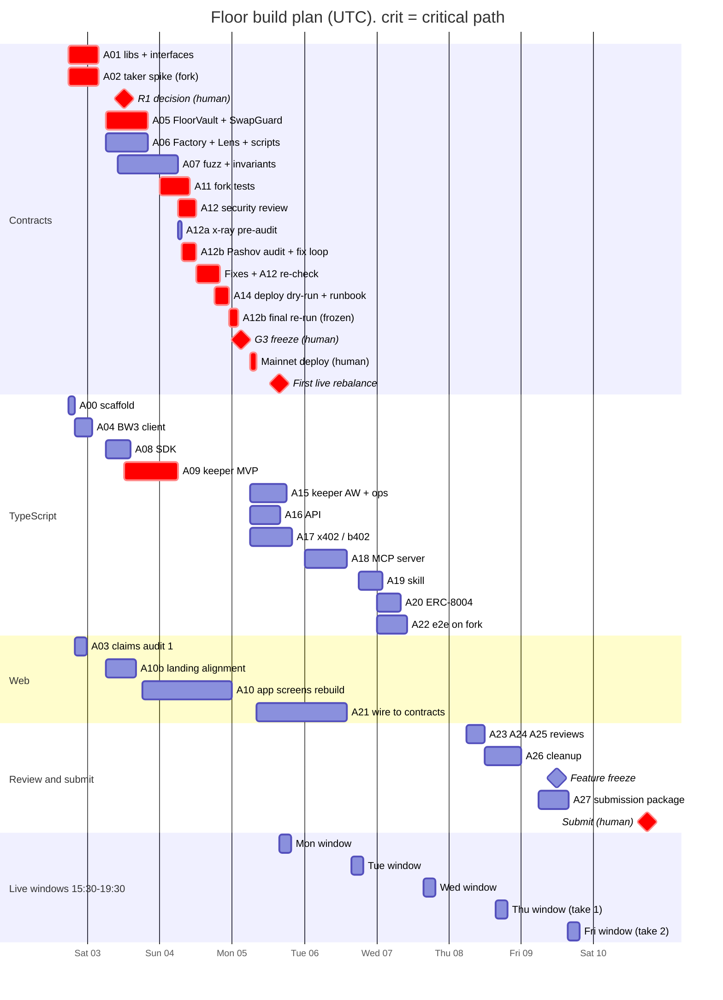
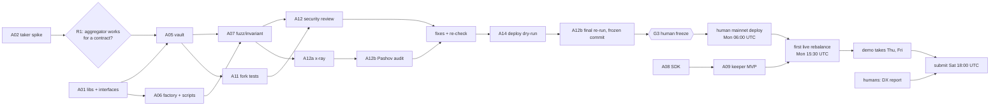

# Floor: execution plan (agents as the team)

Written Fri 2026-10-02, 16:30 UTC (22:00 IST). Deadline **Sun 2026-10-11 12:00 UTC (17:30 IST)**.
Owner of this file: the manager agent. The team lead approves it before any agent is spawned.
Priority between docs: `docs/DECISIONS.md` > `docs/CONTRACTS.md` (on-chain) > `docs/ARCHITECTURE.md` (off-chain) > everything else.
This plan adds decisions P0 to P13 (section 1). Once approved, they rank with DECISIONS.md.

All times are UTC, with IST (UTC+5:30) in brackets where a human is involved.
**The vault's on-chain trading window, Mon to Fri 15:30 to 19:30 UTC, is 21:00 to 01:00 IST.** Every live rebalance and every piece of live footage happens in those hours.

---

## 0. The plan in ten lines

1. Tonight: monorepo scaffold, contract libraries, and a fork spike that answers the riskiest question first: does aggregator calldata work when the taker is a contract?
2. Sat: vault and factory code (two authors), a separate test author, the TypeScript SDK and a keeper MVP.
3. Sun: fork tests, an independent security review, the Pashov audit (x-ray, then solidity-auditor), fixes, then a deploy dry-run on a BSC fork with a written runbook. A clean Pashov re-run on the frozen commit is a hard blocker for any mainnet deploy (§6.4a).
4. **Mon 5 Oct, 06:00 to 08:00 UTC (11:30 to 13:30 IST): the team lead deploys to BSC mainnet. 15:30 UTC (21:00 IST): the first live rebalance**, which is the new position's first stock buy.
5. Mon to Wed: API, MCP server, x402/b402 paywall, Agentic Wallet keeper, skill, ERC-8004 entry, web wired to mainnet.
6. Thu: three review agents (product UX, first-time user, claims) and a cleanup pass. Demo take 1 in the trading window.
7. Fri 12:00 UTC: feature freeze. Demo take 2 in the window.
8. Sat: humans finish the DX report and the video, and submit by 18:00 UTC (23:30 IST).
9. Sun: fixes only. Nothing new.
10. If time runs short, cut from the bottom of section 11. The mainnet vault, one honest live rebalance, a clean landing page and the human-written DX report always survive.

---

## 1. Decisions to approve with this plan

| # | Decision | Why | Changes |
|---|---|---|---|
| P0 | **Merge policy.** The manager merges an agent branch to `main` and pushes when every automated gate in section 7 passes. These still need the team lead's explicit yes: contract freeze, any mainnet step, the Vercel production deploy, external PRs, anything that spends money. | "Approving merges" is listed as human-only. If every merge waits for the team lead, nothing merges between 01:00 and 08:00 IST and the critical path loses about 7 hours a night. | Team-lead preference |
| P1 | **Move `web/` to `apps/web`** with `git mv`, and make the pnpm workspace live at the repo root. | The web app needs `packages/sdk` (ABIs, addresses, CPPI maths) as a workspace import. ARCHITECTURE.md §9.1 uses this layout. Vercel has never deployed this project, so the move costs one settings change (Root Directory = `apps/web`). Keeping `web/` would mean publishing the SDK or copying files. | Repo layout |
| P2 | **The first routers are allowlisted in the `FloorFactory` constructor and are active at deploy.** These are the Binance aggregator router `0xB444…FdDA5` (with its `approveTarget`) and the Pancake v3 SwapRouter `0x1b81…eB14`. Any `addRouter` after deploy keeps the 24 h delay. | The delay protects existing depositors from a router the owner adds later. At deploy there are no depositors. CONTRACTS.md §14 step 5 would otherwise delay aggregator rebalances to Tue. Allowlisting the Pancake SwapRouter as a keeper router also gives the keeper a direct-pool route if aggregator calldata fails from a contract (R1). The vault's balance-delta checks make it safe: a `recipient` other than the vault fails `MinOutNotMet`. | CONTRACTS.md §11.1, §14 |
| P3 | **An EOA is the primary keeper.** An Agentic Wallet (AW) holds the same role and is supervised. | DECISIONS.md. Several copy files still say "AW is the keeper". Those get fixed (section 2). | Copy |
| P4 | **Owner** = a Safe if the team lead has one by Sun 4 Oct 18:00 UTC, else the team lead's hardware-wallet EOA. **Guardian** = a separate hot EOA. | CONTRACTS.md Q10. Team lead's call. | Deploy params |
| P5 | **Launch caps:** `maxDeposit` 1,000 USDT, `maxTotalTvl` 5,000 USDT. | Only team funds are expected. That is smaller than the CONTRACTS.md proposal (5k / 50k) because the review time is short. Caps can be raised later; they cannot be lowered for positions that already exist. | Deploy params |
| P6 | **Demo positions use demo defaults:** `minTrade` = 6 USDT, set with `setDefaults` before the demo positions are created, then restored. The UI labels them "demo settings". | The aggregator rejects orders of $5 or less (afterbell DX_LOG, 2026-09-30). CONTRACTS.md has a default `minTrade` of 20 USDT. ARCHITECTURE.md §10.3 has a demo minimum of 0.25 USDT, which cannot be routed. See appendix A for the numbers. | Demo |
| P7 | **The web app reads the chain directly** (FloorLens, vault views, events) and builds deposit transactions in the browser with `packages/sdk`. The API is not on the web's critical path. | If the API is down, positions, exits and the on-chain rebalance history still work. | ARCHITECTURE.md §4a |
| P8 | **Hosting:** one small VM that the team lead provisions runs `api`, `mcp` and the EOA `keeper`. The supervised AW keeper runs on the team lead's laptop, because `baw` needs a QR-paired session and the OS keychain. Fallback: everything on the laptop behind a tunnel. | ARCHITECTURE.md §0.3 and §3.1. | Infra |
| P9 | **Agents only send transactions to a local anvil fork**, using anvil's published dev accounts. They never send to chain 56. | Hard rule. Fork tests and the e2e test still need to send transactions locally. | All agents |
| P10 | **Each agent writes its own DX notes** to `dx/raw/<task-id>.md`. Notes are raw, timestamped and append-only. Agents never open or draft the DX report. | Parallel agents can't collide on one file, and the report stays human-written. | All agents |
| P11 | **Mainnet deploy target is Mon 5 Oct 06:00 UTC. The hard latest is Wed 7 Oct 12:00 UTC.** After that we deploy whatever passed the gates, with caps lowered to 1,000 total. | The rules require a mainnet deployment, and live footage needs at least two weekday windows. | Schedule |
| P12 | **Build our own x402 facilitator in parallel with b402. Decide which one the demo uses on Tue 6 Oct 18:00 UTC (23:30 IST).** | b402 access is by application with no stated approval time (ARCHITECTURE.md §3.2). | Agents track |
| P13 | **If the generated wireframes `A01` to `A10` are not in `wireframes/generated/` by Sun 4 Oct 12:00 UTC, the app is built from the text spec in `wireframes/prompts.html`.** Images that arrive later get a restyle pass on Wed. | The prompts already give exact layout and exact strings, so the build does not have to wait for images. | Frontend |

---

## 2. Where the docs disagree, and what wins

| # | Conflict | Winner and action |
|---|---|---|
| 1 | ARCHITECTURE.md §2.1 (A1 to A11: single vault, `deposit(asset…)`, `withdraw(id)`, nonce, keeper `setMarketOpen`) vs CONTRACTS.md (factory plus clones, USDT only, `exitInKind`/`requestClose`/`closeToUSDT`, no keeper flag, `minInterval`). | **DECISIONS.md / CONTRACTS.md.** The keeper, API and MCP briefs below use the CONTRACTS.md surface. The MCP tools are renamed to match (`build_create_position_tx`, `build_exit_tx`, `get_floor_info`), and the position id is the vault address. |
| 2 | CONTEXT.md, LANDING_COPY.md step 1, LANDING_COPY FAQ, DEMO_SCRIPT 0:25 ("deposit tokenized stocks… or USDT", "I deposit NVDAB, QQQB") vs DECISIONS.md (USDT only). | **USDT only.** Fix the web copy (A10b) and the demo script (A27). Wireframe D02 already says "Deposit USDT". |
| 3 | POSITIONING.md message 3, LANDING_COPY #agents, DEMO_SCRIPT 1:10, PITCH ("an Agentic Wallet is the keeper") vs DECISIONS.md (EOA primary, AW second keeper). | **DECISIONS.md.** New wording: "A keeper wallet triggers rebalances. A Binance Agentic Wallet holds the same role." If the AW-signed rebalance on Tue works, add "…and signed this one: <tx>". |
| 4 | ARCHITECTURE.md §4b and §5.2: market hours 13:30 to 20:00 UTC, drift trigger 2%, tick 60 s, min 30 s between trades. CONTRACTS.md: window 15:30 to 19:30 UTC, sell band 1% and buy band 2% of V, `minInterval` 15 min. | **CONTRACTS.md.** The keeper does not compute its own trigger. It calls `previewRebalance` and obeys it. Live footage only between 15:30 and 19:30 UTC. |
| 5 | ARCHITECTURE.md §10.3 demo: 100 USDT position, 95% floor, trades of 1.8 USDT, min trade 0.25. Reality: aggregator minimum above $5 (DX_LOG), contract `minTrade` 20 by default. | **Reality.** Demo positions per appendix A (500 USDT at a 95% floor, `minTrade` 6). |
| 6 | CONTRACTS.md §14 step 5: 24 h router delay starts at deploy. | **P2** (constructor routers) if approved. If it is not approved, deploy by Sun 4 Oct 15:30 UTC or accept that only `rebalancePublic` works on Mon. |
| 7 | CONTRACTS.md §13 puts Foundry in `contracts/`. The task brief and ARCHITECTURE.md use `packages/contracts`. | **`packages/contracts`.** |
| 8 | ARCHITECTURE.md gives two b402 decision days ("day 2 (Sun 4 Oct) evening" in §3.2, "Day 3" in §11). | **P12: Tue 6 Oct 18:00 UTC.** The facilitator is not on the critical path, because our own facilitator is built anyway. |
| 9 | ARCHITECTURE.md says Node 22. The machine has Node 20.20.2. | Target **Node ≥ 20**. The VM may run 22. No Node-22-only APIs. |
| 10 | Landing hero tile: "0.7–6.6 bps cost per $10k round trip". Those are aggregator quotes. If R1 fails, the vault trades on direct Pancake pools at about 50 bps round trip for NVDAB/SPCXB (CONTRACTS.md §0.3). | **Whatever path the vault really uses.** The claims review (A25) checks this tile against the path shown in Monday's rebalance tx. If the path is direct, the tile changes. |
| 11 | ARCHITECTURE.md MCP `backtest` runs the CPPI engine over stored daily history. The repo has only 4 path CSVs and `gap_backtest.csv`, and the source licence for the history is unverified. | **`backtest` returns the stored results** from `docs/data/` and RESEARCH_RESULTS.md, and says so in its output. A live re-run is out of scope. |
| 12 | `marketing/` is in `.gitignore`. | Marketing edits (demo script) stay local. A27 copies the final demo script into `ops/submission/` so it is versioned. |
| 13 | CONTRACTS.md §7 lists the Agentic Wallet as the keeper address in deploy step 6. | Both addresses go in: the keeper EOA and the AW keeper (`setKeeper` x2). |

---

## 3. Timeline

### 3.1 Phases

| Phase | From (UTC / IST) | To (UTC / IST) | Content | Exit criterion |
|---|---|---|---|---|
| **0. Start** | Fri 2 Oct 17:30 / 23:00 | Sat 3 Oct 06:00 / 11:30 | A00 scaffold, A01 libs and interfaces, A02 taker spike, A03 claims audit 1, A04 BW3 client | Spike answer for R1 is known. Interfaces are frozen. |
| **1. Core build** | Sat 3 Oct 06:00 / 11:30 | Sun 4 Oct 06:00 / 11:30 | A05 vault, A06 factory/lens/scripts, A07 tests, A08 SDK, A09 keeper MVP, A10/A10b web | `forge test` (unit, fuzz, invariant) is green. Keeper `once --dry-run` works on a fork. |
| **2. Harden** | Sun 4 Oct 06:00 / 11:30 | Mon 5 Oct 03:00 / 08:30 | A11 fork tests, A12 security review, A12a x-ray, A12b Pashov audit and fix loop, fixes, A12 re-check, A14 deploy dry-run and runbook | Gate G3 (contract freeze) is ready for the human. The Pashov re-run is clean on the commit to deploy. |
| **3. Mainnet** | Mon 5 Oct 03:00 / 08:30 | Mon 5 Oct 19:30 / 01:00 Tue | Human: approve G3, deploy, verify, create positions, run the first live rebalance | A real `Rebalanced` tx from the keeper EOA. |
| **4. Agents track** | Mon 5 Oct 06:00 | Wed 7 Oct 19:30 | A15 AW keeper, A16 API, A17 x402, A18 MCP, A19 skill, A20 ERC-8004, A21 web wiring, A22 e2e | Paid MCP call settled. AW-signed tx (or a documented failure). Web reads mainnet. |
| **5. Review and polish** | Thu 8 Oct 06:00 / 11:30 | Fri 9 Oct 12:00 / 17:30 | A23, A24, A25 reviews; A26 cleanup; fixes; A27 submission package; demo takes Thu and Fri | **Feature freeze Fri 12:00 UTC.** |
| **6. Submit** | Fri 9 Oct 19:30 | Sun 11 Oct 12:00 / 17:30 | Humans: DX report, video edit, form. **Submit Sat 10 Oct by 18:00 UTC (23:30 IST).** | Submitted. Sunday is for fixes only, until 09:00 UTC. |

### 3.2 Gantt (UTC)



### 3.3 Critical path



Slack: about 9 hours between G3 (Mon 03:00) and the first window (Mon 15:30). If the review finds a High, the fix eats that slack first. Next, the deploy moves to Tue 06:00 and the first live rebalance to Tue 15:30. That still leaves four windows.

---

## 4. Repo, ownership, branches, env

### 4.1 Layout after A00

```
floor/
  apps/web/            Next.js (moved from web/, P1)
  apps/api/            Hono REST
  apps/mcp/            MCP server, Streamable HTTP
  apps/keeper/         keeper loop, EoaSigner, BawSigner
  packages/contracts/  Foundry
  packages/sdk/        ABIs, addresses, tokens, cppi, zod schemas, tx builders (browser-safe)
  packages/bw3/        Binance Web3 API client (HMAC), Node only
  packages/x402/       gate(), B402FacilitatorClient, SelfFacilitatorClient
  packages/db/         Drizzle + better-sqlite3 schema (keeper_runs, x402_receipts)
  skills/floor-protection/
  scripts/             e2e-fork.sh, erc8004/
  ops/                 progress/, spikes/, deploy/, keeper/, submission/, status.md
  reviews/             one file per review
  dx/raw/              one file per agent; dx/human/ for the team's own notes
  docs/ design/ assets/ wireframes/ marketing/(gitignored)
  package.json  pnpm-workspace.yaml  tsconfig.base.json  .env.example
```

### 4.2 File ownership (no two running agents own the same path)

| Path | Owner | Notes |
|---|---|---|
| root `package.json`, `pnpm-workspace.yaml`, `tsconfig.base.json`, lint config, `.env.example`, `.gitignore` | A00, then manager only | Agents ask the manager in their report for root changes (for example a new env name). |
| `packages/contracts/foundry.toml`, `remappings.txt`, `lib/`, `src/libs/{CPPIMath,TwapOracle,MarketHours}.sol`, `src/libs/vendor/**`, `src/interfaces/**`, `test/unit/{CPPIMath,MarketHours,TwapOracle}.t.sol`, `test/mocks/{MockToken,MockPool,MockRouter}.sol` | A01 | Interfaces are **frozen** when A01 merges. A change needs the manager's sign-off and a note to A05, A06, A07 and A08. |
| `src/FloorVault.sol`, `src/libs/SwapGuard.sol`, `test/unit/{Vault,SwapGuard}.t.sol` | A05 | |
| `src/FloorFactory.sol`, `src/FloorLens.sol`, `script/**`, `holidays/**`, `test/unit/{Factory,Lens}.t.sol` | A06, then A14 for `script/` | A14 starts after A06 merges. |
| `test/fuzz/**`, `test/invariant/**`, `test/mocks/evil/**` | A07 | |
| `test/fork/**`, `test/fixtures/**` | A11 | |
| `test/audit/**`, `reviews/security-*.md` | A12 | |
| `reviews/audit-pashov-*.md` | A12a, A12b | Output of the Pashov skills (§6.4a). Fixes go to A05/A06, never to the auditor. |
| `.claude/skills/**`, `docs/AUDIT.md` | manager | The skills are installed unmodified (`.claude/skills/PASHOV_SOURCE.md`). Skill scratch output (`x-ray/`, `.solidity-auditor/`, `.audit-*`) must be in `.gitignore`: the manager adds it. |
| `packages/contracts/deployments/**` | human deploy output, committed by the manager | |
| `ops/spikes/taker-probe/**`, `ops/spikes/RESULTS-taker.md` | A02 | A separate Foundry project, so it never collides with A01. |
| `packages/bw3/**` | A04 | |
| `packages/sdk/**` | A08 | `src/abis/` is generated, never hand-edited. |
| `packages/db/**`, `apps/keeper/**` | A09, then A15 | |
| `packages/x402/**` | A17 | |
| `apps/api/**` | A16 | |
| `apps/mcp/**` | A18, then A20 (only `src/agent-card.ts` and its route line) | |
| `skills/floor-protection/**` | A19 | |
| `scripts/erc8004/**` | A20 | |
| `scripts/e2e-fork.sh`, `apps/web/e2e/**` | A22 | |
| `apps/web/app/app/**`, `apps/web/components/app/**`, `apps/web/components/ui/**`, `apps/web/lib/adapters/**`, `apps/web/app/agents/**` | A10, then A21 | A10b asks A10 for any shared-UI change. |
| `apps/web/app/page.tsx`, `components/landing/**`, `app/docs/**`, `components/docs/**`, `components/charts/**`, `lib/{docs-nav,docs-data,data,replay,brand}.ts`, `data/**` | A10b, then A26 | |
| `apps/web/screenshots/**` | whichever agent last captured them (A10, A10b, A21, A23) | Overwrite only your own screen IDs. |
| `reviews/claims-*.md`, `reviews/ux-*.md` | A03/A25, A23, A24 | |
| `README.md`, `docs/*.md` status lines | manager; A26 in Phase 5 only | |
| `ops/submission/**`, `marketing/DEMO_SCRIPT.md` (local) | A27 | |
| `dx/raw/<id>.md` | each agent, its own file | `dx/human/` and the DX report: **humans only**. |
| `ops/progress/<id>.md` | each agent, its own file | |

### 4.3 Branches and worktrees

- One worktree per task: `git -C ~/Documents/Projects/floor worktree add ../floor-wt/<id> -b agent/<id> main`. The manager creates it before spawning the agent and gives the agent that path. Named worktrees survive interruptions. The Agent tool's `isolation: "worktree"` cleans up unchanged worktrees, so use it only for read-only reviewers.
- Agents commit often to `agent/<id>` with messages `<id>: <what>`. They never push and never touch `main`.
- Manager merge procedure: `git diff --stat main...agent/<id>` (the paths must match ownership) → run the gate commands for the touched packages in the worktree → squash-merge → `git push origin main` → `git worktree remove`.
- A task that depends on another's output rebases on `main` after that merge (`git rebase main`), not before.

### 4.4 Env and secrets

- `.env.example` (committed) lists names only: `BSC_RPC_URL`, `BSC_FORK_RPC_URL`, `BW3_API_KEY`, `BW3_API_SECRET`, `ETHERSCAN_API_KEY`, `KEEPER_PRIVATE_KEY` (VM only), `KEEPER_SIGNER` (`eoa|baw`), `BAW_KEEPER_ADDRESS`, `B402_CLIENT_ID`, `B402_RSA_KEY_PATH`, `X402_PAYTO`, `SELF_FACILITATOR_KEY` (VM only), `ALERT_WEBHOOK_URL`, `HEALTHCHECK_URL`, `NEXT_PUBLIC_CHAIN_ID`, `NEXT_PUBLIC_RPC_URL`, `NEXT_PUBLIC_API_URL`, `NEXT_PUBLIC_MCP_URL`, `NEXT_PUBLIC_REOWN_PROJECT_ID`.
- Secrets live outside the repo in `~/.config/floor/secrets.env` (chmod 600, created by the human). Agents load it only inside the command that needs it: `bash -c 'set -a; . ~/.config/floor/secrets.env; set +a; <cmd>'`. They never `cat`, `env`, `printenv` or `echo` it, never write it into logs or fixtures, and never commit a file that holds a value.
- Mainnet signing keys (deployer, owner, guardian) never live in that file. The human uses `--ledger` or a Foundry keystore (`--account <name>`) and types the password.
- The manager runs `git diff main...agent/<id> | grep -nE '0x[0-9a-fA-F]{64}|PRIVATE|SECRET|BEGIN RSA'` before every merge. Anvil's published dev keys are allowed only in `scripts/e2e-fork.sh` and `test/` files, behind a `# anvil dev key` comment.

---

## 5. How agents run

### 5.1 Standard preamble (the manager prepends this to every brief)

> You are task `<id>` on Floor. Read `CONTEXT.md`, `docs/DECISIONS.md` and `docs/EXECUTION_PLAN.md` §1, §2 and §4 first. Work only in `../floor-wt/<id>` on branch `agent/<id>`, and only in the paths this plan gives you. **Resume:** if `ops/progress/<id>.md` exists, read it and continue from "Next". After every green step, commit and update that file (Done / Next / exact commands / open questions). Secrets: load `~/.config/floor/secrets.env` only inside the command that needs it, and never print it. Never send a transaction to chain 56. Send only to a local anvil fork with anvil dev accounts. Never commit secrets. Every number you write must come from CONTEXT.md or RESEARCH_RESULTS.md, or be cited (URL or reproducible command), or be marked **unverified**. When a tool, API or doc wastes your time, add one line to `dx/raw/<id>.md`: `UTC time | tool | what you tried | what happened (exact error) | minutes lost | workaround | link`. Facts only, no adjectives, no summaries. Plain English, no hype words. Do not edit files outside your ownership; ask in your report instead. **Report back in under 200 words:** paths changed, commands run with pass/fail, decisions made, contradictions found, open questions, and what the next task needs to know.

### 5.2 Models

| Task | Model | Opus? |
|---|---|---|
| A05 FloorVault + SwapGuard | Sonnet by default | **Request Opus.** This contract holds user funds and does balance-delta checks around arbitrary router calldata. A subtle rounding or ordering bug becomes a loss on mainnet with no upgrade path (CONTRACTS.md §14 rollback). If Opus is declined, A07 and A12 are the controls, and A12 gets an extra 2 h. |
| A12 security review (and its re-check) | Sonnet by default | **Request Opus.** This is the one adversarial read before real money goes in, and the separate-reviewer rule only works if the reviewer is strong. Six hours of Opus, once. |
| A12a, A12b Pashov audit | Sonnet | No. The skills run their own parallel agents, and A12 is the Opus read. |
| Everything else (A00 to A27) | Sonnet | No. The briefs are specific enough. |
| Manager | runs in the team lead's own session | n/a |

### 5.3 Concurrency and interruptions

- **At most 4 sub-agents run at once.** One session limit has already been hit today. Four keeps the critical path moving while leaving room to resume.
- Priority when slots are scarce: critical path (A01, A02, A05, A11, A12, A14, A09) → mainnet-day needs (A08, A06, A07) → agents track → web → reviews.
- Every brief is sized to about 2 to 8 hours of agent work and checkpoints in `ops/progress/<id>.md`. After a limit hit, the manager continues the same agent with SendMessage if it still exists, or spawns a fresh agent with the same brief plus "resume from ops/progress/<id>.md".
- The manager keeps `ops/status.md`: one row per task with state (queued / running / review / merged / blocked), branch, last commit and blocker. That file is the hand-over point if the manager session itself is interrupted.

---

## 6. Workstreams and agent briefs

Each brief below goes to the agent as-is, after the preamble in 5.1.

### 6.1 Foundations

**A00: Monorepo scaffold** (Sonnet, Fri 17:30 UTC, about 2 h)
- Goal: a pnpm workspace that every later task builds into.
- Steps: `git mv web apps/web`. Then `mv web/.vercel apps/web/.vercel` (it is gitignored and untracked). Delete `apps/web/pnpm-workspace.yaml` and `apps/web/pnpm-lock.yaml` and keep its `ignoredBuiltDependencies` in the root workspace file. Add a root `package.json` (scripts `build`, `test`, `typecheck`, `lint`, each `pnpm -r`), `pnpm-workspace.yaml` (`apps/*`, `packages/*`), `tsconfig.base.json` (strict, ES2022, `moduleResolution: bundler`), and `.env.example` (names from §4.4). Create empty packages with `package.json`, `src/index.ts` and a vitest smoke test: `packages/{sdk,bw3,x402,db}` and `apps/{api,mcp,keeper}`. Create the folders `ops/{progress,spikes,deploy,keeper,submission}`, `reviews/`, `dx/raw/` and `dx/human/` (each with `.gitkeep`), and `ops/status.md` with the table header. **Do not create `packages/contracts`.** A01 owns it, so only add a comment to the workspace file.
- Inputs: `web/`, ARCHITECTURE.md §9.1, this plan §4.
- Acceptance: `pnpm install && pnpm -r build && pnpm -r test && pnpm --filter web build` all pass. `git log --follow apps/web/app/page.tsx` shows history.
- Report: anything that moved oddly, and the exact Vercel setting the human must change (Root Directory `apps/web`).

**A04: Binance Web3 API client** (Sonnet, after A00, about 6 h)
- Goal: `packages/bw3`, a typed Node client for the calls the keeper, API and MCP need.
- Inputs: `afterbell/docs/EXECUTION.md` §2 and §6, `afterbell/docs/DX_LOG.md`, `afterbell/research/bw3.py` (port its signing exactly: `/build` in both URL and signed path, ISO-8601 ms timestamp, HMAC of `timestamp+method+path+body`).
- Functions: `rwaPrice(addresses[])` (the param is `tokenContractAddresses`, plural, even for one), `quote({from,to,amount,userWalletAddress,vendor?})`, `swap({…,quoteId,slippagePercent})` (parse `signatureData[0]` with `JSON.parse`; read `approveTarget`; return `{to,data,minReceiveAmount,approveTarget,executionMode}`), `simulate(evmTx)`, `gasPrice()`, `broadcast(signedTx,{mev:true})`. Add retry with backoff (2, 4, 8 s) on 5xx and 429, a 10 s timeout, and zod response schemas. Typed errors: `MinOrder` ("Minimum order amount is 5 USD"), `InsufficientLiquidity`, `RfqRequired`.
- Constraints: never log headers or keys. Record fixtures with keys stripped.
- Acceptance: `pnpm --filter @floor/bw3 test` (unit tests on recorded fixtures) and `pnpm --filter @floor/bw3 live-check` (one live read-only quote for USDT→NVDAB at 10 USDT, run only if the env has keys; prints route vendor and `toTokenAmount`, never keys).
- Report: response-shape surprises (also into `dx/raw/A04.md`).

**A08: Shared SDK** (Sonnet, Sat 06:00, after A01 merges, about 8 h)
- Goal: `packages/sdk`, browser-safe and shared by web, keeper, api and mcp.
- Contents: (1) `gen:abis`, a script that reads `packages/contracts/out/*.json` for `IFloorFactory`, `IFloorVault`, `IFloorLens` and (later) the implementations, and writes `src/abis/*.ts` `as const`. (2) `addresses.ts` keyed by chainId (56, 31337), read from `packages/contracts/deployments/<chainId>.json`. Empty placeholders until deploy, and code that hits a placeholder must throw a clear error. (3) The token table from CONTEXT.md, plus the pools and fees from CONTRACTS.md §2. (4) `cppi`: move `apps/web/lib/cppi.ts` here, and add a bigint WAD mirror of CONTRACTS.md §5 (ceil F, floor V and E*). (5) zod schemas and the `UnsignedTx` type (ARCHITECTURE.md §6). (6) Tx builders: `buildCreatePosition({owner, amount, floorBps, termSeconds, assets, weights})` → `[approve(factory, exact), createPosition]`, and `buildRequestClose`, `buildCloseToUSDT`, `buildExitInKind(to)`. (7) `buildPancakeExactIn` calldata for the direct route (struct per A02's Q9 finding).
- Acceptance: `pnpm --filter @floor/sdk test`. The CPPI tests reproduce the CONTRACTS.md §5 worked example step by step in both float and WAD. `pnpm --filter web build` still passes after the web imports `@floor/sdk` for cppi.
- Report: the ABI regeneration command the manager runs after every contract merge.

### 6.2 Smart contracts

**A01: Foundry project, libraries, interfaces** (Sonnet, Fri 17:30, about 10 h)
- Goal: the base everything else in `packages/contracts` builds on.
- Inputs: CONTRACTS.md §5, §6, §11, §12 (unit tests) and §13 (layout, `foundry.toml`, dependencies).
- Steps: `forge init --no-git packages/contracts`. Add OZ v5 and forge-std (`forge install`, pinned versions). **Vendor `TickMath` and `FullMath` from Uniswap v4-core** into `src/libs/vendor/`, with the licence header kept (CONTRACTS.md Q8 option b). Write `CPPIMath`, `MarketHours` (weekday = `(day+3)%7`, window [15:30, 19:30)) and `TwapOracle` (reads `token0()`, rounds negative ticks toward negative infinity, `OracleHistoryTooShort` when `observe` reverts). Write every interface in §11 plus the pool, router, `ISecuritiesToken`, `IPauseManager` and `IBeacon` interfaces. Add `test/mocks/{MockToken,MockPool,MockRouter}.sol`.
- Interface change from P2: `IFloorFactory` constructor params gain `address[] initialRouters, address[] initialApproveTargets`.
- Acceptance: `forge build --sizes`; `forge test --match-path 'test/unit/*'`; `forge fmt --check`. CPPIMath reproduces §5 steps 0, 1, 2, 3 and 0'. MarketHours covers the boundary seconds and day 20000 = Friday. TwapOracle at tick 54,624 with token0 = NVDAB gives 235.6e18 ±0.1%.
- Report: the frozen interface list (the manager forwards it to A05, A06, A07 and A08).

**A05: FloorVault and SwapGuard** (**Opus requested**, Sat 06:00, after A01, about 14 h)
- Goal: `src/FloorVault.sol` and `src/libs/SwapGuard.sol`, exactly to CONTRACTS.md §5, §7, §8, §9 and §11.2.
- Must hold: `initialize` callable once and only by the factory, and disabled on the implementation. `ReentrancyGuardTransient` on every state-changing external function. `rebalance(Swap)` re-derives direction and size from the TWAP and checks, in order: keeper, trading open (via the factory), status, `minInterval` per asset, multiplier guard, beacon implementation (buys only), amount within [computed/2, computed], router allowed (`factory.routerOk`, approve `approveTarget`; if the router is the factory's `v3SwapRouter`, use `tolDirectBps` instead of `tolAggBps`, a change from CONTRACTS.md needed by P2), and the `PriceDeviation`, cardinality and liquidity guards. SwapGuard does the exact approve, the call with `value=0`, the approve back to 0, and balance-delta checks on **every** tracked token and USDT. `rebalancePublic` uses the Pancake SwapRouter only, after `publicDelay`, with 2× bands and `tolDirectBps`. Exits: `requestClose`, `closeToUSDT` (stock ≤ dust), `exitInKind(to)` (try/catch per token, never reverts on one paused token, gives the try enough gas), and `rescue` (only when Closed). After maturity, E* = 0. **No other function moves assets.**
- Why the strictness: the contract is immutable and the keeper key is hot. Anything the keeper picks must be re-validated.
- Acceptance: `forge test --match-path 'test/unit/*'` green, with Vault and SwapGuard tests covering every revert in §11.2. `forge build --sizes` under 24 KB. Inline NatSpec cites the CONTRACTS.md section for each rule.
- Report: every place you departed from CONTRACTS.md, and why.

**A06: FloorFactory, FloorLens, scripts** (Sonnet, Sat 06:00, after A01, about 14 h)
- Goal: `src/FloorFactory.sol`, `src/FloorLens.sol` and `script/{Deploy,SetHolidays,SmokeTest}.s.sol`, per CONTRACTS.md §11.1, §11.3 and §14, plus P2.
- Must hold: the roles table in §7. Constructor routers active at once (P2), and later `addRouter` with the 24 h delay. 2-step ownership. `addAsset` checks (decimals, `getPool` match, cardinality ≥ 200, `observe` works). Launch caps from P5. `setDefaults` bounds-checked, allowing `minTrade` from 1e18 up (P6 needs 6e18). Economic params are copied into each clone at creation. `createPosition` pulls exact USDT, clones, initializes and transfers the USDT in one tx. `pokeMultiplier`. `isTradingOpen` includes `paused` and `halted`. Lens `status` and `scan` wrap each vault in try/catch, and `scan` respects `minInterval`.
- Deploy script: reads `script/params/<chainId>.json` (owner, guardian, keepers[], routers, assets with pool, fee, minLiquidity and maxTradeValue, caps, holidays file) and writes `deployments/<chainId>.json` (addresses, block, constructor args). **No private key in env.** It runs with `--ledger` or `--account`. `holidays/nyse_2026_2027.json` comes from the CONTRACTS.md §6 list, marked "cross-check nyse.com before deploy".
- Acceptance: `forge test --match-path 'test/unit/*'`; `forge script script/Deploy.s.sol --fork-url $BSC_FORK_RPC_URL` (simulation, no broadcast) prints the deployment summary.
- Report: the params JSON the human must fill in.

**A07: Fuzz and invariant tests** (Sonnet, Sat 10:00, about 20 h; a different author from A05 and A06 on purpose)
- Goal: tests that try to break A05 and A06, written from the spec rather than from their code.
- Inputs: CONTRACTS.md §12 (I1 to I13 and the fuzz list), A01's interfaces and mocks.
- Build: `test/invariant/VaultInvariant.t.sol` with `handlers/KeeperHandler.sol` (hostile `amountIn`, routers, timing), `UserHandler.sol` (exits at any time) and `MarketHandler.sol` (price paths, gaps up to 1/m, pauses). `test/mocks/evil/` holds EvilRouter variants: takes more than `amountIn`, returns less, steals another asset, re-enters `exitInKind`, pays a third address. Add `test/fuzz/CPPIPath.t.sol` and rounding fuzz I6.
- Constraint: **do not edit `src/`.** A bug you find becomes a failing test plus a note in your report, and the author fixes it.
- Acceptance (after A05/A06 merge): `forge test --match-path 'test/fuzz/*'` with `FOUNDRY_FUZZ_RUNS=1000`, and `forge test --match-path 'test/invariant/*'` with `FOUNDRY_INVARIANT_RUNS=1000 FOUNDRY_INVARIANT_DEPTH=50`, green or with failures reported. `forge coverage --report summary` at ≥ 90% lines on Vault, Factory and the libs.
- Report: the failures found, each with a minimal reproduction.

**A11: BSC fork tests** (Sonnet, Sun 00:00, after A05/A06 merge, about 10 h)
- Goal: CONTRACTS.md §12 fork tests 1 to 10 in `test/fork/`, plus a replay of A02's saved aggregator fixtures (test 4).
- Notes: fork at latest (`--fork-url $BSC_FORK_RPC_URL`), no pinned block unless the RPC is an archive. Move bStocks with `vm.prank(pool)` transfers, not `deal`. Prank the real pause-manager admin, compliance admin, token admin and beacon owner (addresses in CONTRACTS.md §4). Warp to Tue 16:00 UTC for trades. Log gas for `rebalance`, `rebalancePublic`, `createPosition` and `exitInKind`.
- Acceptance: `forge test --match-path 'test/fork/*' --fork-url $BSC_FORK_RPC_URL -vv` with **1, 2, 3, 5 and 7 green** (required) and 4 and 6 best effort. `forge snapshot` saved. Answer CONTRACTS.md Q3 (does a blocklist hit the sender, the receiver or both).
- Report: the gas table, the Q3 answer, and any test that only passes on some runs (RPC flakiness, R5).

**A14: Deploy dry-run and runbook** (Sonnet, Sun 18:00, after the fixes merge, about 5 h)
- Goal: prove the exact mainnet sequence on a fork, and give the human commands to copy.
- Steps: start `anvil --fork-url $BSC_FORK_RPC_URL`. Run `Deploy.s.sol --broadcast` with anvil dev keys, using `script/params/31337.json`, which copies the mainnet params but uses anvil addresses for the roles. Then `SetHolidays`, the P6 `setDefaults`, the demo `createPosition` calls (appendix A), a warp into the window, one `rebalancePublic` and one keeper `rebalance` through the Pancake router path, `requestClose`, a sell, `closeToUSDT`, and `exitInKind` on a second position. Write `packages/contracts/deployments/31337.json`.
- Output: `ops/deploy/runbook.md` with every mainnet command in order, with placeholders `<OWNER>` and so on and `--ledger`/`--account`, `forge verify-contract` lines (Etherscan v2 key, Sourcify fallback), expected gas per step, a pre-flight checklist (live pool TVL, cardinality and `uiMultiplier` re-read with `cast`), and a rollback (`pause()`, users `exitInKind`).
- Acceptance: the script runs start to finish on a fresh fork twice.
- Report: the total BNB needed (estimate, labelled).

### 6.3 De-risk spike

**A02: Aggregator calldata from a contract taker** (Sonnet, Fri 17:30, about 10 h, on the critical path)
- Goal: answer CONTRACTS.md Q1/T17 before the vault is written. Can a contract execute Binance aggregator `/swap` calldata for USDT↔NVDAB, SPCXB and QQQB? Also answer Q9 (Pancake SwapRouter struct), Q10 (contracts can hold and move bStocks) and the fork-RPC durability question for R5.
- Method: a standalone Foundry project in `ops/spikes/taker-probe/`. A `TakerProbe` contract approves `approveTarget` for exactly `amountIn`, calls `router` with the data, and records balance deltas. A script picks a fresh address X, calls `quote` then `swap` (port the signing from `afterbell/research/bw3.py`, or use A04's package if it has merged) with `userWalletAddress = X` and 10 USDT (above the $5 minimum). **Within the 30 s TTL** it runs a fork test that `vm.etch`es `TakerProbe` at X, deals USDT, and executes. For sells, move the bStock in with `vm.prank(pool)`. Record `executionMode`, vendor, route and `approveTarget` vs `tx.to`. Save the responses (keys stripped) as fixtures. Repeat at 100 USDT. Then try the `vendor` filter for AMM-only routes.
- Known limit, to write in the result: on mainnet X will have code, and the API may treat that differently. Only Monday's smoke test settles that.
- Output: `ops/spikes/RESULTS-taker.md`, a pass/fail table per token, direction and size, plus Q9/Q10 answers and the commands.
- Acceptance: `bash ops/spikes/taker-probe/run.sh` reproduces the table.
- Report: a one-line verdict (aggregator works / AMM-only works / direct only).

### 6.4 Security review

**A12: Independent contract security review** (**Opus requested**, Sun 06:00, about 6 h, then a 2 h re-check after fixes)
- Goal: find what A05, A06 and A07 missed, before real funds go in.
- Inputs: `packages/contracts/src/**`, the tests, CONTRACTS.md §4, §7, §8, §9, §12 and §15, and P2/P5/P6.
- Do: read every line of `src/`. Run `uvx --from slither-analyzer slither packages/contracts` (and `aderyn` if it installs cleanly) and triage the output. Check each threat T1 to T20 and invariant I1 to I13 against the code. Pay particular attention to: balance-delta completeness (all tracked tokens), approve/approveTarget mismatch, reentrancy through the router or a token, clone init front-running, TWAP tick rounding and token order, the weekday formula and holiday indexing, the 63/64 gas rule in `exitInKind` try/catch, the `rescue` scope, `amountIn` bounds rounding, `minInterval` bypass via `rebalancePublic`, maturity and closing transitions, constructor routers (P2), and the `setDefaults` bounds.
- Output: `reviews/security-01.md`. One row per finding: id, severity (Critical / High / Medium / Low / Info), file:line, exploit scenario, a fix suggestion. For High and above, a failing PoC test in `test/audit/`.
- Constraint: do not fix `src/`. The authors fix it and you re-check (`reviews/security-02.md`).
- Acceptance: `forge test --match-path 'test/audit/*'` fails before the fixes and passes after them.
- Report: the counts by severity, and the go/no-go you recommend for G3.

### 6.5 Keeper

**A09: Keeper MVP (EOA signer)** (Sonnet, Sat 12:00, after A08, about 18 h; on the critical path for Mon 15:30)
- Goal: `apps/keeper`, the CLI the human runs on Monday: `keeper once [--dry-run] [--vault 0x…] [--route agg|direct]` and `keeper run`.
- Loop (CONTRACTS.md §7 last paragraph, not ARCHITECTURE.md §4b): `factory.isTradingOpen(now)`. If closed, write a heartbeat row and stop. Otherwise `lens.scan`, then per vault `previewRebalance`. For the aggregator route: `bw3.quote` with `userWalletAddress=vault` and `amount=amountIn`, then `bw3.swap` with a slippage that keeps `minReceiveAmount ≥ minOutAgg`. Reject if the quote is under `minOutAgg`, if `tx.to` or `approveTarget` is not `factory.routerOk`, or if `executionMode=RFQ`. Encode `rebalance(Swap)`, `simulateContract`, send with EoaSigner (local nonce manager, BW3 broadcast with MEV protection and a fallback to `eth_sendRawTransaction`), wait for the receipt (90 s), decode `Rebalanced`, then write a `keeper_runs` row (`packages/db`) and a JSON log line. The direct route builds Pancake calldata with the SDK. Failure handling follows ARCHITECTURE.md §5.4 (minus the market flag and the nonce), and alerts go to an `ALERT_WEBHOOK_URL` POST.
- Constraints: dry-run needs no key. Run mode reads `KEEPER_PRIVATE_KEY` from env and never logs it. One sender per process.
- Acceptance: `pnpm --filter keeper test` (bw3 and RPC mocked). `pnpm --filter keeper test:fork` runs against A14's fork deployment (or a local deploy) with an anvil key and gets a confirmed `Rebalanced` through the direct route. `keeper once --dry-run` against mainnet RPC prints "no factory configured" cleanly before the deploy.
- Report: the exact commands for the runbook.

**A15: AW keeper signer, alerts, ops** (Sonnet, Mon 06:00, about 12 h)
- Goal: `BawSigner`, a dead-man's switch, and VM service files.
- BawSigner: call `baw` with execFile and an argument array (no shell). Steps: `wallet settings --json` (abort if dev mode is off or the session ends within 6 h), `contract-call preview --binanceChainId 56 --from <BAW_KEEPER_ADDRESS> --to <vault> --value 0 --inputData <hex> --json`, abort on `351803`, `351805`, non-empty `risks.riskDetails` or `requireConfirmation=true`, then `contract-call execute --requestId`. Only `BROADCASTED` counts as sent. Anything else falls through to the EOA in the same cycle and posts "AW needs attention". Log the `requestId` and the outcome per run. Add `HEALTHCHECK_URL` pings, a keeper BNB balance alert, and `ops/keeper/{floor-keeper.service, floor-api.service, floor-mcp.service}` plus `ops/keeper/runbook.md`.
- Inputs: ARCHITECTURE.md §3.1, §4b step 11, §5. The human's spike outputs in `dx/human/baw-spike/*.json` (redacted), which are used as fixtures.
- Acceptance: `pnpm --filter keeper test` with a fake `baw` script that replays the fixtures for every branch (broadcasted, pending confirmation, risk blocked, signed out).
- Report: what the human must do to run a supervised AW rebalance in the window.

### 6.6 Backend and API

**A16: REST API** (Sonnet, Mon 06:00, after A08 and A09's db merge, about 10 h)
- Goal: `apps/api` (Hono) per ARCHITECTURE.md §7, adapted to the CONTRACTS.md surface.
- Routes: `/healthz` (with keeper heartbeat age), `/v1/floor` (factory, lens, assets, defaults, caps, disclosure), `/v1/assets`, `/v1/market` (BW3 RWA price and `statusInfo`, 15 s cache, which shows `null` honestly for bStocks' `marketStatus` per DX_LOG), `/v1/positions?owner=`, `/v1/positions/:vault` (Lens and vault views), `/v1/keeper/runs` and `/:id`, `/v1/tx/create-position`, `/v1/tx/exit` (unsigned, via the SDK, plus an `eth_call` check), and `/v1/paid/quote` behind `@floor/x402` `gate()` (wire it once A17 lands, return 501 until then). Add zod on every input, the IP rate limits from §8.3, a 32 KB body cap, and CORS for the web origin.
- Constraint: the API holds no keys and never returns a tx whose `to` is not USDT, the factory or a known vault.
- Acceptance: `pnpm --filter api test` (Hono `app.request`, chain mocked). `pnpm --filter api dev` against the fork deployment returns real Lens data.
- Report: the base URL env the web and MCP need.

**A17: x402 paywall, b402 client and own facilitator** (Sonnet, Mon 06:00, about 14 h)
- Goal: `packages/x402` per ARCHITECTURE.md §3.2 and §3.3.
- Build: `gate(request, price)` returns 402 with `PAYMENT-REQUIRED` (x402 v2 JSON, `accepts` built from the facilitator's `/supported`, eip3009 tokens first), or verifies `PAYMENT-SIGNATURE` / `_meta["x402/payment"]`, runs, settles and returns `PAYMENT-RESPONSE`. `B402FacilitatorClient` does RSA-SHA256 signing of body+timestamp, the five headers, unwraps the envelope, and polls settle every 3 to 5 s. `SelfFacilitatorClient` verifies the EIP-3009 `transferWithAuthorization` signature with viem and settles from `SELF_FACILITATOR_KEY` (that key sends on mainnet only when the human runs the server). Add a receipts table keyed `(nonce, network, payer)` in `packages/db` (coordinate through the manager: A17 adds `x402Receipts.ts` only).
- Verify on a fork: which of U and USD1 actually expose `transferWithAuthorization` and their EIP-712 domain. Mark the answer verified or not.
- Acceptance: `pnpm --filter @floor/x402 test`, plus a fork test that signs an EIP-3009 authorization with an anvil key and settles it.
- Report: what the human needs for each facilitator (b402: clientId, RSA key path, whitelisted IP; self: a gas EOA with about 0.005 BNB, estimate).

### 6.7 MCP server

**A18: MCP server** (Sonnet, Tue 00:00, after A16 and A17, about 14 h)
- Goal: `apps/mcp`, Streamable HTTP at `POST /mcp`, stateless, per ARCHITECTURE.md §3.3 and §6.
- Tools (renamed to the CONTRACTS.md surface): `get_floor_info`, `list_assets`, `get_status({owner}|{vault})`, `get_rebalance_history`, `build_create_position_tx` (free; returns `UnsignedTx[]` for the USDT approve to the **factory** plus `createPosition`), `build_exit_tx({vault, kind: requestClose|closeToUSDT|exitInKind, to?})` (free), `quote_protection` (paid, 0.01 USD, an idea price: numbers from RESEARCH_RESULTS.md or computed live and labelled so), `backtest` (paid; returns stored results only, conflict 11), `simulate_gap` (paid). Every output carries `disclosure`. Add annotations, output schemas, Origin validation, the `MCP-Protocol-Version` check, and 402 through both the HTTP header and `_meta`.
- Constraint: tools never sign. Tool output is structured JSON. Token names come from our allowlist, never from the chain.
- Acceptance: `pnpm --filter mcp test`, using the SDK client in-process: list tools, a free call, a paid call without payment returns 402, and a paid call with a fixture payment through a mock facilitator returns the result. `npx @modelcontextprotocol/inspector` connects (record the command).
- Report: the endpoint, plus an example client config for `apps/web/app/agents`.

### 6.8 Agentic Wallet skill and BNB Agent Studio

**A19: Floor skill** (Sonnet, Tue 18:00, after A18, about 8 h)
- Goal: `skills/floor-protection/` (`SKILL.md`, `references/flows.md`, `references/troubleshooting.md`) for any agent that has the Binance AW.
- Inputs: ARCHITECTURE.md §3.1 (hub rules, frontmatter conflict, address rule), §4d. Read the shipped AW skill with `gh api repos/binance/binance-skills-hub/contents/skills/binance-web3/binance-agentic-wallet/SKILL.md`.
- Content: frontmatter `name`, `description`, `license: MIT`, `metadata.version`, `metadata.author`. No hard-coded addresses: the agent gets them from `get_floor_info` and checks every `to` against that value and against the AW `contract-call preview` `parsedTx`. The human confirms before every state change. Pay with `baw x402-payment preview/sign` and replay at once. Handle Developer Mode off, `351803`, `PENDING_CONFIRMATION`, the x402 limit and the >$5 minimum. No asset promotion, no "guaranteed" or "safe".
- Also prepare `ops/submission/hub-pr.md` (the PR body in the hub's template: Summary, APIs Used, Binaries Used, How it works, Use Cases).
- Constraint: **do not open the PR.** The human approves, then the manager runs `gh` (G7).
- Acceptance: a dry read-through with an agent session against the fork MCP (record the transcript in `ops/submission/skill-transcript.md`), plus a markdown lint pass.
- Report: the hub rules you could not meet.

**A20: ERC-8004 registration (BNB Agent Studio)** (Sonnet, Wed 00:00, after A18 merges, about 8 h)
- Goal: list Floor's MCP endpoint in the ERC-8004 IdentityRegistry on BSC mainnet, honestly.
- Inputs: ARCHITECTURE.md §3.4 and sources S29 to S31. Read the `bnbagent-studio` SDK (`uvx`/pip in a venv) and the TypeScript quickstart.
- Output: `scripts/erc8004/register.(py|ts)`, which builds the `register_agent(name, endpoint, …)` call and either prints unsigned calldata or signs only through a human-entered keystore (no env key). `scripts/erc8004/README.md` holds the exact human steps. If the registry needs an agent card at the endpoint, add `apps/mcp/src/agent-card.ts` and its route. Fork test: register on an anvil fork and read the entry back with `get_all_agents()` or the equivalent.
- Constraint: never claim a "Studio listing". The claim is "discoverable through the ERC-8004 registry". Mark every unverified schema detail.
- Acceptance: the fork registration round-trips. `pnpm --filter mcp test` still passes.
- Report: the cost estimate and the human command.

### 6.9 Frontend

**A10b: Landing and docs alignment** (Sonnet, Sat 06:00, about 10 h)
- Goal: the landing and `/docs` match wireframes D01 to D05 and M01, and tell the decided truth.
- Inputs: `wireframes/generated/D0*.png` and `M01.png` if present, else the D01 to D05 prompts in `wireframes/prompts.html`. `design/BRAND.md`. `reviews/claims-01.md` (A03). Section 2 conflicts 2, 3 and 10.
- Do: fix the copy to USDT-only deposits, the keeper wording (P3), and a "Contracts: not yet on mainnet" status that reads one `DEPLOYED` flag from `@floor/sdk` addresses, so it flips on deploy with no copy edit. Landing stays visual-first, detail goes in `/docs`. Every backtest number keeps its "past data" caption. The name comes only from `lib/brand.ts`. Read `apps/web/node_modules/next/dist/docs/` before writing Next code (Next 16.3.8, AGENTS.md).
- Acceptance: `pnpm --filter web build && pnpm --filter web lint`. Playwright screenshots of `/`, `/docs` and `/docs/how-it-works` at 1440 and 375, light and dark, saved to `apps/web/screenshots/`. A side-by-side list "screen ID → screenshot → differences left".
- Report: the differences you could not fix and why.

**A10: App screens rebuild** (Sonnet, Sat 18:00 if images exist, else Sun 12:00 per P13, about 30 h, may split into A10-1 (A01 to A05) and A10-2 (A06 to A10, G01 to G03, E01))
- Goal: rebuild `/app`, `/app/position`, `/app/positions` and `/agents` to wireframes A01 to A10, G01 to G03, E01, M02 and M03.
- Do: one `PositionSource` interface in `lib/adapters/` with a `mock` source that is labelled "Example" on screen everywhere it renders, and a `chain` stub for A21 to fill. Screens: connect (no wallet library yet: a visual stub), set floor (basket chips, 80/85/90/95, amount, live CPPI preview from `@floor/sdk`), review (two-tx stepper), created, position active, rebalance detail, market closed, cash locked, exit (request close vs exit in kind, per the C02 modal text), my positions, agents, run trace, keeper log, error states. Use BRAND tokens, the grid and crosshairs, and mono numbers.
- Acceptance: build and lint pass. Screenshots for every screen ID at 1440 (and 375 for M02/M03), both themes, plus a diff list as in A10b. No number appears without a source or an "Example" label.
- Report: the adapter interface (A21 implements it).

**A21: Wire the web to the contracts** (Sonnet, Mon 08:00, after A10-1 and the deploy (addresses), about 30 h)
- Goal: real wallet, real positions, real history on BSC mainnet (and on the 31337 fork for tests).
- Do: wagmi plus viem. Use Reown AppKit if `NEXT_PUBLIC_REOWN_PROJECT_ID` is set, otherwise injected wallets only (Binance Web3 Wallet, MetaMask). Chain 56 only, with a wrong-network prompt. The create flow: `buildCreatePosition`, an exact USDT approve to the factory, wait for it, `createPosition`, read `PositionCreated`, then go to the position page. The `chain` adapter reads `FloorLens.status`, `valuation`, `targets` and maturity, plus events (`PositionCreated`, `Rebalanced`, `CloseRequested`, `Closed`, `ExitInKind`) with chunked `getLogs` from the deploy block. Exits and `rescue`. My positions via `positionsOf`. The keeper log from `/v1/keeper/runs`, with a fallback to on-chain `Rebalanced` events and a note saying which source is shown. The agents page uses the real MCP URL. BscScan links everywhere.
- Constraint: production builds use `chain` only. The mock source is reachable only on `/docs` example panels, labelled.
- Acceptance: `pnpm --filter web build`. `pnpm --filter web e2e:fork` (Playwright with the wagmi mock connector on anvil 31337) creates a position and sees it. A read-only check against mainnet renders the demo position.
- Report: the RPC limits you hit (to `dx/raw/A21.md`).

### 6.10 Wiring and integration

**A22: End-to-end test on a fork** (Sonnet, Wed 00:00, about 10 h)
- Goal: one command that proves deposit → rebalance → exit across contracts, SDK, keeper, API and web.
- Build: `scripts/e2e-fork.sh` starts anvil (fork), deploys with `Deploy.s.sol` and anvil keys, and creates two positions through the SDK builders (signed by an anvil key). It warps to the next weekday at 16:00 UTC, runs `keeper once --route direct` (aggregator calldata cannot be replayed after a warp), and asserts a `Rebalanced` event and that the exposure is within the bands. Then `requestClose`, `keeper once` (sell), `closeToUSDT`, and `exitInKind` on the second position. It starts the API and checks that `/v1/positions/:vault` matches Lens. Then it runs A21's Playwright suite. Add `pnpm e2e:fork` at the root (ask the manager to add the script line).
- Acceptance: exits 0 twice in a row from a clean checkout. Total runtime is printed.
- Report: flaky steps and their causes.

### 6.11 Reviews

**A03: Claims audit, pass 1** (Sonnet, Fri 19:30, after A00, about 4 h; read-only except its report)
- Goal: every number and factual claim on the current site traced to a source.
- Inputs: `apps/web/**` (rendered text: run `pnpm --filter web build` and read the pages, or grep the components), CONTEXT.md, RESEARCH_RESULTS.md, `docs/data/*.csv`, `afterbell/research/vault_check/` (re-derive from the CSVs where you can), DECISIONS.md.
- Output: `reviews/claims-01.md`. One table row per claim: page, exact text, value, source file and line (or a command that reproduces it), verdict (OK / wrong / unsourced / stale vs DECISIONS), fix. Specifically flag "−36%" used as a worst year, "AW is the keeper", "deposit bStocks", "guaranteed" and similar words, any "live" claim before the deploy, and the cost tile (conflict 10).
- Acceptance: every numeric string in `apps/web` appears in the table (`grep -rnoE '[0-9]+(\.[0-9]+)?\s?(%|bps|x|×)' apps/web/app apps/web/components apps/web/lib` is the minimum list).
- Report: the count by verdict and the top 5 fixes.

**A25: Claims review, pass 2** (Sonnet, Thu 06:00, about 5 h)
- Same as A03, run over the site, `README.md`, `skills/`, MCP tool descriptions, `ops/submission/*` and the local demo script. It adds on-chain claims: every tx hash and address shown resolves on BscScan (via `cast tx` / `cast code` on `BSC_RPC_URL`), and the cost the site states matches the path the live rebalance used. Output: `reviews/claims-02.md`. Any "wrong" verdict blocks G8.

**A23: Product UX review (judge's view)** (Sonnet, Thu 06:00, about 6 h; read-only)
- Goal: ranked issues that cost points in Product/UX (20%) and Creativity (25%).
- Inputs: the deployed preview URL (or `pnpm --filter web start` against mainnet addresses), `wireframes/generated/*` or `prompts.html`, BRAND.md, the judging criteria in CONTEXT.md.
- Do: walk every screen at 1440 and 375, both themes. Compare with each wireframe ID. Check the BRAND rules: one accent action per view, mono numbers, the grid, contrast, no colour-only meaning. Check whether a judge can find the contract address, a real rebalance tx and the agent flow in under one minute. Playwright screenshots go to `reviews/ux-product-01/`.
- Output: `reviews/ux-product-01.md`, issues ranked P0 to P3, each with screen, screenshot, expected vs actual, and a suggested fix in one line.
- Report: the top 5.

**A24: First-time user review** (Sonnet, Thu 06:00, about 6 h; read-only)
- Goal: what a person who has never used a crypto wallet gets stuck on.
- Persona: holds stocks at a broker, has heard of BNB Chain, has never signed a transaction. Walk: landing → understand the floor in 30 s? → app → connect → set floor → review → (on the fork) create → position → market closed → exit. At each step record what they would not understand: jargon (CPPI, cushion, TWAP, USDT, gas, "in kind"), missing explanations, and scary or unclear errors. Check that the trade-off and the 25% gap limit are shown before the deposit, not only in the docs.
- Output: `reviews/ux-firsttime-01.md`, issues ranked by "would stop them", with screenshots.
- Report: the top 5.

### 6.12 Cleanup, DX support, submission

**A26: Cleanup** (Sonnet, Thu 12:00, after the review fixes, about 12 h)
- Goal: the repo says only what is true and contains only what is used.
- Do: remove dead mock code and unused components (`knip` or `ts-prune` for reports). Keep the labelled example panels on `/docs`. Use consistent names: Floor from `BRAND`, "position" = a vault address, the CONTRACTS.md function names everywhere. Rewrite `README.md`: what it is, mainnet addresses with BscScan links, the live rebalance tx, how to run (`pnpm i`, `pnpm build`, `forge test`, `pnpm e2e:fork`), and an architecture diagram link. Update the docs status lines ("design only" → what shipped, with dates). Remove stale claims (with the A25 table). Check `web/screenshots` → `apps/web/screenshots` references.
- Constraint: no behaviour changes. Anything that needs one goes to the manager.
- Acceptance: `pnpm -r build && pnpm -r test && forge test` and `pnpm e2e:fork` all pass. `grep -rniE 'guarantee|can.t lose|risk-free|mock' apps/ README.md` shows only allowed, labelled uses.
- Report: a list of what was deleted.

**DX-log support (all agents, no separate agent).** Format and location in §5.1 and P10. The manager never edits these files. On Fri 9 Oct 19:30 UTC the manager runs one command, `cat dx/raw/*.md | sort > dx/raw-index.txt`, so the humans have a chronological list. No prose, no grouping, no draft. **The team writes the DX report.** Their own notes go in `dx/human/`. The 2026-09-30 and 2026-10-02 entries in `afterbell/docs/DX_LOG.md` are the team's own earlier observations of the same Binance APIs. Whether to use them is the humans' call.

**A27: Submission package** (Sonnet, Fri 06:00, about 10 h)
- Goal: everything for the form except the DX report and the video edit.
- Do: rewrite the demo script against the **real footage list** (which takes exist, their timestamps, the tx hashes) into `ops/submission/demo-script.md`, and copy it to `marketing/DEMO_SCRIPT.md`. Fix conflicts 2, 3 and 4. Timing: 2:00 total, live segments marked with the window they were filmed in, the simulated crash labelled. Draft `ops/submission/fields.md` (name, one-liner, description, tracks: bStocks and the side prizes, tech stack, contract addresses, repo link, live URL, video link placeholder, the Agentic Wallet and Agent Studio usage stated plainly). Build a screenshot gallery `ops/submission/gallery/` (A6 asset spec in `assets/ASSETS.md`). Check the README against `fields.md`.
- Constraint: the DX report field says "written by the team" and links the file the humans write. A27 does not write it.
- Acceptance: A25 passes on these files.
- Report: the fields that still need human input.

---

### 6.4a Pashov audit (hard blocker for any mainnet deploy)

The Pashov Audit Group skills are installed in `.claude/skills/` (`solidity-auditor`, `x-ray`). How to run them, triage rules and the allowed claim wording are in `docs/AUDIT.md`. This is an AI-assisted audit. It does not replace a human audit.

**A12a: x-ray pre-audit** (Sonnet, Sun 06:00, about 1 h, after A05, A06 and A07 merge)
- Do: run `/x-ray` on `packages/contracts`. Copy the result to `reviews/audit-pashov-xray.md`.
- Output: the x-ray report, plus a list of any gaps it names (missing tests, unclear docs). The manager routes the gaps to A07 or A05/A06.
- Constraint: do not edit `src/`, `test/` or `script/`.

**A12b: solidity-auditor audit and fix loop** (Sonnet, Sun 07:00, about 5 h, then a 3 h final re-run on the frozen commit)
- Do: run `/solidity-auditor` on `packages/contracts` (default mode, all files, `script/` included). Save the report to `reviews/audit-pashov-01.md` with the commit hash at the top.
- Triage: every High and Medium is **fixed or accepted in writing** (rules in `docs/AUDIT.md`). Fixes are made by A05/A06 (the contracts owner), not by A12b. A12b re-runs after each fix batch: `reviews/audit-pashov-02.md`, and so on.
- Final run: after A14's last `script/` commit and the contract freeze, run once more on the exact commit to deploy. It must report no open High or Medium. Save it as `reviews/audit-pashov-final.md`.
- Hash rule: the audited commit hash must equal the deployed commit hash. Any change to `src/` or `script/` after the final run voids it. The deploy then uses the commit named in `reviews/audit-pashov-final.md`, and the source is verified on BscScan from that commit.
- Report: the counts by severity, which findings were fixed or accepted, and go/no-go for G3.

---

## 7. Review gates

| Gate | When | The manager checks | Human? |
|---|---|---|---|
| **G0 every merge** | after each agent report | Only owned paths changed. `pnpm -r build`, `pnpm -r typecheck` and `pnpm -r test` for the touched packages. `forge build` and `forge test` (non-fork) if contracts changed, then the A08 ABI regen. The secret grep in §4.4. New numbers cited. `ops/progress/<id>.md` updated. DX notes file present if the report mentions friction. | No (P0) |
| **G1 interfaces frozen** | A01 merge | The interfaces match CONTRACTS.md §11 plus P2. ABIs generate. | No |
| **G2 R1 verdict** | Sat 06:00 to 12:00 UTC | `ops/spikes/RESULTS-taker.md` table reproduced by `run.sh`. | **Yes**: pick the primary route (aggregator, AMM-only vendor, or direct), which changes the cost claims. |
| **G3 contract freeze** | Mon 03:00 UTC (08:30 IST) | All unit, fuzz (1,000) and invariant (1,000 × 50) tests green. Fork 1, 2, 3, 5 and 7 green. Coverage ≥ 90%. `reviews/security-02.md` has **zero open Critical or High**, and every Medium is fixed or listed for acceptance. **Pashov audit (hard blocker):** `reviews/audit-pashov-xray.md` exists, `reviews/audit-pashov-final.md` is a clean re-run (no open High or Medium, each earlier one fixed or accepted in writing) and its commit hash equals the commit to deploy. A14's dry-run passed twice. `forge build --sizes` OK. | **Yes**: accept the Mediums, approve the deploy. |
| **G4 deploy params** | Mon 05:30 UTC | `script/params/56.json` addresses match what the human gives (owner, guardian, keeper EOA, AW keeper). Caps per P5. Pools re-read live. Holidays cross-checked. | **Yes**: the human checks the addresses with their own eyes. |
| **G5 keeper live** | Mon 15:00 UTC | `keeper once --dry-run` against mainnet shows the right previews for the demo vaults. | **Yes**: the human runs the real `once`, then starts `run`. |
| **G6 web production deploy** | Sat 3 (landing), Tue 6 (wired) | Screenshots for every changed screen ID vs wireframes. Claims table clean for the changed pages. No mock data in production paths. `pnpm --filter web build`. | **Yes**: Vercel production deploy. |
| **G7 external publication** | Wed 7 | The skill PR body, the ERC-8004 tx, and anything posted outside the repo. | **Yes** |
| **G8 submission** | Sat 10, 12:00 UTC | A25 has no "wrong". README addresses resolve. Video links work. The DX report exists and **was written by the team** (the manager does not open or edit it). | **Yes**: the human submits. |

---

## 8. Human checklist by day

"Why not an agent" lists the reason a step can't be delegated.

| When (UTC / IST) | Action | Why not an agent |
|---|---|---|
| **Fri 2, 17:00 / 22:30** | Approve this plan and P0 to P13. Say yes or no to Opus for A05 and A12. | Plan and model approval are the team lead's. |
| Fri 2, 17:15 / 22:45 | Create `~/.config/floor/secrets.env` (chmod 600) with `BW3_API_KEY`, `BW3_API_SECRET`, `BSC_RPC_URL`, `BSC_FORK_RPC_URL` (public `https://bsc-dataseed.bnbchain.org` is fine for tonight). | Agents must not handle raw secrets. |
| Fri 2, before sleeping | **Apply for b402 merchant access** (sandbox and production): business name, email, a receive-only EVM address, an RSA public key (`openssl genrsa -out ~/.config/floor/b402.pem 1024 && openssl rsa -in ~/.config/floor/b402.pem -pubout`). The IP whitelist can follow once the VM exists. | It is an application under the team's identity, and the private key is a secret. |
| **Sat 3, 06:00 / 11:30** | Read `ops/spikes/RESULTS-taker.md`. **Decide R1 by 12:00 UTC (17:30 IST).** | Product and cost-claim decision. |
| Sat 3, morning | Get an RPC key with good limits or archive access (for example NodeReal, QuickNode, Ankr; free tiers **unverified**) and put it in `BSC_FORK_RPC_URL`. Get an Etherscan v2 API key. | Account sign-up. |
| Sat 3, any time | **Agentic Wallet spike, part 1:** install `baw`, QR-pair with the Binance App, switch on **Developer Mode in the Binance App**, run `baw wallet settings --json` and a `contract-call preview` of a harmless call (for example USDT `approve(<your address>, 0)`). Save the JSON outputs, redacted, to `dx/human/baw-spike/`. Write your own DX notes. | Needs the Binance App, the QR pairing and the team lead's account. It is also first-hand DX material. |
| Sat 3, any time | Create the wallets: owner (Safe or hardware, P4), guardian EOA, keeper EOA, deployer (a Foundry keystore). Note the AW keeper address. Fund (estimates): deployer 0.05 BNB, keeper EOA 0.02 BNB, AW keeper 0.01 BNB, guardian 0.005 BNB, owner/user wallet ~850 USDT + 0.01 BNB (appendix A), the AW user wallet ~110 USDT + 0.005 BNB + about $2 of U or USD1 for x402. | Real funds and keys. |
| Sat 3, evening | Change the Vercel Root Directory to `apps/web`. Approve G6 for the landing (first production deploy to floorbnb.vercel.app). | Vercel account and deploy approval. |
| **Sun 4, by 12:00 / 17:30** | Drop any generated wireframes into `wireframes/generated/` (P13 deadline for A01 to A10). | The team lead is generating them. |
| Sun 4, by 18:00 / 23:30 | Provision the VM (P8), install Node and the keeper key there (`KEEPER_PRIVATE_KEY` in the VM secret store), and send its IP to b402 if they asked. Decide Safe vs EOA (P4). Check the b402 status. | Infrastructure accounts and keys. |
| **Mon 5, 03:00 / 08:30** | **G3:** read `reviews/security-02.md` and `reviews/audit-pashov-final.md`, accept the Mediums, approve the freeze. Check that the Pashov hash equals `git rev-parse HEAD` of the deploy commit. **No Pashov clean run, no deploy.** | Risk acceptance for real funds. |
| Mon 5, 05:30 to 08:00 / 11:00 to 13:30 | **G4 then the mainnet deploy** with `ops/deploy/runbook.md` (from the audited commit only): deploy, verify, `setKeeper` x2, holidays, P6 `setDefaults`. Commit `deployments/56.json` (or hand it to the manager). | Mainnet signing with real keys. |
| Mon 5, 08:00 to 10:00 / 13:30 to 15:30 | Create demo positions A and B (appendix A) from the user wallet, then restore the defaults. Outside the window is fine: creation does not trade. | Real funds. |
| **Mon 5, 15:30 to 19:30 / 21:00 to 01:00** | **G5:** run `keeper once` → **the first live rebalance (position A's first buy)**. Screen-record the terminal, the BscScan tx and the position page. Then start `keeper run` on the VM. Try `baw contract-call preview` of a real `rebalance` on the vault, preview only. | Mainnet signing, recording. |
| **Tue 6, 15:30 to 19:30 / 21:00 to 01:00** | Supervised AW keeper rebalance (`KEEPER_SIGNER=baw keeper once`). Record it whether it works or not. **18:00 UTC (23:30 IST): b402 vs own facilitator decision (P12).** Approve G6 for the wired web. | Binance App taps, signing, decision. |
| **Wed 7, 15:30 to 19:30 / 21:00 to 01:00** | Agent flow on camera: an agent with the Floor skill calls `quote_protection` → 402 → `baw x402-payment` → result. Then `build_create_position_tx` → AW `contract-call` creates a ~100 USDT position. Sign the ERC-8004 registration. Approve the skills-hub PR (G7). **12:00 UTC: hard latest for the mainnet deploy (P11).** | User-side signing and spend, external publication. |
| **Thu 8, 15:30 to 19:30 / 21:00 to 01:00** | **Demo take 1** (full script). Draft the DX report from `dx/human/`, `dx/raw-index.txt` and memory. | Recording. The DX report must be the team's own. |
| **Fri 9, 12:00 / 17:30** | Feature freeze. **15:30 to 19:30 / 21:00 to 01:00: demo take 2** (backup, plus any shot that failed on Thu). | Recording. |
| **Sat 10** | Edit the video. Finish the DX report. Review `ops/submission/fields.md`. **G8 and submit by 18:00 UTC (23:30 IST).** | Submission is the team's act. |
| Sun 11, until 09:00 / 14:30 | Fixes only. Deadline 12:00 UTC (17:30 IST). | |

---

## 9. Risks and fallbacks

| # | Risk | Signal | Fallback | Decision deadline |
|---|---|---|---|---|
| R1 | **Aggregator calldata fails when the vault (a contract) is the taker** (RFQ legs, `tx.origin`, `approveTarget` mismatch). | A02 table; Monday's smoke test on mainnet (X now has code). | (a) A `vendor` filter for AMM-only routes. (b) The keeper uses the Pancake SwapRouter as its router through `rebalance(Swap)` (P2 already allowlists it; A05 applies `tolDirectBps` to that router, because 30 bps cannot cover a 25 bps pool fee plus impact). (c) **Demo asset QQQB** on its 0.01% pool, and NVDAB/SPCXB at a stated ~50 bps round trip. Change the cost claims (conflict 10). | **Sat 3 Oct 12:00 UTC** (G2). Recheck in the Mon 15:30 window. |
| R2 | **AW needs a tap per call, or the risk engine blocks a fresh contract** (`351803`), or the session or dev mode expires. | Human spike Sat; preview on the vault Mon; execute Tue. | Verify the source on BscScan first (it may help, **unverified**). The EOA stays primary. AW keeps its user-side role (deposit and exit via `contract-call`) and its x402 payer role. If `contract-call` is blocked entirely, AW is only the x402 payer and the DX report says why. | **Wed 7 Oct 19:30 UTC**: after that, no more AW keeper attempts on camera. |
| R3 | **b402 access not granted in time.** | No sandbox credentials. | `SelfFacilitatorClient` on U or USD1 (EIP-3009). The claim becomes "x402 on BSC with our own facilitator", with the real settlement tx. The b402 client stays in the repo as "written, waiting for credentials". | **Tue 6 Oct 18:00 UTC** (P12) |
| R4 | **Router allowlist delay** (24 h) puts aggregator rebalances past Monday. | P2 rejected. | Deploy Sun 4 Oct by 15:30 UTC (needs G3 a day early, unlikely), or accept that Monday's first rebalance is `rebalancePublic` (direct pool, possible only 4 h after creation, so create at 08:00, trade after 15:30). | **At plan approval** (P2) |
| R5 | **Fork RPC prunes state** (`missing trie node`) mid-test; no archive. | A02 and A11 flakiness. | A paid or archive key (human, Sat). Keep fork tests short and fork at latest each run. Save the aggregator fixtures from A02. Mark flaky tests and re-run. Required fork tests: 1, 2, 3, 5, 7 only. | **Sat 3 Oct 12:00 UTC** (key in env) |
| R6 | **Agent usage limits / interruptions.** | A session limit hit (it has happened once today). | At most 4 concurrent agents, checkpoints in `ops/progress/`, commits after each green step, `ops/status.md` for hand-over, and critical-path tasks first. If the Opus quota runs out mid-A05, continue the same brief on Sonnet from the checkpoint and add 2 h to A12. | Continuous. The manager re-plans at 06:00 and 18:00 UTC daily. |
| R7 | **Wireframes arrive late.** | `wireframes/generated/` empty. | Build from `prompts.html` text (P13). Restyle pass Wed if images arrive. The landing is already built and only needs alignment. | **Sun 4 Oct 12:00 UTC** |
| R8 | **The security review finds Highs late**, or the fixes take longer than 8 h, or the Pashov re-run still shows a High or Medium. | `reviews/security-01.md`, `reviews/audit-pashov-*.md`. | Use the 9 h of slack before Monday's window first, then deploy Tue 06:00. If Highs are still open on Wed 06:00, deploy with the High-affected feature disabled (for example no `rebalancePublic`) and caps cut to 1,000 total, and state that in the README. | **Mon 5 Oct 03:00 UTC** (G3); hard latest **Wed 7 Oct 12:00 UTC** (P11) |
| R9 | **No natural rebalance after the first buy** (a quiet market). | Lens `needsRebalance` false all week. | Position A at a 95% floor needs about a 2% fall to trigger a sell (appendix A). If none happens by Thu 15:30, open position C at a 97% floor (no forced trade). The log shows the settings. **Never fake a trigger.** | Thu 8 Oct 15:30 UTC |
| R10 | **bStock issuer pause or blocklist** hits a vault during the demo. | `TokenPaused`, or transfer reverts. | Use `exitInKind`, which skips that token. Use it as an honest demo of the emergency path. Switch the asset. | Live |
| R11 | **VM not ready** by Mon. | No host. | Run the keeper on the laptop during the windows only. The site falls back to on-chain events for the log (P7). | Sun 4 Oct 18:00 UTC |
| R12 | **Vercel monorepo build fails** after the move. | First deploy errors. | Set the Root Directory and install command (`pnpm install --frozen-lockfile` at the root). Fallback: `vercel build` locally plus `vercel deploy --prebuilt` (human). | Sat 3 Oct evening |
| R13 | **The direct pool route is used live** and the round-trip cost wipes the small demo cushion. | `Rebalanced.router` = Pancake. | Use QQQB for the demo (0.01% pool). Say the cost on screen. | Mon 5 Oct window |
| R14 | **The Pashov audit is AI-assisted and is not a human audit.** It can miss bugs and gives no guarantee. | A site, README or video line says "audited". | Never write "audited" alone. The only allowed wording is "AI-assisted audit by Pashov Audit Group skills, not a formal audit" (`docs/AUDIT.md`). A24 and A25 check this. | Every public text; hard check at G7 and G8 |

---

## 10. Day 0: spawn tonight, in this order

All four run at once except A03 and A04, which wait for A00's merge (about 1.5 h). Full briefs are in section 6.

| Order | Task | Model | Start (UTC / IST) | Why tonight |
|---|---|---|---|---|
| 1 | **A00 Monorepo scaffold** | Sonnet | Fri 17:30 / 23:00 | Every path in this plan assumes the layout. It is short. |
| 2 | **A02 Aggregator taker spike** | Sonnet | Fri 17:30 / 23:00 | The answer changes the vault's primary path and the cost claims, so it must land before A05 starts on Sat 06:00. It needs `BW3_*` in the secrets file. Without keys it does Q9, Q10 and the RPC check, and leaves the aggregator half for the morning. |
| 3 | **A01 Foundry, libraries, interfaces** | Sonnet | Fri 17:30 / 23:00 | Critical path. A05, A06, A07 and A08 all wait on its frozen interfaces. It owns `packages/contracts`, which A00 does not touch. |
| 4 | **A03 Claims audit, pass 1** | Sonnet | Fri ~19:30 / ~01:00 (after A00 merges) | Cheap and read-only. Its table feeds A10b on Sat, so the first Vercel deploy is honest. |
| 5 | **A04 BW3 client** | Sonnet | when a slot frees (≤ 4 running), ~Fri 21:00 | A09 and A16 need it. Not critical tonight. |

The Pashov skills are installed in the repo already. Nothing to audit tonight, so do not run them before A05, A06 and A07 merge.

Manager's own steps before spawning: create the five worktrees (§4.3), seed `ops/status.md`, and paste the §5.1 preamble plus each brief into its agent. After each report: run G0, merge, push, and spawn the next task in the order of section 3.

Tomorrow's first spawns (Sat 06:00 UTC, after G1 and G2): A05, A06, A08, then A10b. A07 starts at 10:00 and A09 at 12:00.

---

## 11. Scope cuts, in the order to drop them

Drop from the top. Nothing below the line is ever cut.

1. Phone polish beyond M01 to M03, motion and animations.
2. MCP `simulate_gap`, then `backtest`.
3. The skills-hub PR (keep the skill in our repo; say "not submitted").
4. ERC-8004 registration (A20).
5. A23/A24 second rounds; keep one pass of each.
6. `rebalancePublic` live footage (keep the fork test as proof).
7. b402 production → own x402 facilitator (R3).
8. Paid tools entirely (keep free MCP tools and unsigned tx builders).
9. The REST API beyond `/healthz` and `/v1/keeper/runs` (the web reads the chain, P7; MCP imports the packages directly).
10. Supervised AW keeper rebalance (keep the AW user-side `contract-call`, or document why it failed).
11. Multi-asset baskets in the UI (single asset only; the contract still supports baskets).
12. The wired web app beyond a read-only position page by address (deposit through `cast`/BscScan in the runbook).
13. The MCP server (last before the line, because the team lead values it most).

**Never cut:** the verified FloorVault/FloorFactory on BSC mainnet · one honest live keeper rebalance with its BscScan tx · a clean, honest landing page on floorbnb.vercel.app · the human-written DX report.

---

## Appendix A. Demo positions (arithmetic, not measured)

CPPI per CONTRACTS.md §5, m = 4. Bands: sell when over by ≥ 1% of V, buy when under by ≥ 2% of V. The aggregator needs > $5 per order.

| Position | Deposit | Floor | Assets | minTrade | First rebalance (Mon 15:30 UTC) | Next trigger |
|---|---|---|---|---|---|---|
| A (demo settings) | 500 USDT | 95% (F = 475) | NVDAB 100% (QQQB if R1 forces direct) | 6 USDT (P6) | C = 25, E* = 100: **buy 100 USDT of stock** | After the buy, a stock fall of x needs a sell of 300·x USDT (E − E* = (100 − 100x) − (100 − 400x)). The sell band (1% of V ≈ 5) and `minTrade` 6 both clear at **x ≈ 2%**: a sell of 6 USDT. At −3%, the sell is 9 USDT. A rise of y needs a buy of 300·y and must clear the 2% buy band (≈ 10 USDT), so **y ≈ 3.4%**. |
| B (normal defaults) | 300 USDT | 90% (F = 270) | NVDAB / SPCXB / QQQB 40 / 30 / 30 | 20 USDT | C = 30, E* = 120: buys of 48 / 36 / 36 (three calls, one per asset) | Rarely within the week. It exists to show a real basket position. |
| AW agent demo (Wed) | ~100 USDT | 90% | NVDAB | 20 USDT | E* = 40: one buy in the window | n/a |

Honest captions (from ARCHITECTURE.md §10.3): "This is a small position with a tight floor, so an ordinary daily move triggers a rebalance. A real 90% floor trades less often." The demo's swap costs are not the product's costs at $10k.

## Appendix B. Mainnet parameters to fill (G4)

| Param | Value | Source |
|---|---|---|
| USDT | `0x55d398326f99059fF775485246999027B3197955` | CONTEXT.md |
| Pancake v3 factory / SwapRouter | `0x0BFbCF9fa4f9C56B0F40a671Ad40E0805A091865` / `0x1b81D678ffb9C0263b24A97847620C99d213eB14` | CONTRACTS.md §2 |
| Aggregator router / approveTarget | `0xB44446b0c8E56988c34f7Ff73Ae904982b5FdDA5` / from A02 (expected the same) | EXECUTION.md, A02 |
| Token beacon / approved impl | `0x156d6dce9a4f6139a3406f1f021f1a4880de93a3` / `0xCFEd6c4679297ea4889F8183bC057B4A86C64e46` (re-read at deploy) | CONTRACTS.md §2 |
| Assets: pool, fee, maxTradeValue | NVDAB `0x8FB4…690C` 2500 25k; SPCXB `0x977D…5b4d` 2500 10k; QQQB `0xe531…B693` 100 5k (proposed; re-read TVL live) | CONTRACTS.md §2, §3 |
| Caps | 1,000 / 5,000 USDT | P5 |
| Owner / guardian / keeper EOA / AW keeper | human supplies | P4 |
| Holidays | `holidays/nyse_2026_2027.json`, cross-checked with nyse.com | CONTRACTS.md §6 |
