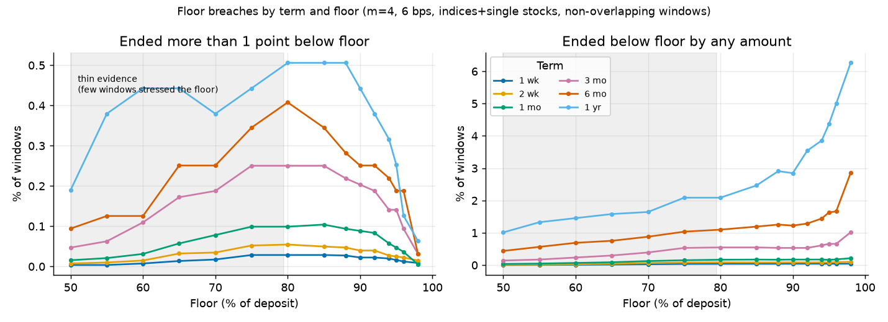
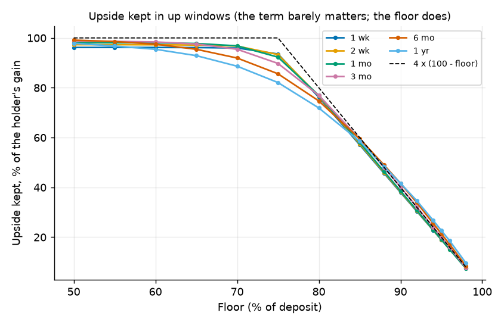
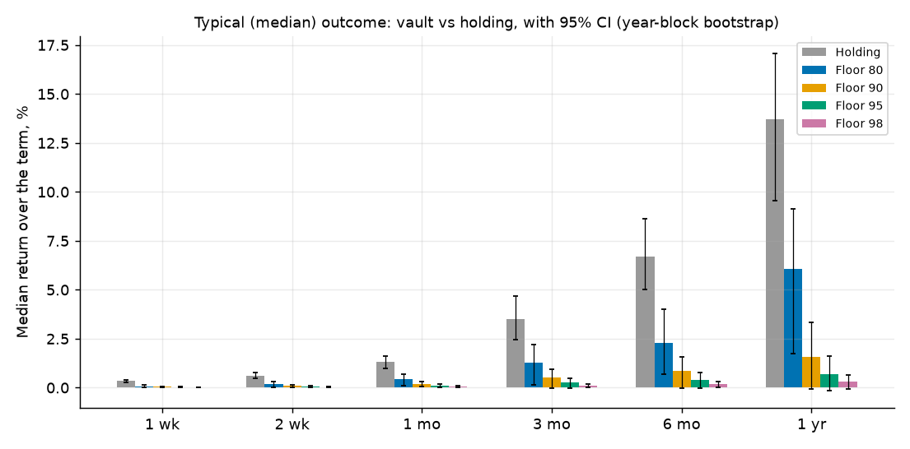
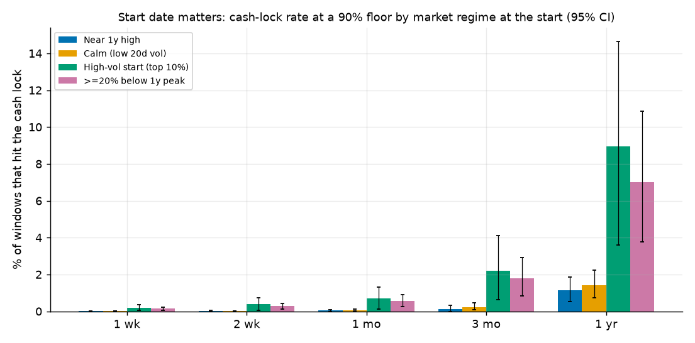
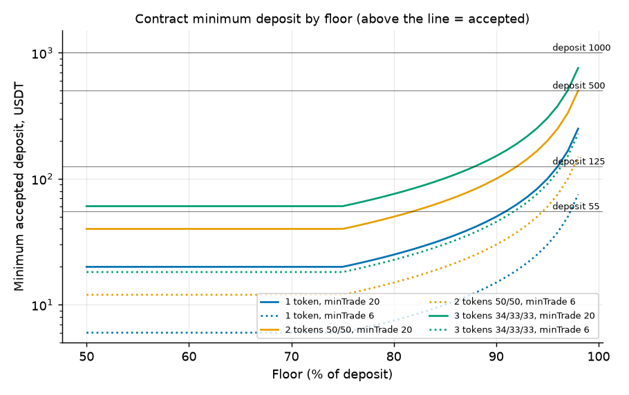

# Floor and term: how far can the slider go? (agent MSTUDY2)

Branch `agent/MSTUDY2`. Everything here is a simulation on historical daily prices (data from yfinance, pulled
2026-10-04, same 38 series as `research/m_study/`). Nothing on-chain was touched. Reproduce with `run_all.sh`.
Simulator: `research/m_study/sim.py` logic (m = 4, daily rebalance at the close, sell band 1%, buy band 2%, 6 bps and
25 bps one-way, final unwind charged), extended in `common2.py` only to record when the lock happens, average
exposure, and separate buy and sell minimum sizes (verified identical to `sim.cppi`: `check_sim.py`, max difference 0).

## 0. Summary in plain English (read this first)

**The floor sets how much of the stock you own; the term barely changes the protection per day, it just gives the
market more time to hurt you or help you.** At m = 4 the vault starts with stock worth `4 x (100% - floor)` of the
deposit (capped at 100%). A 90% floor starts 40% in stock; 95% starts 20%; 98% starts 8%; any floor of 75% or lower
starts fully in stock. The share of a holder's gain that the vault keeps follows that same number almost exactly:
about 72% to 77% at an 80% floor, 38% to 42% at 90%, 19% to 23% at 95%, 8% to 10% at 98%, for every term from one week to one
year (T6). So the floor is the product's real "risk dial", and the term is just a calendar.

**Protection.** Across 38 indices, ETFs and large single stocks (1928 to 2026), at a 90% floor the vault ended more
than 1 point below its floor in 0.02% of one-week windows, 0.09% of one-month windows, 0.20% of three-month windows and
0.44% of one-year windows (95% CIs in T1). The longer the term, the more chances for a one-day gap to land. Nearly
every material miss is a single-stock gap day (AIG 15 Sep 2008 -61%, AAPL 26 Sep 2000 -52%, NFLX Oct 2004 and Oct 2011); the
only index case is the Hang Seng in Oct 1987 (market shut for four days, reopened about -33%). The
S&P 500 alone never ended below an 80%, 90% or 95% floor in any window of any of the six term lengths (0 of 98 years, 0 of 4,961 weeks), and
once in 98 years at 98%. "Ended below the floor by any amount" is more frequent at high floors (6.3% of one-year
windows at 98%) but those misses are tiny (median 0.02 points).

**What people actually get.** The typical result is small. At a 90% floor the median one-month ride returns +0.19%
(holding: +1.31%), the median one-year +1.56% (holding +13.70%), because the vault is only 40% invested and sells
into every fall. The point of the product is the bad windows: when holding lost more than 10%, the 90%-floor vault's
median result was -5.3% over a month (holding -14.5%) and -8.8% over a year (holding -24.0%).

**Cash lock and "start date matters".** The cash lock is rare (0.04% of one-week windows, 0.17% of one-month, 0.53% of
three-month, 2.85% of one-year at a 90% floor) and when it happens it is typically around the middle of the term. It is
strongly regime dependent: a three-month ride started when the stock was already 20% below its 1-year high, or after the
20-day volatility was in its top 10%, hit the lock in 1.8% to 2.2% of windows, against 0.10% when it started within 5% of the
1-year high (T18). The crash starts (Oct 1987, Sep 2008, Feb 2020) all ended 0.4 to 4.9 points above the 90% floor, never below,
for the S&P 500, Nasdaq-100 and NVDA (T20).

**What does not work.** A 98% floor is nearly cash: average stock exposure 8%, median one-year return +0.31%, in one
window in five (21%) it averaged under 5% in stock over the year, and 45% of windows end below the deposit. A one-week
ride has a median result of +0.04% at 6 bps and a negative mean at 25 bps (T11): it is a coin flip with fees. Floors
below 75% are not "more protective but cheaper", they are simply buy-and-hold with a deep stop: only 27 non-overlapping one-year
windows in the whole history ever ended with the stock below a 50% floor, so we have almost no evidence of how those behave.

**Contract limits that bite before the market does.** The factory rejects any deposit where the smallest basket
token's first purchase `min(100%, 4 x (100% - floor)) x deposit x weight` is under `minTrade` (20 USDT live). At 20 USDT
minTrade a 3-token basket cannot be opened with 55 USDT at any floor, and a 125 USDT deposit works only up to an 87%
floor (section 6). A separate rule rejects terms that mature within 14 days of the end of the holiday table (31 Dec 2027):
a 365-day term can no longer be created after 17 Dec 2026 unless the table is extended.

## 1. Recommendation for the UI

| Item | Recommendation | Evidence |
|---|---|---|
| Floor slider range | **80% to 95%**, step 1 point, ticks at 80 / 85 / 90 / 95. Default **90%**. | T16: from 80% up there are at least 173 windows (36 distinct years) in which holding ended below the floor, in every term. 75% to 79%: only 132 to 226 windows for terms of 1 month and longer, 89 to 121 for shorter (22 to 28 years), and the vault is 100% invested at the start so the "floor" is a stop-loss. |
| Label 'backtested' | **80% to 98%**, all terms from 1 week to 1 year. | Same rule: at least 100 stress windows and at least 30 distinct years in every term. |
| Label 'light evidence' | 75% to 79%. Do not offer in v1; if offered, show a yellow note "few historical cases; this is nearly buy-and-hold". | T16, T17. |
| Label 'not backtested' | **below 75%**, and terms over 365 days. Do not offer (the contract accepts 50% and 400 days; the UI should not). | At 50% to 60% only 3 to 68 stress windows, 2 to 31 years; vault still ended below those floors in 29% to 41% of the few stress windows (T17). |
| Why stop at 95% in the UI | 96% to 98% are tested, but they keep under 20% of the upside, make the position mostly cash (at 98%: 8% stock), and need big deposits (min deposit 75 USDT at 98% with a single token even at minTrade 6, 250 at 20). Offer 96 to 98 only behind an "almost all cash" warning, if at all. | T6, T10, section 6. |
| Term presets | **1 month, 3 months, 6 months, 1 year** (30, 90, 180, 365 days). Default **1 year**: it is the best evidenced (98 years of S&P windows, 1,581 pooled) and matches existing copy. | T1 to T14 |
| 1 week and 2 weeks | **Do not offer as presets.** Contract allows 7 to 400 days and the simulation is fine, but the typical gain is about zero: +0.04% median, +0.09% mean at 6 bps (+0.19% / +0.52% for 1 month), mean -0.08% at 25 bps, before gas and keeper effects we did not model. If kept, label "experiment, expect roughly 0". | T7, T11 |
| Custom term | Allow 30 to 365 days only. Not 366 to 400 (untested), not under 30. | |
| Live readout next to the slider | "Starts with `min(100, 4 x (100 - floor))`% in stock. Keeps about the same percentage of a rise." Show the loss at the floor in USDT. | T6, T10 |
| Pre-sign blocking check | Use the formula in section 6; block with "Minimum deposit for this floor and basket: X USDT". | A1, A2 |
| Soft warnings | deposit under 3x the minimum: "small deposits keep a few points less upside" (T21: 125 USDT at minTrade 20 keeps 38% instead of 42% of upside at 90%); floor over 95: "mostly cash"; single-stock baskets: "a one-day drop of more than about 25% can push the final value below the floor" (T15); term 7 to 14 days: "typical result about zero". | T15, T21 |
| Default term and floor pair | 1 year / 90% | |

## 2. Exact numbers allowed in public copy

All: m = 4, daily rebalance at the close, 6 bps one-way unless stated, 38 indices, ETFs and large-cap stocks, 1928 to
2026, non-overlapping windows (indices and single stocks pooled, baskets reported separately), floor measured against
the deposit at creation. "Ended more than 1 point below" means final value below floor minus 1% of the deposit.
Always say "in our historical test" and link the caveats.

| Number | Definition / where | Allowed wording |
|---|---|---|
| **0.44%** (95% CI 0.07% to 0.93%) of windows | 1-year, 90% floor, ended more than 1 point below the floor; 7 of 1,581 windows (T1) | "In 1,581 historical one-year windows, 7 ended more than 1 point below a 90% floor (0.4%)." |
| **0.09%** (0.04 to 0.15) | 1-month, 90% floor, same definition; 17 of 19,209 (T1) | as above for one month |
| **0 of 98 years** | S&P 500 alone, 1-year windows, floors 80, 90, 95 | "never in 98 years of S&P 500 windows" (98% floor: once) |
| **38% to 42%** of the gain kept | up windows, 90% floor, every term (T6); formula `4 x (100 - floor)` for floors 80 to 98 | "keeps roughly 4 times the cushion: about 40% of the rise at a 90% floor" |
| **+0.19%** vs **+1.31%** | median 1-month return, 90% floor vs holding, indices+stocks (T7; CI +0.04% to +0.33% vs +0.99% to +1.63%) | only with "median" and CIs |
| **+1.56%** vs **+13.70%** | median 1-year, 90% floor vs holding (T7) | only with "median"; CI -0.09% to +3.34% vs +9.55% to +17.08% |
| **-5.3% vs -14.5%** (1 month), **-8.8% vs -24.0%** (1 year) | median result in windows where holding lost more than 10%, 90% floor (T8). Not a worst case | "In windows where the stock fell more than 10%, the median 90%-floor ride lost about 5% to 9% where holding lost 15% to 24%." |
| **0.04% / 0.17% / 0.53% / 2.85%** | share of windows reaching the cash lock: 1 wk / 1 mo / 3 mo / 1 yr, 90% floor (T4) | "the cash lock was triggered in 1 in 600 one-month windows" (0.17% = 1 in 590) |
| **0.22% / 0.90%** of deposit | total trading cost over a year at 6 / 25 bps one-way, 90% floor (T9, T9b) | cost estimates, not measured on chain |
| **0.4 to 4.9 points above the floor** | named crash starts, 90% floor, 3 months, S&P 500 / Nasdaq-100 / NVDA (T20). One path each, daily closes | "e.g. started 1 Sep 2008" with the date |

Do not publish: any "worst case" better than "single-stock gap days of -50% to -61% breached every floor" (worst
simulated shortfalls in T3: one-week, 90% floor, AIG 15 Sep 2008: 24% loss, 14 points under the floor); the 98% floor's
tiny breach rates without the "mostly cash" context; any one-week number without its CI.

## 3. How protection and upside change with term (answers by term)

{{T1}}

{{T2}}

{{T3}}

{{T4}}

{{T5}}



*Reading T1 to T5.* Per day, short rides are not safer: the one-week 90% result (18 of 80,733 windows) and the
one-year (7 of 1,581) come from the same few single-stock crashes, and one-week and two-week windows share the same
gap days, so the effective number of independent breach events is under 10 for every cell. The material-breach rate
grows with the term (0.02% to 0.44%) because there are more days at risk; it is lower at 95% to 98% because the stock
share is smaller. "Any shortfall" at high floors rises quickly with term (98% floor, 1 year: 6.3%, CI 4.1% to 8.7%)
but with a median depth of 0.02 points of the deposit: that is the cash lock firing a hair late, not real loss.

**1 month ride, 90% floor (what to tell a person who wants a month):** you start 40% in stock; if the stock rises, you
keep about 39% of the rise; if it falls 10%, you lose roughly 4% (40% x 10%); the chance of ending more than 1 point below your floor
was 1 in 1,100 (0.09%) in our history, and always from a single-stock one-day collapse. Typical result +0.19%, which
is the price of protection.

**1 year hold, 90% floor:** median +1.56%, mean +8.75% (holding median +13.70%, mean +20.32%); 2.9% of windows hit the
lock, and one in seven (13.9%) ends within two points of the floor.

{{T6}}



{{T7}}



{{T8}}

**Cost and turnover.** Cost is not the limiting factor at 6 bps (0.065% of the deposit for a one-month 90% ride) but
it is at 25 bps: it eats half the mean gain of a one-month ride (T7 +0.52% to T11 +0.31%) and turns the one-week mean
negative (-0.08%). The 46 bps TSLAB quote in CONTEXT.md would be worse. Turnover at 90% floor: 0.85x to 3.7x the deposit
over the term.

{{T9}}

{{T9b}}

{{T11}}

{{T12}}

{{T10}}

## 4. Start date matters (short terms especially)

Weekly-start overlapping windows, classified by what the market looked like just before the start (no look-ahead:
the 20-day volatility rank is within each series over its whole history, which is mild hindsight; the 1-year-peak
drawdown is purely backward-looking).

{{T18}}

{{T19}}



*Reading.* Starting after volatility has spiked or when the market is already 20% off its high multiplies the chance
of hitting the lock by roughly ten (1 month: 0.70% / 0.55% vs 0.04% to 0.05% for calm or near-high starts) and flips the median result
from slightly positive to slightly negative (-0.30% vs +0.24%). The protection still holds (breach rates stay under
0.5%), but the person who starts a ride in a panic gets the stock exposure cut and a small loss rather than the rebound.
For one-year rides the same split is 9.0% (CI 3.6% to 14.6%) after a volatility spike and 7.0% when starting 20% below the high, against 1.1% near a high and 1.4% in calm markets (chart; T18 prints 1 week, 1 month, 3 months). This is worth one line in the UI ("starting after a sell-off: the vault can lock early and miss the rebound").

{{T20}}

## 5. Overlapping windows and groups (robustness)

{{T13}}

{{T14}}

Overlapping weekly starts agree with the non-overlapping set within the CIs (the CIs use calendar-year blocks, so overlap
does not make them too narrow).

{{T15}}

Index/ETF pools (US and international indices, ETFs): 0 to 0.17% material breaches at any floor and term (the one repeat offender is the Hang Seng in Oct 1987); single
stocks carry nearly all breaches. Baskets (4 baskets, 106 to 5,434 windows) had no material breach, but only 106 independent
one-year windows each correlated across 4 baskets, so that is weak evidence.

{{T16}}

{{T17}}

*Reading T16 and T17.* This is the basis of the tested/untested zones. At a 50% floor only 27 windows in 98 years ever
had the stock end below the floor and in 41% of those the vault still ended below it too (7.4% by more than 1 point):
a few events, not enough to claim anything. By 80% the evidence is 173 to 365 windows over 36 to 59 years per term.

## 6. What the contract accepts (practical constraints)

Source: `packages/contracts/src/FloorFactory.sol` `createPosition` and `_checkNotTooSmall`, `libs/CPPIMath.sol`,
`script/params/56.json` (live defaults: minTrade 20 USDT, buy band 2%, sell band 1%, dust 1 USDT), `packages/sdk/src/constants.ts`.
`contract_accept.py` reproduces the contract's integer arithmetic exactly and matches the contract's own tests
(`PashovFix4.t.sol`: 50 USDT / 90% / 1 token accepted, 49 rejected, 500 at 98% accepted, 200 at 98% rejected, 100 at 60/40 rejected,
150 accepted) and the closed form below (0 mismatches).

Checks in order: not paused/halted; deposit between 1 and the launch cap 1,000 USDT (`maxDeposit`; total TVL cap 5,000);
floor 50% to 98%; term 7 to 400 days AND maturity + 14 days (`UNWIND_BUFFER`) not after `holidayHorizonDay`; 1 to 3 assets,
weights sum 100%, every asset active with enough oracle history; then, for every token:

1. first target `t = min(4 x (D - F), D) x weight` must be at least `minTrade` (else `PositionTooSmall`);
2. `t` must pass the buy band: `t >= 2% x weight x D` (else `BadFloor`). With floors up to 98% the first target is at least 8% of the
   deposit, so **`BadFloor` can never fire inside the 50% to 98% range** (it would need a floor above 99.5%). The
   "floor so high that the first buy never passes the band" case is therefore unreachable today; `PositionTooSmall` is
   the only rejection driven by floor and size.

**Formula for the UI (single check, matches the contract):** let `w` = the smallest basket weight (1 for one token),
`f` = floor as a fraction (0.90), `D` = deposit in USDT.

```
start_stock_share = min(1, 4 x (1 - f))
first_buy_of_smallest_token = D x start_stock_share x w
accept  iff  first_buy_of_smallest_token >= minTrade
minimum deposit = minTrade / (w x min(1, 4 x (1 - f)))
highest accepted floor = 1 - minTrade / (4 x D x w)     (floors at or below 75% only need D x w >= minTrade)
```

Round the floor up when the contract does (`floorFor` rounds the floor amount up, so a hair more than the formula can be rejected at the boundary;
add a 1% margin in the UI).

{{ACCEPT}}

Minimum deposit (USDT) by floor, from the formula (`A2_min_deposit.csv`):

| minTrade | Basket (smallest weight) | 80% | 85% | 90% | 92% | 95% | 96% | 98% |
|---|---|---|---|---|---|---|---|---|
| 20 | 1 token | 25 | 33 | 50 | 63 | 100 | 125 | 250 |
| 20 | 2 tokens 50/50 | 50 | 67 | 100 | 125 | 200 | 250 | 500 |
| 20 | 3 tokens 34/33/33 | 76 | 101 | 152 | 190 | 304 | 379 | 758 |
| 6 | 1 token | 7.5 | 10 | 15 | 19 | 30 | 38 | 75 |
| 6 | 2 tokens 50/50 | 15 | 20 | 30 | 38 | 60 | 75 | 150 |
| 6 | 3 tokens 34/33/33 | 23 | 31 | 46 | 57 | 91 | 114 | 228 |



**"Accepted but stays mostly in cash."** The contract only checks the first purchase. Later buys also need `minTrade`
and the 2% weighted band, so a small position whose cushion has shrunk can sit in USDT after a drawdown (sells above
the 1 USDT dust size always go through). Effect on a one-year ride (T21, single series pool): 125 USDT at minTrade 20
keeps 38% of the upside instead of 42% at a 90% floor (19% vs 23% at 95%); 55 USDT at minTrade 6 keeps 40% and 36% for
one and three tokens. So the upside cost of a small deposit is a few points, not a loss of protection (material
breach unchanged at 0.4% to 0.5%). The mid-term re-buy rule is simulated for a single token; for baskets each token must pass on its own,
which we approximate by scaling the minimum.

The 'never bought stock' metric asked for in the brief: with the factory check passed, the vault buys on day one, so
the share of windows that never exceeded 2% stock is 0.00% to 0.03% at floors 50 to 98 (only windows where a gap wipes the
cushion on the first day). The related real-world effect is "mostly cash" (average stock share under 5%): 1.0% at 90%,
4.3% at 95% and **21.1% at 98% over a year**, and 9.2% at 98% over three months.

{{T21}}

**Terms:** bounds 7 to 400 days (`MIN_TERM`, `MAX_TERM`). Today the holiday table covers through 31 Dec 2027
(`holidayHorizonDay`, from `packages/contracts/holidays/nyse_2026_2027.json`), and a position is rejected if
`now + term + 14 days` is later than that day. Latest creation dates: 365 days: **17 Dec 2026**; 180 days: 20 Jun 2027; 90
days: 18 Sep 2027; 30 days: 17 Nov 2027; 7 days: 10 Dec 2027. The 400-day cap itself binds only until 12 Nov 2026. The UI
should read `holidayHorizonDay` from the factory and disable a term whose maturity plus 14 days exceeds it. Ops should extend the table
(it covers 2028 only if `setHolidayHorizon` is called) before 17 Dec 2026 or the 1-year preset will revert.
The sdk constant `LAUNCH_TERM_SECONDS` is 365 days.

## 7. Honest wording about "term" and exiting early

Plain-language version (checked against `docs/CONTRACTS.md` and `FloorVault.sol`):

- **The floor is a level the vault defends by selling, not a guarantee from anyone.** It is a fixed amount (a percentage of
  your deposit when you open). It never moves up, so after a gain it protects much less of your *gains* than your principal.
  Do not say "protects your gains".
- **What the term controls.** Until maturity the vault trades Monday to Friday inside the window. At maturity the target stock
  exposure becomes zero: it sells everything to USDT during the next trading window(s) and the protection is over. Nothing
  renews; to keep riding you open a new position (new deposit, new floor from the then-current value).
- **If the floor is reached before maturity (cash lock):** the vault holds USDT only until maturity and cannot re-enter. It is
  worth about the floor; the term ends, you take the USDT. It is not a refund of more, and not less (except the rare shortfall).
- **Exiting early.** You can close at any time (`requestClose` then `closeToUSDT`, or `exitInKind` to take whatever the vault holds). You receive
  the vault's current value at that moment (stock plus USDT, after sale costs), not the floor amount. That is normally
  above the floor, but nothing promises it, and you give up the rest of the term's upside. There are no partial withdrawals and no top-ups.
- **Short terms.** A one-week or one-month term does not change the 1-in-4 rule: a one-day drop of more than about 25% of the stock
  can still push the final value under the floor. Typical results over a month are small (+0.19% median at a 90% floor).

## 8. Claims in CONTEXT.md / site that change or need a qualifier (report only; not edited here)

1. "One-year term" in the product definition: now several terms. Every statistic in CONTEXT.md applies to a 1-year
   ride at a 90% floor unless stated; add the term and floor to each.
2. "~42% of upside": true for a 90% floor only (38% to 42% by term). At 80% it is ~75%, at 95% ~20%, at 98% ~8%. Replace with
   "about 4 times your cushion", e.g. "40% at a 90% floor".
3. "Worst-case loss is X": the worst simulated windows (AIG 15 Sep 2008, one-week) lost 24% at a 90% floor (shortfall 14 points);
   keep "unless prices gap more than about 25% in a day", and never "you cannot lose more than 10%". At 1,581 one-year windows 7 ended more than 1
   point under a 90% floor (0.44%).
4. "93 of 93" is 2018 to 2026 only (already flagged). Do not generalize to other terms.
5. Cash lock wording: it fires in about 0.2% of one-month and 2.9% of one-year windows at 90% (not "often"); a more
   common experience is "ended within 2 points of the floor" (13.9% of one-year windows at 90%, 21.9% at 95%).
6. The 1-year default will stop working on 2026-12-17 (holiday horizon); ops item.
7. The marketing claim of a floor "slider" from 50% to 98%: only 80% to 95% is backtested well enough (see section 1);
   the contract allows more.
8. Anything about "short rides" earning something: median one-week +0.04%, mean negative at 25 bps. No promotional copy.

## 9. Caveats (state these next to any number)

- **Survivorship bias.** Only companies that exist in 2026 (and indices) are in the data: no Lehman, Enron, SVB, no bankruptcies
  or delistings. A -100% gap breaks any m. Single-stock breach rates are therefore a floor, not a ceiling.
- **Daily closes only.** No intraday path, no halts, no token-vs-stock gap, no oracle (TWAP) lag, no weekend token trading. The
  contract trades mid-session (15:30 to 19:30 UTC) and never at the close; the first study measured a mid-window variant
  (m_study REPORT section on timing) with similar results, not repeated here. Weekends and overnight gaps are fully inside the
  daily returns.
- **Short windows have large sampling noise.** Material-breach events are 7 to 18 windows per term in the whole pooled
  history and the same gap days appear in every term, so the cells are not independent. CIs shown are 95% year-block
  bootstrap (resampling calendar start-years, 1,000 draws; medians 300 draws); one-week and one-month medians are tight
  only because there are tens of thousands of overlapping-in-time windows, not because we know the future.
- **Pooling.** Indices and 23 single stocks pooled equally per window; single stocks drive all breaches. Baskets are treated as one
  daily-rebalanced equal-weight asset. The result for TSLA-like names (46 bps cost, whipsaw) is worse than the pooled mean.
- **Costs** are a flat 6 or 25 bps one-way on traded value (swap fee plus slippage). No gas, no keeper reward, no weekend cost,
  USDT earns 0%. The final unwind is charged.
- **Hold return** is price return for indices and total (dividend-adjusted) for stocks; tokenized stocks track total return only if the
  issuer passes dividends through.
- **Contract vs simulator.** Simulator locks at V <= floor; the contract latch fires at V <= floor / 1.01 (1% confirmation margin). The
  rebalance already sets target stock to zero at the floor, so the effect on the numbers is negligible but not zero.
- **Evidence labels** ("backtested") mean that many historical windows, not that the future will look like them.

## 10. Reproduce

`run_all.sh` (about 6 minutes on 12 cores). Outputs: `results/S1_nonoverlap.csv` (term x floor x cost x group, with CIs),
`S2_overlap.csv`, `S3_start_regime.csv`, `S4_named_starts.csv`, `S5_deposit_size.csv`, `S6_stress_counts.csv`,
`P1_median_ci.csv`, `A1_contract_accept.csv`, `A2_min_deposit.csv`, `tables.md`; `charts/` has 5 PNGs. Data is cached
under `data/` (gitignored).
